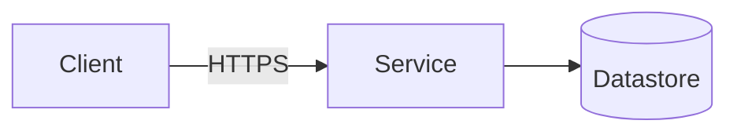

# <Title — one phrase a non-author can recall>

**Author(s):** <names>
**Status:** Draft | Under review | Accepted | Superseded
**Last updated:** <YYYY-MM-DD>
**Reviewers:** <names or teams expected to sign off>

## TL;DR

<Three sentences or fewer. What is this, and what decision is it asking the
reader to make?>

## Context

<The user-visible problem. The constraints — deadline, regulatory, team
shape, existing system shape. The system being changed, named by module
or service. At least one constraint should be non-obvious.>

## Goals and Non-goals

### Goals

- <Testable from the outside. "p95 < 200ms at 10× current load", not
  "better performance".>
- <…>

### Non-goals

- <Something a reasonable reader might assume is in scope. Name why
  it's out: "We are not tackling X in this proposal because Y.">
- <…>

## Proposal

<The shape of the solution, in enough detail that a reader can implement
it or knows what they'd need to ask. Name the trust boundaries crossed
(auth, data residency, blast radius). Where structure genuinely needs a
picture, embed a Mermaid diagram and reference it from the prose.>

## Alternatives Considered

### <Alternative 1 — one-phrase name>

<What this option looks like. Why a reasonable engineer might have
chosen it.>

**Rejected because:** <specific property — not "doesn't fit our
architecture">.

### <Alternative 2 — one-phrase name>

<…>

**Rejected because:** <…>

## Risks

- **<Risk, one phrase>.** <How it manifests. Mitigation, or explicitly
  *accepted unmitigated* with the reason.>
- **<Operational risk — what breaks at 3am>.** <…>
- **<…>**

## Rollout

<Migration / launch shape: big-bang, phased, shadow-traffic, dark
launch, feature-flag. Rollback story — concrete, not aspirational. Who
is on the hook for the rollout window.>

## Open Questions

- <Question, with the person, team, or measurement that could answer
  it. Drop this section entirely if there are no honest open
  questions.>

## Appendix (optional)

<Detailed diagrams, data models, schemas, link-outs. Only what doesn't
fit comfortably in the body.>
