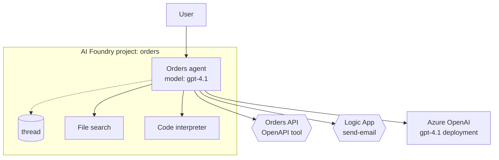

# Microsoft AI Foundry Agent Service — components, isolation, conventions

Load this when the user's request mentions AI Foundry, AI Foundry
Agent Service, Azure AI Agent Service, or names AI Foundry primitives
(agent identity, project, thread, run, tool, model router).

**An AI Foundry diagram is not "an App Service running an agent."**
The Agent Service is a managed runtime with its own identity,
threading, and tool model.

## Core components

| Component | What it does | Diagram conventions |
| --- | --- | --- |
| **AI Foundry project** | The deployment unit — agents, models, tools, connections live inside a project. | Outer subgraph labeled "AI Foundry project: <name>". |
| **Agent (published)** | A named, versioned agent with its own managed identity. | Rectangle inside the project subgraph; label the model. |
| **Thread** | Conversation state for one user / session. | Cylinder; one per active conversation. |
| **Run** | One model invocation against a thread. | Usually elided; surface only when the diagram is about request lifecycle. |
| **Tool** | A function or connection the agent can call (OpenAPI, Logic Apps, file-search, code-interpreter, browser). | Hexagon (external) for OpenAPI / Logic Apps; rectangle inside the project for managed tools. |
| **Model deployment** | The deployed model behind the agent (Azure OpenAI). | Rectangle, can sit inside the project or in a peer AOAI resource. |
| **Connection** | Authenticated link to an external resource. Carries an identity. | Annotate on the edge — don't make it a node — except when the connection itself is the subject. |
| **RBAC / Entra ID** | Who can invoke the agent, who can read threads, who can manage. | Annotate as a property of the entry edge; expand to a node only when the diagram is *about* RBAC. |

## Identity and isolation

- **Each published agent has a managed identity.** That identity
  is what the agent uses when calling tools or connections.
  Render the identity on the *outbound* edge from the agent
  (`Agent → Tool [Identity: orders-agent]`), not as a node.
- **Threads are tenant-scoped** to the project (and, depending on
  config, to the user). Render the thread inside the project; if
  cross-tenant access is in scope, that is a security finding
  worth flagging.
- **Runs are transient.** Don't draw them in a topology diagram;
  draw them in a sequence diagram if the question is about flow.

## Tool surface

## Trust boundaries that matter

- **Project boundary.** Threads, agents, and tool connections are
  scoped here. Cross-project access requires explicit RBAC.
- **Connection boundary.** Every external connection carries an
  identity that's separate from the user's. Render it on the edge.
- **Tool sandbox boundaries** for code-interpreter and browser.
  Same convention as elsewhere — render as separate nodes with the
  trust boundary visible.

## Common pitfalls

- **Drawing the agent as the model.** The agent and the model
  deployment are different things; agent has the identity and the
  tool wiring, the deployment is the inference endpoint.
- **Hiding the thread.** When the question is about *state*, draw
  the thread; threads are where prompt history and tool state live.
- **OpenAPI tools as managed components.** OpenAPI tools live at
  the customer's endpoint; they're external. Use the external
  hexagon shape, not the internal rectangle.
