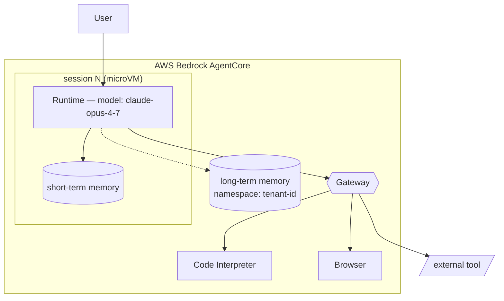

# AWS Bedrock AgentCore — components, isolation, diagram conventions

Load this when the user's request mentions Bedrock AgentCore, or any
of: AgentCore Runtime, AgentCore Memory, AgentCore Gateway, AgentCore
Identity, AgentCore Code Interpreter, AgentCore Browser, AgentCore
Observability, AgentCore Evaluations, AgentCore Policy.

**An AgentCore diagram is not "AWS with a Lambda in it."** The
managed components are first-class boxes; treating them as Lambda is
the most common mistake.

## Core components

| Component | What it does | Diagram conventions |
| --- | --- | --- |
| **Runtime** | Hosts the agent. One microVM per session. | Rectangle inside an `AgentCore` subgraph. Label the model used. |
| **Memory (short-term)** | Conversation buffer for the active session. | Cylinder, scoped to the session boundary. |
| **Memory (long-term)** | Persisted memory across sessions, namespaced by user / tenant. | Cylinder, *outside* the session boundary; label the namespace. |
| **Gateway** | MCP / tool gateway. Authenticates and routes tool calls. | Hexagon (external system shape inverted — managed but mediating). Sits between Runtime and any tool. |
| **Identity** | Identities the agent assumes when calling tools. OAuth / IAM. | Annotate as a property of the edge — `Gateway → Tool [Identity: orders-agent]` — not a node. |
| **Code Interpreter** | Sandboxed Python execution. | Rectangle inside the AgentCore subgraph; mark sandbox boundary. |
| **Browser** | Headless browser sandbox. | Rectangle inside the AgentCore subgraph; mark sandbox boundary. |
| **Observability** | Tracing, metrics, eval signals. | Annotate as a sink at the edge of the AgentCore subgraph; do not clutter inline. |
| **Evaluations** | Offline / online eval harness. | Separate diagram usually — out of scope for runtime topology. |
| **Policy** | Guardrails (input / output filtering, denied topics). | Annotate on the Runtime or as a wrapper subgraph; not a separate node. |

## Session and isolation

- **microVM-per-session.** Each session gets a fresh, isolated
  microVM with its own short-term memory. Render the session as a
  dashed-border subgraph inside Runtime; multiple sessions =
  multiple dashed boxes side by side, with shared long-term memory
  outside.
- **Long-term memory crosses sessions** for the same user / tenant.
  The arrow from session → long-term memory crosses the session
  boundary; label it `read` / `write` and name the namespace key.
- **Tools live outside AgentCore.** Even managed tools (Code
  Interpreter, Browser) are sandboxes — render them as their own
  nodes, with the trust boundary between them and the agent.

## Tool / function-call surface

## Trust boundaries that matter

- **Session boundary.** Short-term memory does not leak across.
- **Tenant / namespace boundary** on long-term memory. Render as
  dashed border.
- **Tool sandbox boundaries.** Code Interpreter and Browser are
  sandboxes — their boundary is a trust boundary.
- **Identity-on-the-edge.** Every tool call carries an identity
  (which can be different from the user's identity); label it on
  the edge.

## Common pitfalls

- **Drawing Runtime as a Lambda.** It isn't. Runtime is its own
  managed component with microVM semantics; misrepresenting it
  misleads security review.
- **Conflating short- and long-term memory.** Two separate stores
  with different lifecycles; render them separately.
- **Hiding the Gateway.** Tool calls *always* go through Gateway;
  putting a direct arrow from Runtime to a tool is wrong.
