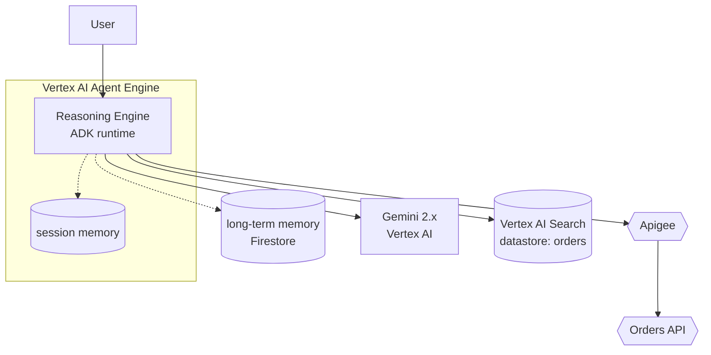

# Google Vertex AI Agent Engine — components, isolation, conventions

Load this when the user's request mentions Vertex AI Agent Engine,
Vertex AI Agent Builder, Agent Development Kit (ADK), Reasoning
Engine, Vertex AI Search grounding, or Apigee-as-agent-gateway.

**A Vertex Agent Engine diagram is not "Cloud Run with a model
call."** Agent Engine is a managed runtime with native agent
identities, IAM at agent granularity, and integration affordances
(Apigee, Vertex Search grounding) that change the picture.

## Core components

| Component | What it does | Diagram conventions |
| --- | --- | --- |
| **Vertex AI Agent Engine (managed runtime)** | Hosts the deployed agent. Scales sessions. | Outer subgraph labeled "Vertex Agent Engine". |
| **Reasoning Engine** | The deployed runtime — ADK or other framework code. | Rectangle inside the Agent Engine subgraph; label the framework (ADK, LangGraph, custom). |
| **Agent identity (SA)** | A service account scoped to the agent. Drives IAM. | Annotate on outbound edges — `Agent → tool [SA: orders-agent]`. |
| **Session / memory** | Session state managed by the runtime; long-term memory via the user-supplied store. | Cylinder; short-term inside the Agent Engine, long-term outside. |
| **Tools / connectors** | Functions the agent calls. Often Apigee-fronted. | Hexagon (external) for customer endpoints; rectangle for managed tools. |
| **Apigee (as agent gateway)** | API management for tools the agent calls — auth, rate-limit, audit. | Hexagon shape between agent and downstream tools when present. |
| **Vertex AI Search (grounding)** | RAG grounding source. | Cylinder labeled "Vertex AI Search [datastore: <name>]". |
| **Gemini model** | The model behind the agent. | Rectangle inside or peer to the Agent Engine — `Gemini 2.x via Vertex`. |

## Identity and isolation

- **Native agent identities.** Each agent has a service account;
  IAM at the agent boundary, not just the project boundary. This
  is the differentiator versus a "Cloud Run with a model" picture.
  Render the SA on outbound edges.
- **Sessions are managed.** The runtime handles session affinity;
  short-term memory is inside the runtime. Long-term memory is
  whatever the customer wires up (Firestore, Spanner, etc.) —
  render it outside.
- **Tool authorization** typically goes through Apigee when the
  organization is using it; the agent's SA authenticates to
  Apigee, Apigee enforces policy and forwards. Render Apigee as a
  mediating hexagon.

## Tool surface

## Trust boundaries that matter

- **Agent SA boundary.** Each agent's identity scopes what tools
  and data it can reach. Render on the edges.
- **Apigee boundary** when present — Apigee is the policy
  enforcement point for tool calls and external API surface.
- **Project boundary.** Cross-project tool access requires
  explicit IAM grants; if the diagram crosses projects, label what
  crosses.

## Common pitfalls

- **Drawing the agent as a Cloud Run service.** Agent Engine is
  its own managed primitive — the runtime is not exposed as a
  Cloud Run URL, the scaling and session model differ, the IAM is
  agent-granular.
- **Skipping Apigee when it's the agent gateway.** If the user
  said "Apigee fronts the tools", render it; otherwise the
  authorization model is wrong on the picture.
- **Conflating Vertex AI Search with a vector DB.** Vertex AI
  Search is a managed retrieval-augmented endpoint; if the user
  is actually using a vector DB (Vertex Vector Search, Pinecone,
  etc.) render that instead.
