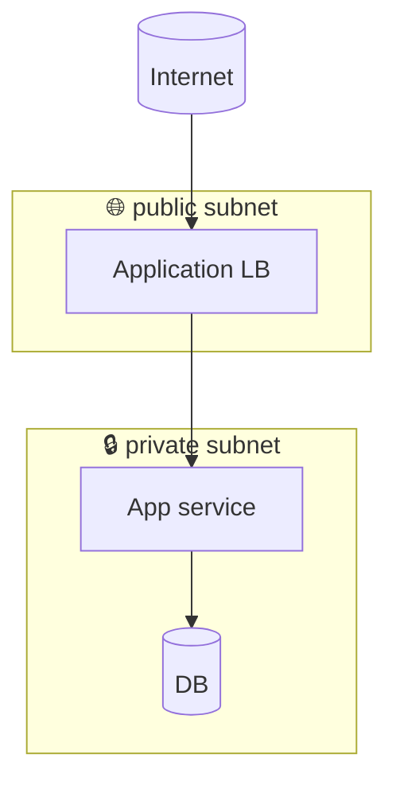

# Cloud-agnostic structural patterns

These patterns apply across AWS, Azure, and GCP. The cloud-specific
references (`cloud-aws.md`, `cloud-azure.md`, `cloud-gcp.md`) give
the boundary vocabulary and service-naming; this file gives the
*shapes* that are common.

## The boundary stack

Most cloud architectures stack the same five boundaries, even if the
cloud calls them different names:

```
+-----------------------------------------+
|  Cloud (provider)                       |
|  +-----------------------------------+  |
|  |  Account / Subscription / Project |  |
|  |  +-----------------------------+  |  |
|  |  |  Region                     |  |  |
|  |  |  +----------------------+   |  |  |
|  |  |  |  VPC / VNet          |   |  |  |
|  |  |  |  +----------------+  |   |  |  |
|  |  |  |  |  Subnet        |  |   |  |  |
|  |  |  |  +----------------+  |   |  |  |
|  |  |  +----------------------+   |  |  |
|  |  +-----------------------------+  |  |
|  +-----------------------------------+  |
+-----------------------------------------+
```

Render this with nested `subgraph` blocks in Mermaid. The boundary at
which the customer's trust expectations *change* — typically the
account / subscription / project boundary — gets a dashed border.

## Public vs. private subnets

Always visibly distinct. Easiest pattern: emoji or text marker on the
subgraph label.



## Async vs. sync edges

- Solid arrow: synchronous, the caller blocks until the callee
  returns.
- Dashed arrow: asynchronous, fire-and-forget or eventual.
- Label the protocol or transport on every edge — "HTTPS", "gRPC",
  "Kafka orders.v1", "S3 event".

## Trust boundary crossings

When an arrow crosses a trust boundary (account, tenant, region for
data-residency purposes), label *what* crosses, not just *that* it
crosses. "writes user PII" beats "calls".

## Storage shape

Storage gets the canonical cylinder shape: `[(...)]` for a database,
`[[...]]` for a queue / topic, `[/.../]` for an object store or blob.
Be consistent across the diagram.

## External actors

Render external actors with a distinct shape (rounded rectangle, or
C4's `Person()`) and the word *external* if it's not obvious from
context. They live outside the outermost subgraph.

## When to use C4 instead of flowchart

- The diagram is about *who calls what across services* — C4 Container.
- The diagram is about *people and external systems* — C4 Context.
- The diagram is about *what code modules exist inside one service* —
  C4 Component (rarer; usually a code question, not an architecture
  question).

Flowchart wins when the structure is heterogeneous (mix of services,
queues, datastores, lambdas) and you need precise subgraph nesting
for cloud boundaries.
