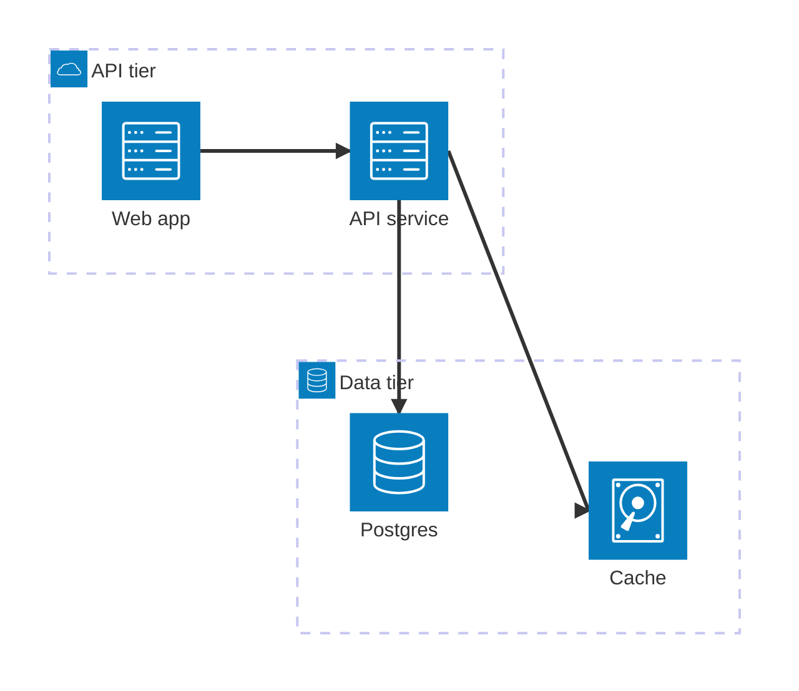

# Mermaid architecture-beta — the optional alternative

A newer Mermaid notation with native cloud-service icons. Looks nicer
than flowchart-with-subgraphs but **renders inconsistently across
enterprise wikis** as of mid-2026: rendering varies by Mermaid version
and by wiki integration.

**This is not the default.** Default to `flowchart TB` with subgraphs.
Mention `architecture-beta` as an option when the user is publishing
to a venue you've confirmed renders it (GitHub README, a recent
Mermaid Live Editor link, a Mermaid-CLI-rendered PNG).

## Skeleton

````

````

## Vocabulary

| Element | Syntax |
| --- | --- |
| Group / boundary | `group <id>(<icon>)[Label]` |
| Service / node | `service <id>(<icon>)[Label] in <group>` |
| Junction (fan-in / fan-out) | `junction <id> in <group>` |
| Edge | `<from>:<side> --> <side>:<to>` |

Sides for connection points: `L`, `R`, `T`, `B` (left, right, top,
bottom). The directional notation lets the renderer route edges
sensibly.

## Available icons (built-in)

`cloud`, `database`, `disk`, `internet`, `server`. The set is
deliberately small — for richer cloud-vendor icons, the user's
Mermaid renderer needs the iconify plugin enabled.

If iconify is available, vendor icons follow the pattern
`logos:aws-lambda`, `logos:azure`, `logos:google-cloud`, etc.
Confirm with the user before reaching for these — they fail silently
on renderers without iconify.

## When to use architecture-beta

- The diagram is going into a venue that *you have confirmed* renders
  it (GitHub README rendered live, Mermaid Live Editor link, an
  exported PNG embedded in a doc).
- The audience values aesthetics over text-grepability.
- The diagram is small (≤10 nodes).

## When to NOT use architecture-beta

- Confluence (rendering depends on the macro version).
- Azure DevOps Wiki (Mermaid version often lags).
- GitLab (renders the older Mermaid).
- Plain Markdown rendered server-side (most wikis).
- The diagram needs deep nesting (architecture-beta groups don't
  nest as cleanly as flowchart subgraphs).
- The user is going to *grep* the diagram for service names
  (architecture-beta hides them inside the icon DSL).

## Fallback procedure

Default to `flowchart TB` with subgraphs (see `mermaid-flowchart.md`).
Offer `architecture-beta` as a second pass:

> "If your renderer supports it, this would also work as Mermaid's
> newer `architecture-beta` syntax — want me to redraw?"

If the user doesn't know, redraw once in flowchart and stop.
