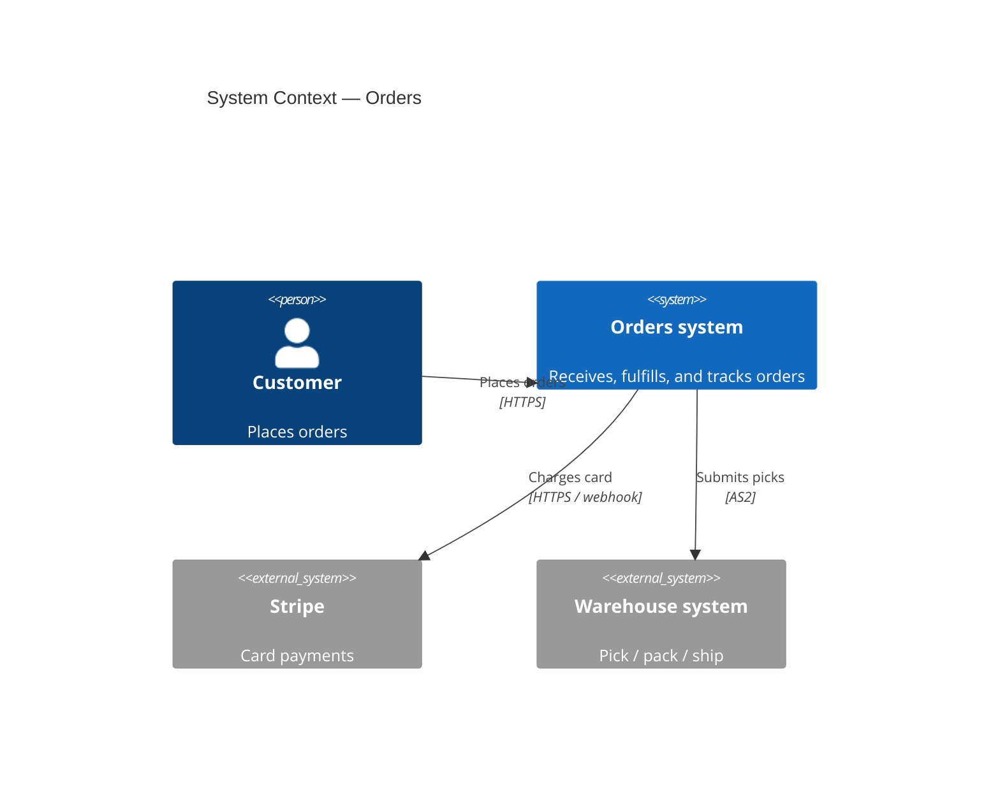
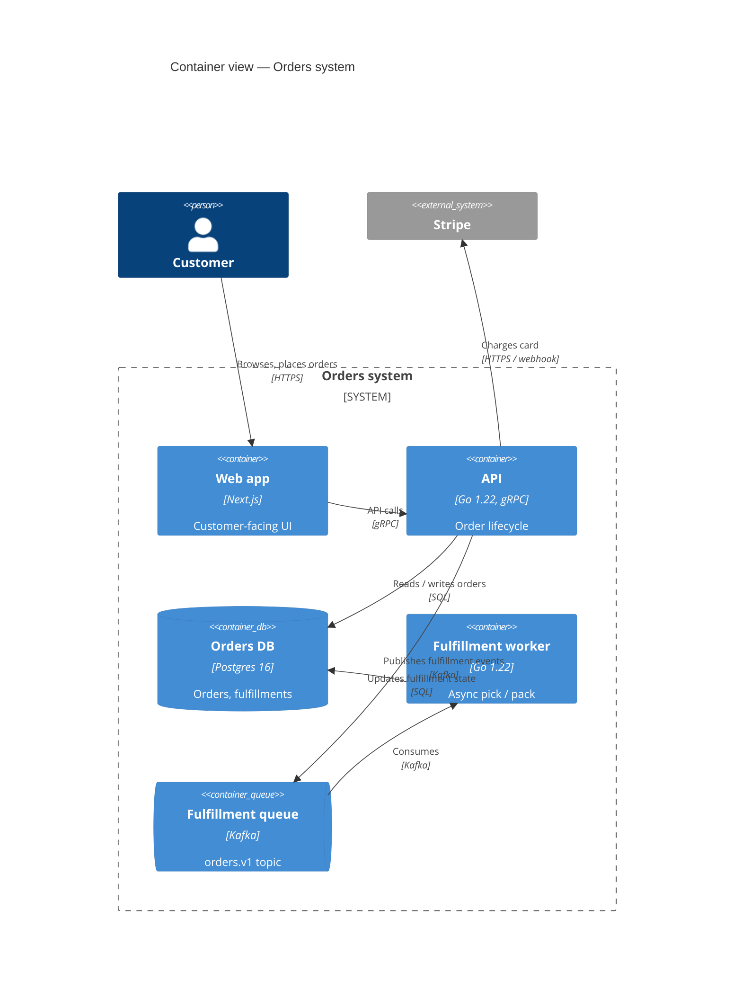

# Mermaid C4 — Context, Container, Component

C4 is the right notation when the question is *who talks to what*. Use
Context for the system-and-its-neighbors view; Container for the
service-decomposition view; Component for the inside of one container
(rare, usually a code question).

Mermaid C4 support is *experimental* at the time of writing — the
flowchart-with-subgraphs alternative renders more reliably across
enterprise wikis. Mention this trade-off to the user when picking
between the two.

## C4 Context skeleton

````

````

## C4 Container skeleton

````

````

## The C4 vocabulary

| Element | Mermaid | Meaning |
| --- | --- | --- |
| Person | `Person(id, "Name", "Description")` | Human user or operator |
| External person | `Person_Ext(id, "Name", "Description")` | Person outside the org |
| System | `System(id, "Name", "Description")` | A system you control |
| External system | `System_Ext(id, "Name", "Description")` | A system you don't |
| System boundary | `System_Boundary(id, "Name") { ... }` | Logical grouping |
| Container | `Container(id, "Name", "Tech", "Desc")` | App / service inside a system |
| Container DB | `ContainerDb(id, "Name", "Tech", "Desc")` | Persistent store |
| Container queue | `ContainerQueue(id, "Name", "Tech", "Desc")` | Async transport |
| Relationship | `Rel(from, to, "Label", "Tech")` | Directed call / dependency |

## Non-negotiables (matches `diagram-rubric.md`)

- **Technology label on every Container.** The third argument is not
  optional — "Go 1.22, gRPC" beats blank every time.
- **Description on every Container** — the fourth argument. One
  short phrase about *what it does*.
- **`Rel` carries the protocol** in the fourth argument. "HTTPS",
  "gRPC", "Kafka", "AS2" — not "uses".
- **External systems use `*_Ext`.** Don't blend internal and
  external into one shape.
- **One system per diagram.** A Container view spanning four
  systems is a Context view in disguise.

## When to fall back to flowchart

- Mermaid C4 doesn't parse in the target wiki — fall back to
  `flowchart TB` with subgraphs.
- The diagram needs deep cloud boundary nesting (Account → Region →
  VPC → Subnet) — flowchart subgraphs nest more reliably than C4
  boundaries.
- The audience doesn't know C4 — flowchart is universally legible.

## Common architecture pitfalls

- **Treating C4 levels as a hierarchy you must climb.** Pick the
  level that answers the reader's question; you rarely need all
  four.
- **Component view for an architecture review.** Component view
  describes *one container's internals* — almost always a code
  question, not an architecture question.
- **Anonymous boxes.** Every C4 element has an id and a name; if you
  can't name it, you don't understand it well enough to diagram it.
