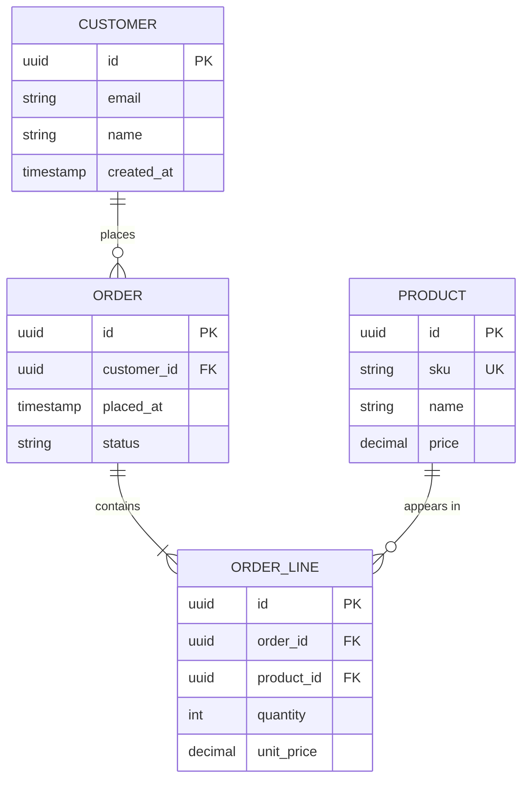

# Mermaid erDiagram — data model in a design doc

The right notation for *what is the shape of the data, and how do the
entities relate*. Use inside a design doc when the data model is
load-bearing for the proposal.

For *operational* schema management (migrations, indexes), use the
actual SQL — don't reach for an ER diagram.

## Skeleton

````

````

Entity names go in CAPS by convention. Attributes go inside the
braces with type, name, and modifiers.

## Cardinality

The relationship glyph carries the cardinality at *both* ends:

| Left | Right | Meaning |
| --- | --- | --- |
| `\|\|` | `\|\|` | Exactly one (mandatory, single) |
| `\|o` | `o\|` | Zero or one (optional, single) |
| `}\|` | `\|{` | One or more (mandatory, many) |
| `}o` | `o{` | Zero or more (optional, many) |

Composed via `--` (identifying) or `..` (non-identifying). For
example, `CUSTOMER ||--o{ ORDER : places` reads:

> "A CUSTOMER places zero or more ORDERs; an ORDER belongs to
> exactly one CUSTOMER."

**Always label the relationship** — `places`, `contains`, `appears
in`. Bare lines fail the rubric.

## Attribute modifiers

| Modifier | Meaning |
| --- | --- |
| `PK` | Primary key |
| `FK` | Foreign key |
| `UK` | Unique key / unique constraint |

Mark every PK and every FK. UK only where the constraint is
load-bearing for the design.

## Common types

Mermaid doesn't enforce types — pick a convention and stay with it:

- `uuid`, `int`, `bigint`, `decimal(p,s)`, `string`, `text`,
  `timestamp`, `date`, `boolean`, `jsonb`.
- Match the actual DDL when in document mode; in design mode, pick
  a sensible default and flag it.

## What ER diagrams should *not* show

- **Implementation details** — index strategies, partition keys,
  storage parameters. Those go in the migration, not the picture.
- **Every column.** Show the ones that matter for the design. A
  diagram with 30 columns per entity is unreadable.
- **Transient / cache shapes** unless they're part of the proposal.

## Common architecture pitfalls

- **Bare relationship lines.** Always label.
- **Cardinality on only one end.** Both ends carry information;
  half a cardinality is half a model.
- **ER diagram inside a flow diagram.** Don't mix notations.
- **Treating ER as a class diagram.** ER is about persisted
  state; classes are about runtime behavior.
