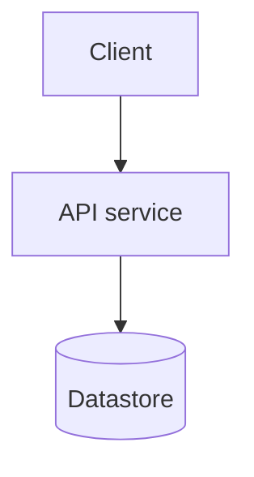
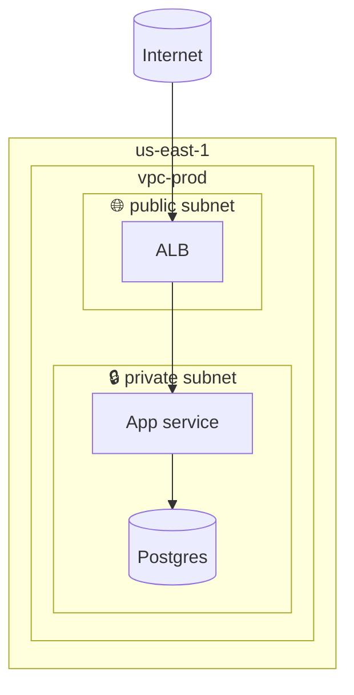

# Mermaid flowchart — the architecture workhorse

The right default for *deployment*, *infrastructure*, *integration*, and
*topology* diagrams. Renders cleanly in GitHub, Confluence, Azure DevOps
Wiki, and GitLab.

## Skeleton

````

````

`flowchart TB` is top-to-bottom — best for deployment hierarchies.
`flowchart LR` is left-to-right — best for request flows. Pick one
and stick with it within a diagram.

## Node shapes (architecture-relevant)

| Shape | Mermaid | Use for |
| --- | --- | --- |
| Rectangle | `A[Label]` | Service, component, generic |
| Rounded | `A(Label)` | External actor, person |
| Stadium | `A([Label])` | Start / end / boundary marker |
| Subroutine | `A[[Label]]` | Queue, topic, channel |
| Cylinder | `A[(Label)]` | Database, persistent store |
| Trapezoid | `A[/Label/]` or `A[\Label\]` | Object store, blob, file system |
| Diamond | `A{Label}` | Decision, conditional routing |
| Hexagon | `A{{Label}}` | External system, third-party |
| Circle | `A((Label))` | Junction, fan-in / fan-out |

Be consistent across the diagram — pick one shape per *category* of
thing and never mix.

## Edges

| Mermaid | Meaning |
| --- | --- |
| `A --> B` | Synchronous call, A initiates |
| `A -.-> B` | Asynchronous call, fire-and-forget |
| `A --o B` | Observation / read-only |
| `A --x B` | Failure path / terminates |
| `A === B` | Strong / heavy coupling (used sparingly) |
| `A -->|"label"| B` | Labeled edge — name the protocol or payload |

**Always label edges** that cross a trust boundary or carry data.
"HTTPS" alone is fine; "gRPC orders.v2" is better; "uses" is wrong.

## Subgraphs — for boundaries

Subgraphs are the workhorse for cloud boundary nesting. Nest them
inside-out for visual clarity.

````

````

Use a dashed border for *trust* boundaries — Mermaid renders this via
the `classDef` mechanism:

```
classDef trust stroke-dasharray: 5 5
class accountA,accountB trust
```

## Styling — use sparingly

Stick to defaults. The exception is the trust-boundary `classDef`
above. Heavy theming rots fast and doesn't reproduce across wiki
renderers.

## Common architecture pitfalls

- **Top-down flowchart used as a request flow.** Switch to
  `flowchart LR` or use a `sequenceDiagram`.
- **One mega-flowchart with 30 nodes.** Split by scope sentence.
- **All edges unlabeled.** A diagram without labeled edges is
  abstract art.
- **Mixing shapes inconsistently** — `[Service A]` and `(Service B)`
  for two services that play the same role. Pick one.
