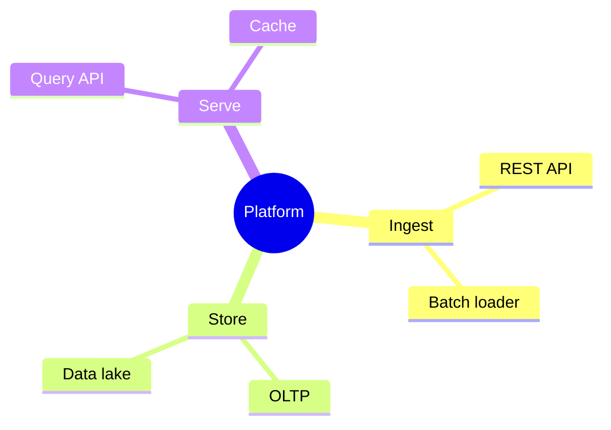
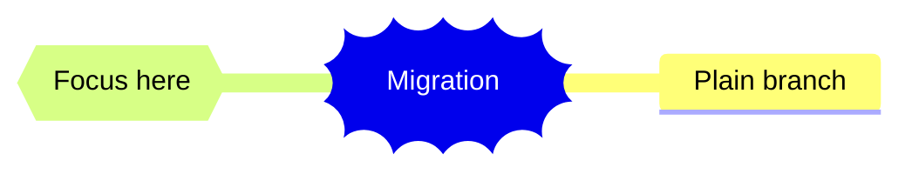

# Mermaid mindmap — hierarchical decomposition

The right notation for a **pure hierarchy**: a decomposition of a system
into parts, a breakdown of a capability into sub-capabilities, a topic
tree. One root, branches, no cross-links — if things connect sideways,
it's a flowchart, not a mindmap.

**Newer grammar — not universally rendered.** `mindmap` is a newer
Mermaid notation and, like `architecture-beta`, **renders inconsistently
across enterprise wikis** as of mid-2026 (varies by Mermaid version and
wiki integration). Offer it when the venue is confirmed to render it
(GitHub, a recent Mermaid Live Editor link, a Mermaid-CLI PNG); for an
older Confluence / Azure DevOps Wiki / GitLab, fall back to a nested
Markdown bullet list, which carries the same hierarchy.

## Skeleton

````

````

**Hierarchy is set by indentation** — deeper indent = child. There are no
edge declarations; nesting *is* the structure. Keep indentation
consistent (2 spaces per level is conventional).

## Node shapes

| Shape | Syntax | Use for |
| --- | --- | --- |
| Default | `Text` | Ordinary branch node |
| Circle | `id((Text))` | The root, or an emphasized hub |
| Rounded / square | `id(Text)` / `id[Text]` | Sub-branches, when you want a box |
| Cloud / bang / hexagon | `id)Text(` / `id))Text((` / `id{{Text}}` | Accent shapes — use at most one, sparingly |

Only the root needs a distinctive shape. Resist decorating every node —
shape noise defeats the "one glance" purpose. Applied sparingly:

````

````

## When mindmap is the right choice

- **Decomposition** — "break this system / capability / problem into its
  parts", where the parts form a tree.
- **A topic or taxonomy tree** — categories and sub-categories.
- Brainstorm-style expansion from a single central idea.

## When to use something else

- **Things connect sideways** (a node has two parents, or branches link to
  each other) → it's a graph, not a tree → `flowchart`.
- **Sequence or lifecycle** (order matters, states transition) →
  `sequenceDiagram` or `stateDiagram-v2`.
- **Data entities and relationships** → `erDiagram`.

## Complexity budget

Keep it to **≤ 3 levels deep** and **≤ 5 branches** off the root. A
mindmap's value is the shape you take in at a glance; a four-level,
twenty-leaf tree is a file listing. Go deeper only by splitting a branch
into its own mindmap with a scope sentence.
