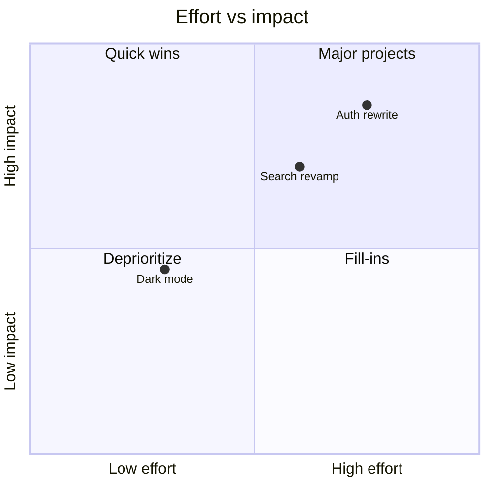

# Mermaid quadrant — 2×2 prioritization and positioning

The right notation for a **two-axis trade-off**: effort vs. impact,
reach vs. cost, urgency vs. importance, a competitive-positioning map.
Items are plotted as points; the two axes and four quadrants carry the
meaning.

**Newer grammar — not universally rendered.** `quadrantChart` is a newer
Mermaid notation and, like `architecture-beta`, **renders inconsistently
across enterprise wikis** as of mid-2026 (varies by Mermaid version and
wiki integration). Offer it when the venue is confirmed to render it
(GitHub, a recent Mermaid Live Editor link, a Mermaid-CLI PNG); for an
older Confluence / Azure DevOps Wiki / GitLab, fall back to a Markdown
table with an `effort` and `impact` column.

## Skeleton

````

````

## Syntax

| Element | Syntax |
| --- | --- |
| Title | `title <text>` |
| X axis | `x-axis <low label> --> <high label>` |
| Y axis | `y-axis <low label> --> <high label>` |
| Quadrant labels | `quadrant-1` … `quadrant-4` (top-right, top-left, bottom-left, bottom-right) |
| Plotted item | `<label>: [<x>, <y>]` with `x`, `y` in `0`–`1` |

Coordinates are normalized `0`–`1`: `[0, 0]` is bottom-left, `[1, 1]` is
top-right. Quadrant numbering is counter-clockwise from the top-right
(`quadrant-1` = high-x / high-y).

## When quadrant is the right choice

- **Prioritization** — plotting a backlog on effort × impact (or
  value × risk) to see the quick wins vs. the money pits.
- **Positioning** — where products / competitors / options sit on two
  dimensions that matter.
- Any argument whose punchline is *"these two things trade off, and here's
  where each item lands."*

## When to use something else

- **One dimension** (just a ranking) → a sorted Markdown list or table.
- **Three or more dimensions** → a table; a 2×2 forced onto 3 axes lies.
- **Precise values matter** (the reader needs the actual numbers, not the
  relative position) → a table with the numbers.

## Complexity budget

Keep it to **≤ 8 plotted points**. A 2×2 with 15 dots is a scatter plot
pretending to be an argument — the eye can't group them. Above 8, either
cluster (plot categories, not individual items) or switch to a table.
