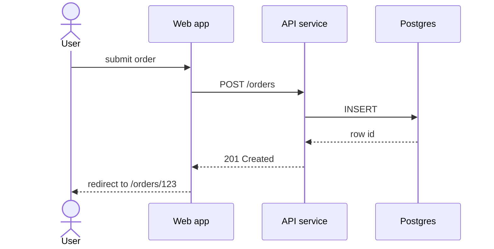

# Mermaid sequenceDiagram — request flows and handshakes

The right notation for *what happens when X arrives* — request paths,
integration handshakes, async event flows.

## Skeleton

````

````

Declare every participant at the top. `actor` for humans, `participant`
for systems. Use `as` to give a short alias and a readable label.

## Arrow shapes

| Mermaid | Meaning |
| --- | --- |
| `A->>B: msg` | Synchronous call — A blocks until B returns |
| `A-->>B: msg` | Return / reply (dashed) |
| `A-)B: msg` | Asynchronous send — A does not wait |
| `A--)B: msg` | Asynchronous reply |
| `A-xB: msg` | Sync that fails / does not return |
| `A--xB: msg` | Async that fails |

Be consistent. Don't mix `->>` (sync) and `-)` (async) for the same
kind of edge across the diagram.

## Activation bars

Show *who is doing work* during a span:

````
sequenceDiagram
    A->>+B: request
    B->>+C: subrequest
    C-->>-B: response
    B-->>-A: response
````

`+` activates the receiver; `-` on the reply deactivates. Use it when
the diagram needs to show concurrency or hold-open semantics; skip it
when the flow is purely linear.

## Alternative and parallel paths

```
alt happy path
    A->>B: success request
    B-->>A: 200 OK
else error
    A->>B: failing request
    B-->>A: 500
end

par fan-out
    A->>B: branch 1
and
    A->>C: branch 2
end

opt only sometimes
    A->>B: optional call
end
```

Use `alt` for mutually exclusive paths, `par` for concurrent paths,
`opt` for "happens sometimes".

## Notes and separators

```
Note over A,B: assumption: token already validated
Note right of A: TODO: clarify retry policy
```

Notes are the right way to surface *assumptions the picture can't
show* — auth state, prior context, time skips.

## Loops

```
loop every 30s
    Worker->>Queue: poll
    Queue-->>Worker: batch
end
```

## Common architecture pitfalls

- **Happy path only.** Add at least one `alt` for the failure case
  that matters. A flow without error handling is fiction.
- **Unnamed participants.** Every box has an alias and a label;
  `participant A as User-service [Go, gRPC]` is fine and answers
  "what tech" at a glance.
- **Time skips with no note.** If the flow waits 24 hours for a
  human, `Note over B: waits for human approval (≤24h)` makes it
  honest.
- **Diagram drives the design.** Sequence diagrams describe flows
  that already exist or are being committed to; if you find
  yourself inventing the flow *as you draw*, switch back to a
  design doc first.
