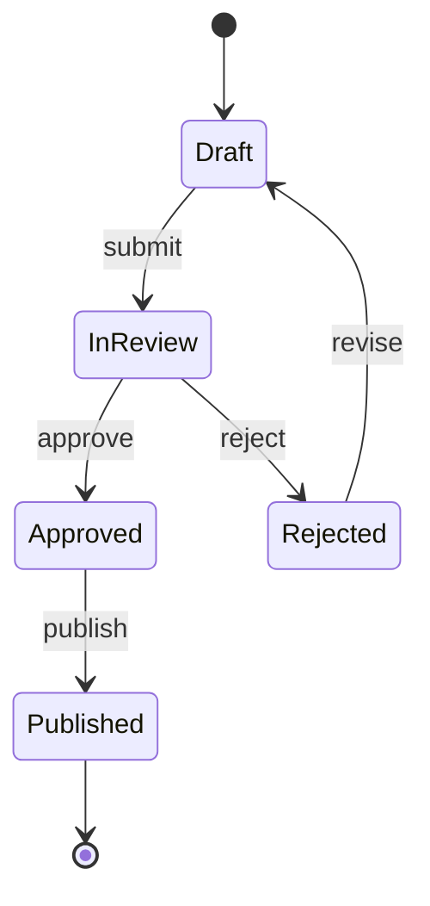

# Mermaid stateDiagram-v2 — lifecycles and workflows

The right notation for *what states does this go through, and what
event moves it between them*. Order workflows, deployment lifecycles,
session states, document-approval flows.

Always use `stateDiagram-v2` — the older `stateDiagram` syntax is
deprecated.

## Skeleton

````

````

`[*]` is the implicit initial / terminal state. Every reachable
state has a path *to* `[*]` (or to a terminal state); orphans are
rubric failures.

## Composite (nested) states

When a state has its own internal lifecycle, nest it:

```
state Fulfillment {
    [*] --> Picking
    Picking --> Packing: items ready
    Packing --> Shipped: handed to carrier
    Shipped --> [*]
}

Approved --> Fulfillment: begin fulfillment
Fulfillment --> Complete: shipped
```

Composite states let you keep the top-level view legible while
preserving detail under a state when the reader needs it.

## Concurrent regions

For states that run in parallel:

```
state Active {
    [*] --> Listening
    Listening --> Responding: event
    Responding --> Listening
    --
    [*] --> Logging
    Logging --> Logging: every event
}
```

The `--` separator splits a composite state into concurrent regions.
Use this sparingly — it's powerful but easy to over-use.

## Transition labels — what event fires the transition

| Pattern | Example |
| --- | --- |
| Just an event | `Draft --> InReview: submit` |
| Event with condition | `InReview --> Approved: approve [reviewer=lead]` |
| Event with action | `InReview --> Approved: approve / send notification` |
| Auto-transition | `Loading --> Ready: when load complete` |

Be consistent — pick a labeling convention and stay with it across
the diagram.

## Notes

```
note right of InReview
    SLA: response within 48h
end note
```

Use notes to surface non-functional context — SLAs, ownership,
data-retention rules — that the transition labels can't carry.

## Choice and fork / join

```
state choice <<choice>>
state fork <<fork>>
state join <<join>>

InReview --> choice
choice --> Approved: score >= 80
choice --> Rejected: score < 80
```

`choice` is the diamond / decision; `fork` and `join` model parallel
branches. Use only when the diagram is actually about decisions or
concurrency — otherwise the regular state arrows are clearer.

## Common architecture pitfalls

- **State name = past-tense verb.** "Approved" passes; "Approve"
  fails — that's an event, not a state.
- **Unreachable state.** A state with no inbound transition that
  isn't the initial state is a bug in the picture or the system.
- **Implicit initial state.** Always draw `[*] --> Initial` so the
  reader knows where to start.
- **State diagram used for what should be a sequence.** If the
  question is *who calls what when*, use `sequenceDiagram`.
