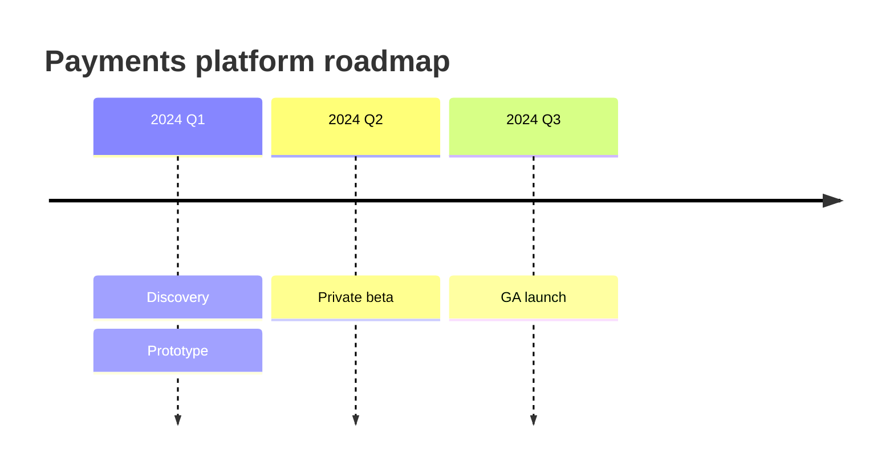
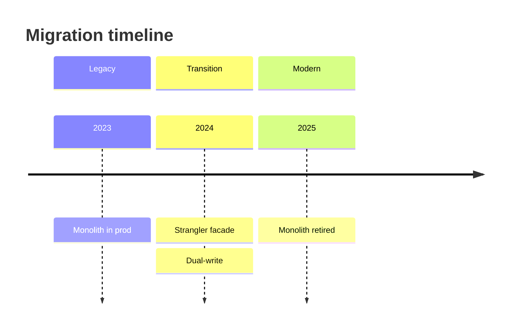

# Mermaid timeline — chronology and roadmaps

The right notation for a **time-ordered** story: a product roadmap, a
release history, a migration schedule, an incident chronology. One axis
(time), events hung off it in order.

**Newer grammar — not universally rendered.** `timeline` is a newer
Mermaid notation and, like `architecture-beta`, **renders inconsistently
across enterprise wikis** as of mid-2026 (varies by Mermaid version and
wiki integration). Offer it when the venue is confirmed to render it
(GitHub, a recent Mermaid Live Editor link, a Mermaid-CLI PNG); for an
older Confluence / Azure DevOps Wiki / GitLab, fall back to a Markdown
table of `date → milestone`.

## Skeleton

````

````

## Grouping into periods

Use `section` to band events into eras / phases — each section renders
in its own colour band.

````

````

## Syntax

| Element | Syntax |
| --- | --- |
| Title | `title <text>` (optional, one per diagram) |
| Time period + event | `<period> : <event>` |
| Multiple events at one period | `<period> : <event> : <event> : …` |
| Period band | `section <name>` (events under it until the next section) |

The `<period>` is free text — `2024`, `2024 Q1`, `Jan`, `Day 1`,
`v2.0`. Keep the label short; long periods crowd the axis.

## When timeline is the right choice

- A **roadmap** — quarters or releases with the work in each.
- A **chronology** — what happened, in order (incident post-mortem,
  project history).
- A **release / version history** — versions along the axis.

## When to use something else

- **Comparing options side by side** → Markdown table, not a timeline.
- **Durations, dependencies, or scheduling** (task A blocks task B, this
  runs for 3 weeks) → a Gantt chart (`gantt`), which models start/end and
  dependencies; `timeline` only models *order*, not duration.
- **A branching sequence of states** → `stateDiagram-v2`.

## Complexity budget

Keep it to **≤ 6 periods** and **≤ 3 events per period** — beyond that
the axis crowds and the "at a glance" value is lost. Split a long history
into two timelines with scope sentences ("the 2023 rebuild", "the 2024
launch") rather than one dense strip.
