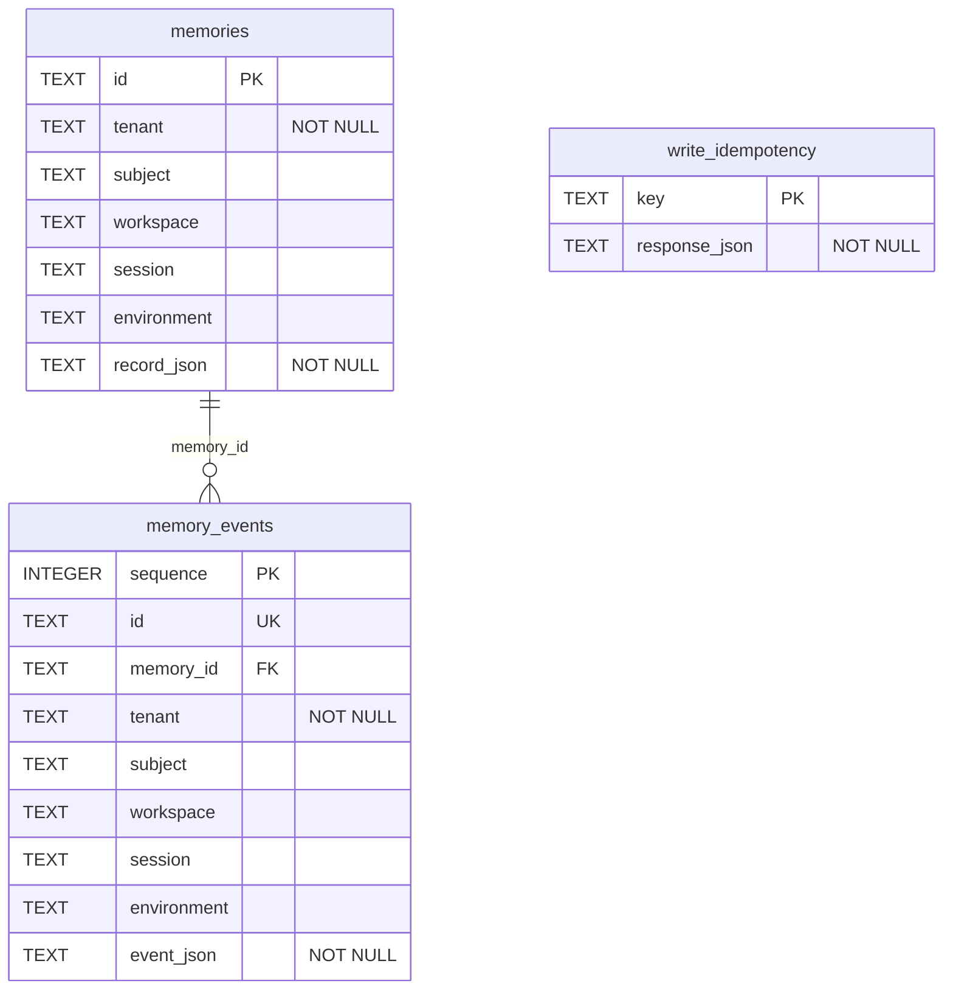
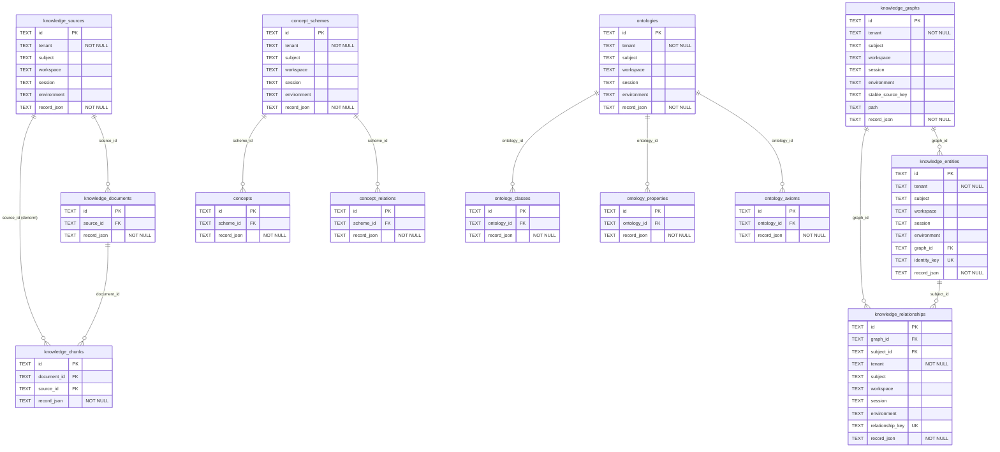
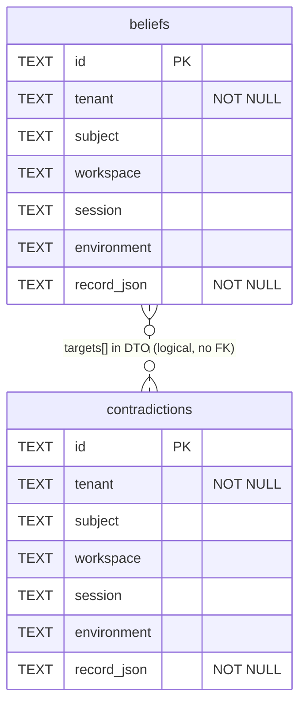
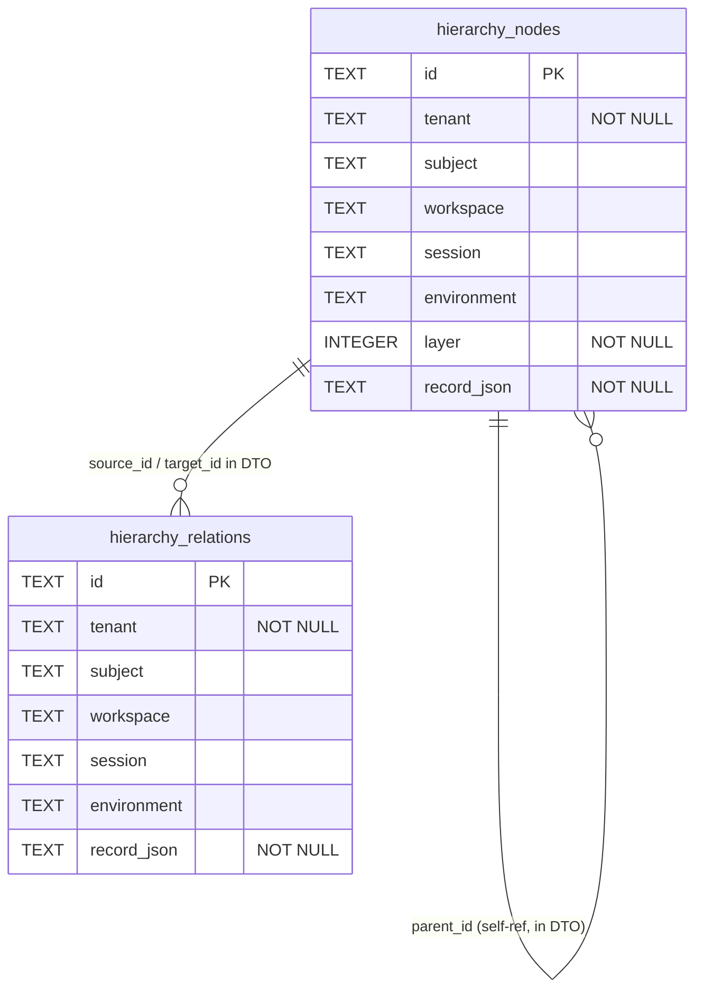
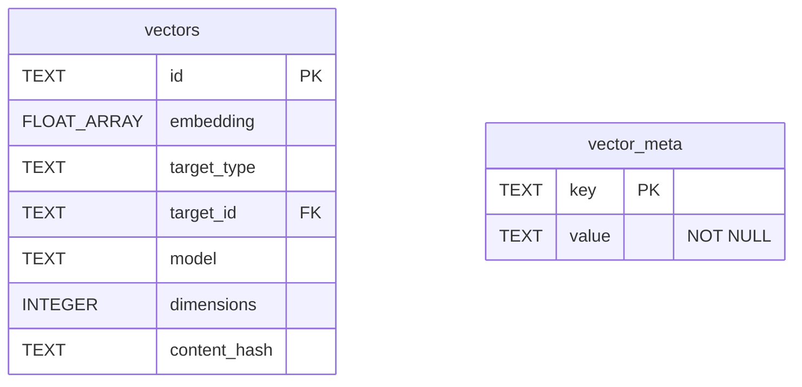

# Database Persistence — Schema & ER Reference

> Physical persistence layer for engram. This documents **every object that is
> written to disk** by the storage adapters: the SQLite backend (the active
> default) and the embedded SurrealDB backend (`engram-store-surreal`).
>
> This is the *physical* view. For the logical/domain model see
> [`docs/domain-data-model.md`](domain-data-model.md); for adapter design
> rationale see [`docs/sql-adapter-design.md`](sql-adapter-design.md).

## 1. Persistence architecture at a glance

engram has two storage backends today. Both are embedded (in-process, no server)
and disk-backed. A backend is selected by configuration at
`EngramProvider::open` time.

| Backend | Crate | Engine | Physical layout | Tables created by |
|---|---|---|---|---|
| **SQLite** (active default) | `engram-store-sqlite` (`adapters/sqlite`) | rusqlite + `sqlite-vec` | One `.db` file per capability family (default `MultiFileDirectory`), or one shared file (`SingleFile`) | `adapters/sqlite/src/<family>/schema.rs` + `vector/index.rs` |
| **SurrealDB** | `engram-store-surreal` (`adapters/surreal`) | embedded **SurrealKV**, namespace `engram` / database `engram` | One SurrealKV store at the configured path; tables are schemaless and auto-created on first record write | `adapters/surreal/src/<cell>.rs` (implicit) |

Wiring (which adapters get constructed and which tables therefore get created on
first use) lives in:
- SQLite: [`core/integration/src/sqlite/bootstrap.rs`](../core/integration/src/sqlite/bootstrap.rs)
- Surreal: [`core/integration/src/surreal/bootstrap.rs`](../core/integration/src/surreal/bootstrap.rs)

### 1.1 The two cross-cutting conventions

Everything below follows two rules. Understanding them makes the whole schema
mechanical.

**A. Lossless contract JSON + projected scope columns (SQLite).** Every record
is stored *whole* as the accepted contract payload in a `record_json` (SQLite)
or `data` (Surreal) column. On top of that, a few high-traffic lookup/scope
fields are **projected into real columns** so reads can filter/join without
parsing JSON:

- `id TEXT PRIMARY KEY` — the record id.
- **Scope columns** — `tenant` (always `NOT NULL`), and optional
  `subject`, `workspace`, `session`, `environment`. These are the visibility
  envelope: a read sees a record only when `scope_allows(record_scope,
  request_scope)` (tenant must match; each optional field, when set on the
  *request*, must equal the record's).
- **Relationship columns** — e.g. `source_id`, `document_id`, `graph_id`,
  `scheme_id`, `ontology_id`, `layer`, `identity_key`, `relationship_key`,
  `stable_source_key`, `path`. Pure query accelerators; not enforced foreign
  keys.
- `record_json TEXT NOT NULL` — the full DTO, the source of truth.

> Only records that **carry their own scope** get the scope columns. Children
> that **inherit** visibility from an owner (e.g. a chunk inherits its source's
  scope) store only the owner's id and are filtered by joining to the owner.
> See `adapters/sqlite/src/knowledge/schema.rs:1` header comment.

**B. The `data`-wrapper (Surreal).** SurrealDB attaches its own record metadata
to each thing (`id`, etc.), so every cell stores the full DTO under a single
`data` field: `UPSERT type::thing('<table>', $key) SET data = $record`, and
reads `SELECT data FROM <table>`. Logically each Surreal table is one engram
record type; the field shape is identical to the matching SQLite `record_json`.

## 2. SQLite backend

Default layout (`MultiFileDirectory`) → five files under `<storage_path>/`:

| File | Capability family | Adapter open |
|---|---|---|
| `memory.db` | memory + lifecycle + write idempotency | `SqlMemoryService::open_file` |
| `knowledge.db` | knowledge, graph, taxonomy, ontology, **identity**, provenance query | `SqlKnowledgeStore::open_file` |
| `belief.db` | belief synthesis + contradiction | `SqlBeliefStore::open_file` |
| `hierarchy.db` | hierarchy nodes + relations | `SqlHierarchyStore::open_file` |
| `vectors.db` | embedding vector index + meta | `SqliteVectorIndex::open_with_embedding_space` |

In `SingleFile` layout all five open the same file; the table names are disjoint
across families so there are no collisions
(`core/integration/src/sqlite/bootstrap.rs:56`).

> **ER diagram conventions.** Each diagram below is **one physical SQLite
> database file**, drawn database-centric: every table, every column, its SQLite
> type, and key markers — `PK` primary key, `FK` a projected referential column,
> `UK` unique, and `"NOT NULL"`. Every row also stores the lossless contract
> body in `record_json` (source of truth; the other columns are query
> accelerators projected out of it). Relationship lines are **projected
> referential columns, not enforced `FOREIGN KEY` constraints** — the SQLite
> adapter declares no FKs; referential integrity is enforced at the application
> layer. Edges labelled *"in DTO"* live inside `record_json`, not as columns.

### 2.1 `memory.db`

Source: `adapters/sqlite/src/memory/schema.rs:13`

| Table | Purpose |
|---|---|
| `memories` | One row per accepted `MemoryRecord` (lossless DTO in `record_json`). Scope columns drive visibility filtering. |
| `memory_events` | Append-only lifecycle log: write/redact/archive/forget/tombstone. Ordered by `sequence` (autoincrement PK); `id` is the unique event id; `memory_id` links back to the memory (nullable — some events are scope-level). |
| `write_idempotency` | Idempotent write cache. Keyed by the request's idempotency key; stores the serialized `WriteMemoryResponse` so a replay returns the original result without re-writing. (Standalone — no FK.) |

> No secondary indexes exist on this family — v1 reads are PK lookups plus
> in-Rust scope/status/policy filtering over `record_json`.

### 2.2 `knowledge.db`

Source: `adapters/sqlite/src/knowledge/schema.rs:13`. The largest database: 13
tables across four repositories (`KnowledgeRepository`,
`KnowledgeGraphRepository`, `TaxonomyRepository`, `OntologyRepository`) plus the
**identity** capability (which adds no table of its own — see §2.6).

| Table | Purpose | Scope |
|---|---|---|
| `knowledge_sources` | A grounded knowledge source (filesystem/git/…). | owner |
| `knowledge_documents` | A document within a source. | inherits source |
| `knowledge_chunks` | An addressable chunk of a document. Stores **both** `document_id` and `source_id` (denormalized) for direct lookup without a join. | inherits source |
| `knowledge_graphs` | A named graph container; repo-identity attribution via `stable_source_key` + `path`. | owner |
| `knowledge_entities` | Graph nodes; `graph_id` links to its graph; `identity_key` is the dedup/identity hash (§2.6). | owner |
| `knowledge_relationships` | Directed edges; `graph_id` + `subject_id` projected for neighbor queries; `relationship_key` is the exact-edge dedup hash. | owner |
| `concept_schemes` | A SKOS concept scheme. | owner |
| `concepts` | A concept in a scheme. | inherits scheme |
| `concept_relations` | A skos:broader/narrower-style link between concepts. | inherits scheme |
| `ontologies` | An ontology. | owner |
| `ontology_classes` | A class in an ontology. | inherits ontology |
| `ontology_properties` | A property in an ontology. | inherits ontology |
| `ontology_axioms` | An axiom in an ontology. | inherits ontology |

#### 2.2.1 Knowledge indexes

From `adapters/sqlite/src/knowledge/schema.rs:127` and `:165`:

| Index | Table(columns) | Kind |
|---|---|---|
| `idx_chunks_document` | `knowledge_chunks(document_id)` | plain |
| `idx_chunks_source` | `knowledge_chunks(source_id)` | plain |
| `idx_documents_source` | `knowledge_documents(source_id)` | plain |
| `idx_relationships_graph_subject` | `knowledge_relationships(graph_id, subject_id)` | plain |
| `idx_concepts_scheme` | `concepts(scheme_id)` | plain |
| `idx_concept_relations_scheme` | `concept_relations(scheme_id)` | plain |
| `idx_ontology_classes` | `ontology_classes(ontology_id)` | plain |
| `idx_ontology_properties` | `ontology_properties(ontology_id)` | plain |
| `idx_ontology_axioms` | `ontology_axioms(ontology_id)` | plain |
| `idx_graphs_stable_source_key` | `knowledge_graphs(stable_source_key)` | plain |
| `idx_graphs_path` | `knowledge_graphs(path)` | plain |
| `idx_entities_graph_id` | `knowledge_entities(graph_id)` | plain |
| `idx_entities_identity` | `knowledge_entities(identity_key) WHERE identity_key IS NOT NULL` | **UNIQUE partial** |
| `idx_relationships_exact_key` | `knowledge_relationships(relationship_key) WHERE relationship_key IS NOT NULL` | **UNIQUE partial** |

The two UNIQUE partial indexes are the concurrency backbone of the **identity**
capability (§2.6). The `stable_source_key` / `graph_id` / `identity_key` /
`relationship_key` / `path` columns are added by a migration `ALTER TABLE` block
(`schema.rs:141`) so existing DB files predating those specs are upgraded in
place.

### 2.3 `belief.db`

Source: `adapters/sqlite/src/belief/schema.rs:11`. Two flat tables. Both carry
their own scope. A `contradiction` references its two target beliefs **inside its
DTO** (`targets[]`) — there is no column FK, so the link is drawn dotted/logical.

| Table | Purpose |
|---|---|
| `beliefs` | A synthesized belief (subject → content, with confidence, valid-time window `valid_from`/`valid_until`, status, supersession chain). Bi-temporal: **valid-time** (`as_of`) queries are supported; **record-time** history is *not* (current rows only). |
| `contradictions` | A detected contradiction between two belief targets (held in `targets[]` inside `record_json`). Resolution state lives in the DTO. |

### 2.4 `hierarchy.db`

Source: `adapters/sqlite/src/hierarchy/schema.rs:11`. The node tree shape
(`parent_id`, `members`) and the relation endpoints (`source_id`/`target_id`,
predicate, weights) all live inside `record_json` — only `layer` is projected as
a column. Edges are therefore drawn logical.

| Table | Purpose |
|---|---|
| `hierarchy_nodes` | Aggregate/base nodes. `layer` is projected for layer-bounded traversal; the parent pointer (`parent_id`) and members live in the DTO, giving the tree its shape. |
| `hierarchy_relations` | Typed edges between nodes (`source_id`→`target_id`, predicate, optional layer/strength/inter-cluster flag). Both endpoints and weights are in the DTO. |

> Path navigation (`path_for`) loads visible nodes + relations and runs the
> shared `engram_hierarchy::navigation::navigate` in Rust — identical logic to
> the Surreal cell.

### 2.5 `vectors.db`

Source: `adapters/sqlite/src/vector/index.rs:318` (`vectors`) and `:342`
(`vector_meta`). `vectors` is a `sqlite-vec` **virtual table** (`vec0`); its
`embedding` column is a fixed-width `float[DIM]` blob, shown as `FLOAT_ARRAY`.
`target_id` is a *cross-database* logical pointer (disambiguated by
`target_type`) to a row in `memories`, `knowledge_chunks`, `knowledge_entities`,
or `concepts` — not an enforceable FK — so no edge is drawn to those tables.

| Object | Purpose |
|---|---|
| `vectors` | One row per embedded target. `embedding` is the KNN-indexed vector; `target_type`/`target_id` link back to a memory or knowledge target (logical); `model`/`dimensions`/`content_hash` record embedding provenance. **Written by** `SqliteVectorIndex::insert` (`vector/index.rs:133`, `INSERT INTO vectors …`). |
| `vector_meta` | Key/value guard table recording the `EmbeddingSpace` the index was built with (`provider`, `model`, `dimensions`, `prompt_profile`, `normalization`). On reopen, if the configured space differs from the persisted one, the capability reports `RequiresReindex`. |

### 2.6 Identity capability — no new table

The **identity** capability (entity/relationship dedup, merge, collision
discovery, consolidation) does **not** introduce a table. It is implemented by
`SqlIdentityStore` (`adapters/sqlite/src/knowledge/identity.rs`) over the
**existing** `knowledge_entities` and `knowledge_relationships` tables, using two
projected columns + their UNIQUE partial indexes:

- `knowledge_entities.identity_key` — content hash of an entity's identifying
  attributes. `idx_entities_identity` (UNIQUE, partial) makes "same identity →
  one row" enforceable, so concurrent writers converge to a single canonical
  entity.
- `knowledge_relationships.relationship_key` — exact-edge hash.
  `idx_relationships_exact_key` (UNIQUE, partial) dedups semantically identical
  edges.

`consolidate_entities` runs a transactional redirect+coalesce+delete against
those two tables (`identity.rs:243`): it redirects `subject_id`, rewrites the
`object`/`subject` refs inside relationship `record_json`, coalesces duplicate
relationships by `relationship_key`, and deletes the duplicate entity rows.

> In the Surreal backend, identity is **not yet wired**
> (`bootstrap_surreal` reports `identity` only via the knowledge store; the
> `EntityIdentityRepository` SQLite implementation has no Surreal counterpart
> yet — see `core/integration/src/surreal/bootstrap.rs`).

## 3. SurrealDB backend

Source: `adapters/surreal/src/{memory,knowledge,belief,hierarchy,vector}.rs`.
One embedded SurrealKV store, namespace `engram`, database `engram`
(`adapters/surreal/src/connection.rs`). Tables are **schemaless** and are
created implicitly on first `UPSERT`. Each record stores the full DTO under a
`data` field, so the SQLite `record_json` and the Surreal `data` field carry the
same payload — there is a one-to-one mapping from each SQLite table to a Surreal
table (singular names). The logical relationships are identical to §2.

| Capability | Surreal table(s) | Source |
|---|---|---|
| memory | `memory`, `memory_event` | `memory.rs:29` |
| knowledge corpus | `knowledge_source`, `knowledge_document`, `knowledge_chunk` | `knowledge.rs:24` |
| knowledge graph | `knowledge_entity`, `knowledge_relationship`, `knowledge_graph` | `knowledge.rs:27` |
| taxonomy | `concept_scheme`, `concept`, `concept_relation` | `knowledge.rs:30` |
| ontology | `ontology`, `ontology_class`, `ontology_property`, `ontology_axiom` | `knowledge.rs:33` |
| belief | `belief`, `contradiction` | `belief.rs:24` |
| hierarchy | `hierarchy_node`, `hierarchy_relation` | `hierarchy.rs:18` |
| vectors | `vector_record` (+ `DEFINE INDEX vec_idx … MTREE DIMENSION D`) | `vector.rs:20`, `vector.rs:77` |

Notable Surreal specifics:
- **No `record_json`/scope columns.** The whole DTO (including its `scope`) is
  under `data`; scope filtering happens in Rust after `SELECT data FROM <table>`.
- **No write-idempotency table.** The Surreal memory cell mirrors the S7 stub
  lifecycle and does not persist an idempotency cache.
- **Vector index** is an MTREE index (`vec_idx`) defined lazily and idempotently
  on first `insert`; KNN search uses the `<|k|>` operator. Cosine similarity is
  computed in Rust from the returned embeddings.
- **Schema/version metadata** (`SCHEMA_VERSION`, `ADAPTER_VERSION`) is reported
  by the SQLite observability handle only; Surreal has no equivalent persisted
  meta.

## 4. Backend comparison

| Aspect | SQLite | SurrealDB |
|---|---|---|
| Schema definition | explicit `CREATE TABLE IF NOT EXISTS` in `schema.rs` | schemaless; implicit on first write |
| Record body | `record_json` column | `data` field |
| Scope filtering | projected `tenant`/`subject`/… columns + indexes | in-Rust over `data.scope` |
| Relationships | projected FK-like columns (`source_id`, `graph_id`, …) | inside `data` DTO |
| Referential integrity | none declared (no `FOREIGN KEY`) — app-layer enforced | n/a (schemaless) |
| Idempotent writes | `write_idempotency` table | not persisted |
| Vectors | `sqlite-vec` `vec0` virtual table + `vector_meta` | `vector_record` + MTREE index |
| Identity dedup | UNIQUE partial indexes on `identity_key`/`relationship_key` | not wired |
| Secondary indexes | knowledge family only (§2.2.1) | MTREE on vectors only |
| File layout | 5 `.db` files (default) or 1 shared | 1 SurrealKV store |

## 5. What is NOT persisted

Several runtime capabilities deliberately keep **no** database tables:

| Capability | Why no table |
|---|---|
| **Lexical retrieval** (`engram-store-lexical`, Tantivy) | A Tantivy **directory index**, not SQL. The unified-recall lane builds an in-RAM index with a knowledge-store-backed resolver. |
| **Associative-graph retrieval** (Personalized PageRank) | Stateless: runs PPR over the live knowledge graph on each query. |
| **Community-summary retrieval** (GraphRAG) | Recomputes community detection + ranking at query time over the graph. |
| **Cross-encoder rerank** | Pure compute over candidate lists; no storage. |
| **Consolidation — decay** | Mutates existing `memories` rows (marks expired memories, skipping LegalHold) via a `DecayMemorySource`. Owns no table. |
| **Consolidation — reflection** | Reads active memories, writes derived **beliefs** into `beliefs`. Owns no table. |
| **Migration service** | v1 runs in `DryRun`; fingerprinting is computed, not stored. |
| **Observability** | Record counts are derived at call time by listing wired stores; capability report is held in memory. |

## 6. Complete table inventory (quick index)

**SQLite (21 regular tables + 1 virtual table = 22 objects)**
`memory.db`: `memories`, `memory_events`, `write_idempotency` ·
`knowledge.db`: `knowledge_sources`, `knowledge_documents`, `knowledge_chunks`,
`knowledge_entities`, `knowledge_relationships`, `knowledge_graphs`,
`concept_schemes`, `concepts`, `concept_relations`, `ontologies`,
`ontology_classes`, `ontology_properties`, `ontology_axioms` ·
`belief.db`: `beliefs`, `contradictions` ·
`hierarchy.db`: `hierarchy_nodes`, `hierarchy_relations` ·
`vectors.db`: `vectors` (vec0), `vector_meta`.

**Surreal (20 tables)** — `memory`, `memory_event`, `knowledge_source`,
`knowledge_document`, `knowledge_chunk`, `knowledge_entity`,
`knowledge_relationship`, `knowledge_graph`, `concept_scheme`, `concept`,
`concept_relation`, `ontology`, `ontology_class`, `ontology_property`,
`ontology_axiom`, `belief`, `contradiction`, `hierarchy_node`,
`hierarchy_relation`, `vector_record` (+ `vec_idx` MTREE index).
