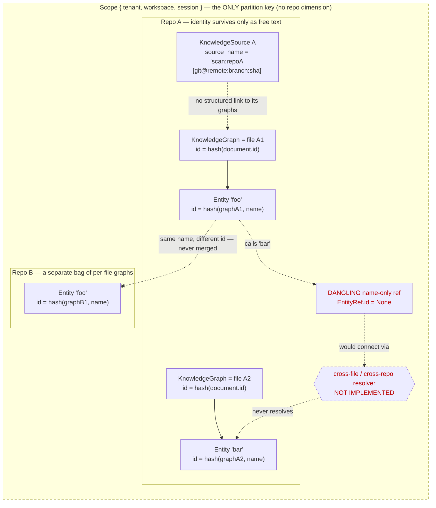
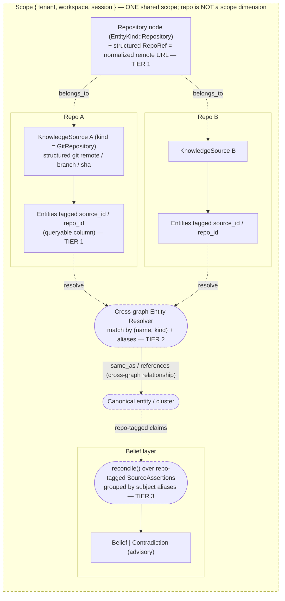

# Cross-Repo Linkage in Engram — Research

> Status: research only (no code changes). Author: exploratory study, 2026-07-04.
> Companion proposal: `docs/rfcs/0008-cross-repo-linkage.md`.

This note studies how Engram could link knowledge **across multiple
repositories**, even as a secondary capability. It moves from the conceptual
framing to the concrete keying that exists today, then to a tiered
implementation path. Findings are grounded in the current code; file:line
references are given so claims are checkable.

---

## Part 1 — The conceptual picture

### 1.1 Two different features hide under one phrase

"Cross-repo linkage" collapses two genuinely different features that live in
different layers of Engram and have very different costs. Keeping them separate
is the most important conceptual move.

| | **(A) Structural / graph linkage** | **(B) Belief / assertion linkage** |
|---|---|---|
| Question it answers | "This function / service / concept appears in repo A *and* repo B — show the connection." | "Repo A claims X about service E; repo B claims Y. Which do I trust?" |
| Layer | Knowledge graph (`core/knowledge`, extractor) | Belief layer (`core/belief`, `reconcile`) |
| Example | A shared library symbol called from three repos; a domain concept ("Order") modeled in two services | Ownership, API version, on-call, dependency — facts multiple repos assert differently |
| Current status | Specced (`graph-explorer`) but **not implemented**; edges are emitted dangling and never resolved | Engine **shipped** (`reconcile`), but single-scope-only and no repo-tagged input |

Engram's own strategic framing (`docs/research/engram-framing-synthesis.md`)
points at **(B)**: *"a portable reconciliation engine that federates the
systems already holding the facts"* — a git repo being one such system. **(A)**
is the demo-visible, cheaper one. A pragmatic program does (A) first as the
"secondary" feature and treats it as the identity foundation that (B) reuses.

### 1.2 The unifying insight

**Cross-repo linkage is the same unsolved problem as cross-*file* linkage — and
that problem is already half-built.**

When the extractor sees a call to a symbol it cannot find in the current file,
it emits an edge whose target is a *name only*, with a code comment promising
that *"the cross-file resolver connects it by name"*
([extractor.rs:167-178](../../adapters/ingest/src/extractor.rs#L167-L178)).
**That resolver does not exist.** Every graph is one file; the SQLite neighbour
query is hard-scoped `WHERE graph_id = ?1`
([service.rs:471](../../adapters/knowledge/sqlite/src/service.rs#L471)); nothing
ever joins entities across graphs.

So the machine already *knows* it has references it cannot resolve. Cross-repo
linkage is just cross-file resolution with the search space widened from "other
files in this repo" to "other files in any repo in this scope." Build the
resolver once and you get both.

### 1.3 The root gap: there is no cross-repo *identity* for anything

Everything is keyed downward into a per-file silo, and repo provenance is
unstructured text.

Three things are missing, and every linkage feature needs some subset of them:

1. **Structured repository identity.** A repo is only a folder basename plus a
   git triple *interpolated into a string*
   ([scanner.rs:262-267](../../adapters/ingest/src/scanner.rs#L262-L267)). There
   is no `RepoId`, no normalized remote URL, no queryable column. You cannot
   filter, group, or join by repo today.
2. **A resolvable entity identity that can span graphs.** Entity id =
   `hash(graph_id, name)`, so identity dies at the file boundary. There is no
   canonical/qualified symbol identity and no alias-merge across graphs.
3. **A place to hang the link.** For (A): cross-graph relationships (the domain
   type already permits this — only the *traversal* is graph-scoped). For (B):
   subject aliasing so repo-A's `service:auth` and repo-B's `auth-svc`
   reconcile as one subject.

### 1.4 The one decision to make first: how is a repo modeled?

`Scope.workspace` is documented as *"Workspace **or** repository boundary,"* so
there is a real fork:

- **(i) Repo = a `workspace` in `Scope`.** Clean isolation — but then cross-repo
  becomes **cross-scope**, which `reconcile` *explicitly forbids* ("never mix
  assertions across scopes") and which `ScopeMatcher` would block on retrieval.
  This fights the grain for *linkage*.
- **(ii) Repo = a `KnowledgeSource` within one shared scope.** Linkage stays
  *intra-scope* and therefore legal. **This is already what the demo does** —
  every scan writes into the single hard-coded scope `tenant-demo / engram /
  local`, so multiple repos already coexist; they are just not individually
  addressable.
- **(iii) Repo = an `EntityKind::Repository` node in the graph** (that variant
  already exists), with symbols linked by `belongs_to` edges — making repo
  grouping and cross-repo edges ordinary graph relationships.

**Recommendation: (ii) for isolation + (iii) for representation.** Keep repo
*out* of `Scope` so linkage remains a legal intra-scope operation; promote the
repo to a first-class structured `KnowledgeSource` *and* a `Repository` graph
node. This is the direction the code already leans.

---

## Part 2 — What exists today (verified against the code)

**Already built and reusable:**

- **Ingestion at scale.** Rust `RepositoryScanner` + `rayon` parallel ingest,
  background jobs (`POST /ingest/jobs` → poll), `.gitignore`/secret-blocklist/
  size/path-confinement, content-hash manifest for incremental re-scan
  (`background-repo-indexer`, shipped).
- **One shared ingest path** for HTTP and MCP (`scan-defaults.ts`), so a repo
  dimension added once is honoured everywhere.
- **Per-source records already carry git remote/branch/sha** — parsed back out
  of the source name by `/knowledge/stats` into `{gitRemote,gitBranch,gitSha}`
  ([app.ts:339-362](../../demo/backend/src/app.ts#L339-L362)). The raw material
  for structured repo identity exists; it is just stringly-typed.
- **The reconciliation engine** (`reconcile`, shipped): authority-tiered
  survivorship over competing claims, advisory contradictions, bitemporal
  validity, provenance-preserving. Architecturally generic over "N origins
  asserting about one subject" — it does not care whether the origins are
  catalogs or repos.
- **Domain types that already anticipate this:** `EntityKind::{Repository,
  Project, Organization}`; `KnowledgeEntity.source_refs` (an entity may cite
  evidence from *many* sources, not one owner); `KnowledgeEntity.aliases`;
  `BeliefSubject.aliases`; the domain doc reserves *"an explicit federated query
  type … added later."*

**Specced but NOT implemented:**

- `graph-explorer` spec defines cross-repo edges as *"entity-name matches across
  distinct graphs, computed client-side… no new domain types."* But
  `demo/frontend/src/lib/graph-model.ts` **does not do this** — it colours by
  Louvain community and only adds edges from shared `sourcePath` *within* a
  graph. The `/knowledge/overview` comment claiming *"cross-repo linking
  computed client-side"* is aspirational.
- The `background-repo-indexer` spec lists **"multi-repo queuing"** under *"Ask
  first"* — a known, deliberately-deferred next step.

**Decided but NOT built** (RFC-0007 follow-ons): the Registry source adapter
that emits `SourceAssertion`s, the promotion trigger family (ADR-0013), and
SQLite persistence for assertions. Only the reconciliation *core* shipped.

**Notable rough edge:** the scanner tags git repos as `SourceKind::Filesystem`,
not `GitRepository`
([scanner.rs:361](../../adapters/ingest/src/scanner.rs#L361)) — the
`GitRepository` variant is effectively unused on the demo path. Any
structured-repo work should fix this.

---

## Part 3 — What would need to be implemented (tiered)

Each tier is independently shippable and additive (no contract break).
"Secondary" work naturally lands at **Tier 0–1**.

### Tier 0 — Presentation-only cross-repo view *(smallest; realizes `graph-explorer`)*

- Map each entity → its repo via `graph_id → KnowledgeGraph → source`, and
  compute cross-repo edges by **(name, kind) match across distinct graphs**, in
  a read-model endpoint or client.
- Colour/group nodes by repo instead of only by Louvain community.
- **Cost:** no Rust, no domain change. **Value:** demo-visible cross-repo
  linking today. **Limit:** name-match is heuristic and lossy.

### Tier 1 — Structured repository identity *(the foundation everything reuses)*

- Parse the git triple into **structured provenance / a normalized `RepoRef`**
  (normalized remote URL as the stable key) instead of interpolating into
  `source_name`; fix `SourceKind::GitRepository`.
- Establish a queryable `source_id` (and/or a lifted column) so entities can be
  **filtered and grouped by repo**, and add the graph→source linkage that is
  currently absent.
- **Cost:** ingest + adapter + a lifted SQLite column, additive. **Value:** repo
  becomes a first-class, addressable thing — prerequisite for real (not
  name-guessed) linkage.

### Tier 2 — Cross-graph entity resolution *(builds the missing "cross-file resolver")*

- A resolution pass that connects the dangling name-only `EntityRef`s and mints
  **cross-graph relationships** (`references` / `same_as`). The domain already
  allows a relationship whose subject and object live in different graphs; only
  `neighbors()` is graph-scoped, so this also needs a cross-graph traversal
  query.
- Start **deterministic** (qualified-name + kind match), leave semantic/
  embedding matching as a follow-up. Optionally introduce a canonical-entity /
  entity-cluster concept.
- **Cost:** the biggest single piece of new logic. **Value:** true cross-file
  *and* cross-repo structural linkage from one mechanism.

### Tier 3 — Belief-level cross-repo reconciliation *(deepest; the RFC-0007 north star)*

- A **Registry adapter** emitting repo-tagged `SourceAssertion`s.
- Make `reconcile` group by `subject.aliases` (it currently matches
  `subject.key` literally and *ignores* aliases), relax the single-scope-per-pass
  rule (or seat repo *below* scope), and elevate repo origin from carried
  metadata to a **ranked authority** (ideally per-attribute — "code-owner repo
  wins for ownership; API-catalog wins for endpoints").
- **Cost:** highest; touches the belief contract and needs Tier 2 to know two
  repos mean the same subject. **Value:** the strategic product — an org-wide,
  authority-weighted, contradiction-aware belief layer over many repos.

---

## Part 4 — Recommendation for a "secondary" incorporation

If cross-repo is to be a secondary track, the highest-leverage, lowest-risk
slice is **Tier 1 + Tier 0**: give repos a structured identity, then render
name-matched cross-repo edges over it. That is demo-visible, fully additive,
sanctioned by the existing `graph-explorer` spec, and — critically — it lays the
exact identity foundation (structured repo + queryable grouping) that Tiers 2
and 3 require later. The deepest, most differentiated version (Tier 3) is
genuinely within reach because the reconciliation engine already exists; it is
gated almost entirely on **cross-repo *identity*, not on new reconciliation
machinery.**

**The one decision to make before any building:** how is a repo modeled — a
`Scope.workspace`, a `KnowledgeSource`, or a graph node? Recommendation:
`KnowledgeSource` + `Repository` node within one shared scope, precisely so
linkage stays a legal intra-scope operation rather than colliding with the
cross-scope prohibition baked into `reconcile` and `ScopeMatcher`.

---

## Appendix — Key files

- `core/domain/src/identity.rs` — `Scope { tenant, subject, workspace, session, environment }`
- `core/domain/src/knowledge.rs` — `KnowledgeSource`, `KnowledgeGraph`, `KnowledgeEntity`, `KnowledgeRelationship`, `SourceKind`, `EntityKind`
- `core/domain/src/assertion.rs` — `SourceAssertion`, `AuthorityTier`
- `core/belief/src/reconcile.rs` — authority-weighted survivorship (`reconcile`)
- `adapters/ingest/src/scanner.rs` — repo scan; git triple string-interpolated into `source_name`
- `adapters/ingest/src/ingestor.rs` — `source_id` / `document_id` derivation
- `adapters/ingest/src/extractor.rs` — per-file `graph_id`, `entity_id`; dangling name-only refs
- `adapters/knowledge/sqlite/src/schema.rs` — entity/relationship tables (no `source_id`/`repo_id` column)
- `adapters/knowledge/sqlite/src/service.rs` — single-graph `neighbors()` traversal
- `demo/backend/src/{app.ts,scan-defaults.ts,mcp-executors.ts}` — one shared scope, one repo per scan
- `demo/frontend/src/lib/graph-model.ts` — Louvain colouring; no repo grouping
- `docs/rfcs/0007-federated-assertion-reconciliation.md`, `docs/adr/0012`, `docs/adr/0013`
- `docs/specs/{graph-explorer,background-repo-indexer,scale-repo-ingestion}/`
- `docs/research/engram-framing-synthesis.md`
