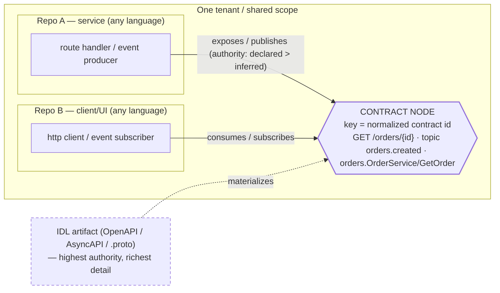

# Cross-Repo Linkage in Engram — Research

> Status: research only (no code changes). Author: exploratory study, 2026-07-04.
> Companion proposal: `docs/rfcs/0008-cross-repo-linkage.md` (interface/contract linkage).

This note studies how Engram could link knowledge **across multiple
repositories**. It moves from the conceptual framing to the concrete state of
the code, then to the proposed direction. Findings are grounded in the current
code; file:line references are given so claims are checkable.

The headline conclusion: the *valuable* cross-repo relationships in a real
system are **service integrations** — one repo exposes a REST endpoint another
calls; one publishes a Kafka topic another subscribes to — and these are linked
by a **shared interface contract, not a shared code symbol**. Symbol-name
matching cannot see them. So cross-repo linkage should be built as
**interface/contract linkage**.

---

## Part 1 — The conceptual picture

### 1.1 Two kinds of cross-repo linkage

| | **Direct linkage** | **Indirect / contract linkage** |
|---|---|---|
| What connects them | repo B references a symbol repo A *publishes* (a shared library) | repo A and repo B never reference each other's code; both reference a shared **external contract** (a route, a topic, a gRPC method) |
| Join key | a shared **symbol** — SCIP keys it as `package + version + qualified name` | a normalized **contract identifier** — `GET /orders/{id}`, `topic orders.created`, `orders.OrderService/GetOrder` |
| Language coupling | same ecosystem (shared package) | cross-language by nature (Java service ↔ TypeScript UI) |
| Prevalence | narrower — only where a genuinely shared artifact exists | the dominant cross-service pattern in microservice/UI estates |

Your motivating examples — a UI calling a microservice's REST endpoint; a service
subscribing to another's Kafka topic — are **indirect linkage**. The two sides
share no symbol and are usually in different languages, so the earlier
symbol-name-matching framing (and the pruned `graph-explorer` view) **cannot
connect them**. This is the reframe that drives RFC-0008.

### 1.2 The mechanism that works: a contract node + normalized key

Materialize the **contract itself** as a first-class node, keyed by a
normalized, language-independent identifier, and attach each repo to it with a
typed edge:

The join key is the **contract string**, not a symbol. Producer and consumer are
found by different extraction rules but normalized to the *same* key, then
joined. This is an **extract → normalize → join** problem, and it mirrors how
Backstage relates components to a standalone `API` entity via
`providesApi`/`consumesApi`.

### 1.3 Language/framework independence is real but not free

Independence comes from normalizing every framework's idiom down to **one
contract vocabulary** — not from a universal parser. You need a per-framework
rule library (Spring `@GetMapping` → `exposes(METHOD, path)`; Express
`app.get(path)`; Spring Kafka `@KafkaListener(topics=…)` → `subscribes(topic)`;
etc.). The repo already has the parsing substrate — tree-sitter multi-language
chunking (`adapters/ingest/src/tree_sitter_chunker.rs`). The framework rules are
the work.

### 1.4 The reliability gradient (this determines how "rich" the graph gets)

There are three sources of a contract fact, and they differ sharply in
reliability and richness:

1. **Contract-first / IDL** (OpenAPI, AsyncAPI, `.proto`): easiest and richest.
   The contract is already a machine-readable artifact both sides reference;
   ingest it as the canonical node and rich detail (schemas, methods, message
   types) comes for free. Highest authority.
2. **Declarative-in-code** (annotations, decorators, route builders): tractable
   with AST + per-framework rules. Medium authority.
3. **Dynamically constructed** (`fetch(baseUrl + path)`, topic from `${ENV}.…`,
   service discovery): best-effort only. Statically resolving these is
   undecidable in general (Rice's theorem), so a static resolver must
   over-approximate; **runtime signals** (OpenTelemetry-style service maps
   derived from traces) are the natural complement, not part of a static code
   graph.

### 1.5 The one decision to make first: how is a repo modeled?

`Scope.workspace` is documented as *"Workspace **or** repository boundary,"* but
the **hard partition is `tenant`** — `scope_allows` requires only `tenant` to
match exactly; `workspace`/`subject`/`session`/`environment` are optional
narrowing filters (`adapters/knowledge/sqlite/src/scope.rs:8-14`). So cross-repo
*reads* already work within a tenant regardless of repo model. Options:

- **(i) Repo = a `workspace` value.** Clean isolation, and reads still work
  (unset `workspace` spans all). But it repurposes `workspace`'s meaning and puts
  each repo in a distinct scope, so later belief reconciliation would run per-repo
  or need the reconcile single-scope rule relaxed.
- **(ii) Repo = a `KnowledgeSource` within one shared scope.** Reuses existing
  types; additive; keeps later reconciliation single-scope. **The demo already
  puts every repo in one scope.**
- **(iii) Repo = an `EntityKind::Repository` node** (variant already exists),
  with contracts/files linked via `belongs_to`.

**Recommendation: (ii) + (iii)** — a structured `KnowledgeSource` plus a
`Repository` node within one shared scope.

---

## Part 2 — What exists today (verified against the code)

**Present:**
- Deterministic code-symbol extraction: `Function`/`Class`/`Concept` entities +
  `calls`/`mentions` edges (`adapters/ingest/src/extractor.rs:107,150,280-295`),
  over ~10 languages via tree-sitter (`tree_sitter_chunker.rs`).
- Repo-scale ingest: `RepositoryScanner` + `rayon`, background jobs,
  `.gitignore`/secret/size/path controls, content-hash manifest
  (`background-repo-indexer`, shipped).
- An expressive **generic substrate** that can carry contract edges without a
  contract change: `KnowledgeRelationship` has a free-string `predicate` and
  `confidence: Option<f32>` (`core/domain/src/knowledge.rs:218-236`);
  `SourceAssertion` carries `authority_level: AuthorityTier`
  (`Primary|Secondary|Inferred`, `core/domain/src/assertion.rs`); `reconcile`
  ranks by authority under a policy (`core/belief/src/reconcile.rs:132-158`);
  `KnowledgeEntity.source_refs: Vec<EvidenceRef>` lets one entity accrue
  evidence from multiple repos.
- Prior internal design intent: `docs/research/more/it-sdlc-ontology-*.md`
  already specifies `produces`/`subscribesTo`/`sendsTo`/`receivesFrom`
  predicates, an `InterfaceContract`/`EventStream` concept, and an unbuilt
  OpenAPI/AsyncAPI "Contract scanner."

**Absent (the gap for contract linkage):**
- **No protocol/interface awareness** — no routes, verbs, topics, channels, or
  gRPC methods; no OpenAPI/AsyncAPI/`.proto` ingestion (spec files are
  classified as plain `Code`/`Text`, `adapters/ingest/src/scanner.rs:357-358`).
- **`EntityKind::Api` is defined but never produced** (`knowledge.rs:185`); no
  `exposes`/`consumes`/`publishes`/`subscribes` predicate is ever emitted.
- **No structured repo identity** — a repo survives only as free text in
  `source_name` (`scanner.rs:262-267`), tagged `SourceKind::Filesystem` not
  `GitRepository` (`scanner.rs:361`).
- **No cross-repo / cross-graph identity or resolution.** Each *file* is its own
  graph (`graph_id = hash(document.id)`), entity id = `hash(graph_id, name)`, so
  the same interface named in two repos becomes two disjoint entities; the
  "cross-file resolver" is a comment (`extractor.rs:168`), not code; `neighbors()`
  is hard-scoped `WHERE graph_id = ?1` (`adapters/knowledge/sqlite/src/service.rs:471`).
- The pruned `graph-explorer` view matched on **bare entity name** — which
  cannot connect a Java controller to a TypeScript `fetch`, and over-links common
  names. (`explorer.tsx` is deleted; superseded by `demo-reimagine`.)

---

## Part 3 — Proposed direction (see RFC-0008 for the decision)

Cross-repo linkage as **contract linkage**, on a structured repo-identity
foundation, extracted along the reliability gradient:

- **Foundation** — structured repo identity (normalized git remote key) +
  `Repository` node, all repos in one shared scope.
- **Phase A (first slice)** — contract-first ingestion: parse OpenAPI/AsyncAPI/
  `.proto` in repos → `Api`/channel contract nodes keyed by the normalized
  identifier, with `exposes`/`publishes` edges and rich detail from the spec.
- **Phase B** — declarative-in-code extraction: per-framework tree-sitter rules
  emit participation edges to the same contract keys.
- **Join & accrual** — link producers↔consumers on the shared key; one contract
  node accrues `source_refs` from every participating repo.
- **Phase D (confidence & drift)** — three *distinct* mechanisms, not one call:
  the participation *edge* is a `KnowledgeRelationship` (predicate + confidence);
  `reconcile` ranks only **scalar** contract facts (schemas/versions) over
  `SourceAssertion`s, declared > inferred; **missing-producer drift** (a consumer
  edge to a contract with no producer) is a **graph-reachability check**, not a
  `reconcile` contradiction. Edge-level authority is an open contract question
  (`AuthorityTier` lives only on `SourceAssertion`).
- **Deferred** — dynamic/constructed identifiers + runtime/observability
  (OpenTelemetry service graph) as the complement.
- **Demoted** — bare entity-name matching, to a weak within-tenant hint;
  SCIP-style symbol identity is the separate *direct-linkage* track.

**Why this order:** for IDL-declared contracts the join key is explicit in the
artifact, so normalization is unambiguous — prioritizing that case de-risks the
whole mechanism. Declarative-in-code is tractable per framework; dynamic values
are undecidable (Rice) and best left to runtime signals.

---

## Part 4 — Feasibility summary

- **Direct linkage:** possible where a shared artifact exists (SCIP-style
  symbol/package key).
- **Indirect / contract linkage (the valuable case):** possible and high-value —
  via a contract node + normalized contract key + producer/consumer join,
  refined by the belief layer for confidence and drift. A *distinct, richer*
  mechanism than symbol-name matching.
- **Language/framework-agnostic:** achievable by normalizing per-framework
  extraction to one contract vocabulary; the cost is a rule library, not a
  universal parser.
- **Rich details:** scale with how declarative the source is — IDL-first gives
  the most; dynamic code the least (runtime signals as the fallback).

---

## Appendix — Key files & sources

**Repo:**
- `core/domain/src/identity.rs` — `Scope { tenant, subject, workspace, session, environment }`
- `core/domain/src/knowledge.rs` — `KnowledgeSource`/`Entity`/`Relationship`, `SourceKind`, `EntityKind::Api`(:185)/`Repository`(:178)
- `core/domain/src/assertion.rs` — `SourceAssertion`, `AuthorityTier` (object is a `Scalar`, not an `EntityRef`)
- `core/belief/src/reconcile.rs` — authority-weighted survivorship over `SourceAssertion`s
- `adapters/ingest/src/{scanner.rs,extractor.rs,tree_sitter_chunker.rs}` — repo scan, code-symbol extraction, dangling name-only refs
- `adapters/knowledge/sqlite/src/{scope.rs,service.rs}` — tenant-only hard match; single-graph `neighbors()`
- `docs/research/more/it-sdlc-ontology-*.md` — prior interface-model design intent
- `docs/rfcs/0007-federated-assertion-reconciliation.md`, `docs/adr/0012`, `docs/adr/0013`
- `docs/specs/{graph-explorer,background-repo-indexer,scale-repo-ingestion}/`

**External prior art (fetched + confirmed):**
- [Backstage — Well-known Relations](https://backstage.io/docs/features/software-catalog/well-known-relations/) — `providesApi`/`consumesApi` to standalone `API` entities
- [OpenAPI — Introduction](https://learn.openapis.org/introduction.html); [AsyncAPI v3.0.0](https://www.asyncapi.com/docs/reference/specification/v3.0.0) (channels + `send`/`receive`); [gRPC — Core concepts](https://grpc.io/docs/what-is-grpc/core-concepts/) (shared `.proto` IDL)
- [Rice's theorem](https://en.wikipedia.org/wiki/Rice%27s_theorem); [Rapoport et al., arXiv:1705.06629](https://arxiv.org/abs/1705.06629) — static-extraction limits on dynamic values
- [OpenTelemetry — Service Graph Connector](https://github.com/open-telemetry/opentelemetry-collector-contrib/tree/main/connector/servicegraphconnector) — runtime topology from traces
- [Sourcegraph scip-clang — CrossRepo](https://github.com/sourcegraph/scip-clang/blob/main/docs/CrossRepo.md) — direct-linkage symbol identity contrast
