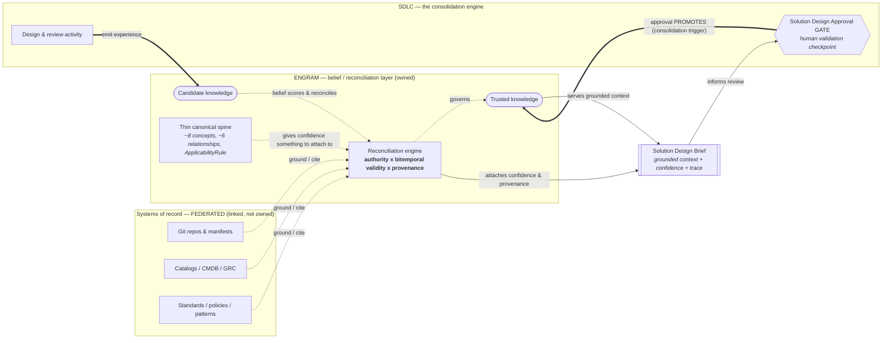

## Purpose

This artifact fixes the product framing for Engram. It is the synthesis of a
multi-agent read across the full IT SDLC ontology research corpus
(`docs/research/more/`, Phases 0–12 plus roadmaps and vendor survey) against
Engram's existing model (memory types, belief network, hierarchy, knowledge).

It should answer:

> What is Engram, honestly — not what it stores, but what it uniquely owns —
> and what is the smallest thing to build first?

## Headline

**Engram is the belief layer for enterprise knowledge: a portable
reconciliation engine that federates the systems already holding the facts, and
owns the one thing none of them do — confidence, provenance, and bitemporal
validity, with a lifecycle that promotes candidate knowledge to trusted at a
human gate.**

The IT SDLC ontology is not a second product. It is the first proof that this
layer is real.

One-line version:

> Engram is not a knowledge store and not an ontology platform. It is the trust
> layer between the systems that hold the facts and the humans who must decide —
> and the SDLC gate is where that trust gets minted.

## What The Research Proved

The strongest signal is convergence. The ontology work, developed for a client
engagement, independently re-derived Engram's core primitives:

| Ontology research artifact | Engram primitive it matches |
|----------------------------|-----------------------------|
| Relationship Evidence Model (`sourceSystem · assertedBy · confidence · authorityLevel · validFrom/validTo · reviewStatus`) | Belief network (bitemporal provenance + confidence per assertion) |
| Fact-state machine (`source → candidate → reviewed → authoritative → disputed → deprecated`) | Consolidation lifecycle |
| Solution Design Approval gate as promotion checkpoint | Gate = consolidation trigger |
| Phase 10 MVP: one output, one gate | One vertical slice |
| Federate-don't-replicate (records stay in systems of record) | Composable adapters over federated sources |

Two teams solving different problems drew the same core model. That is bedrock,
not coincidence. Federate-don't-replicate is also where the wider market has
converged (Backstage repo-local descriptors, OpenMetadata connectors, MCP
resources); only Palantir Foundry replicates into a governed store, and that is
the heavy anti-pattern to avoid for a pilot.

## Corrections To The Earlier Thesis

The earlier framing — "own confidence, not the facts" — was too clean. The
research forced three corrections.

### 1. Engram must own a thin canonical spine

Confidence is meaningless without a shared identity and relationship vocabulary
to attach it to. To answer the queries that are the actual point — "what can I
reuse," "what breaks if this changes" — Engram needs a small canonical spine.

Irreducible spine (from Phase 3/4, reduced):

- **~8 concepts:** SoftwareSystem, DeployableUnit, InterfaceContract,
  DataEntity, Team, Standard/Control, Evidence, Deployment/RuntimeService.
- **~6 relationships:** composedOf, exposes/consumesContract, dependsOn, owns,
  constrainedBy (+ satisfiedBy Evidence), changes/deployedBy.

This is a spine, not a Palantir-scale ontology. It is the minimum needed to make
confidence answer a question.

### 2. Two primitives Engram genuinely lacks

These are not memory types and cannot be modeled as one:

- **ApplicabilityRule** — "fact X binds target Y only when condition Z." A small
  rules engine; the keystone of gate-aware compliance. Engram has no equivalent
  today.
- **Attribute-level authority-precedence conflict resolution** — a policy for
  "telemetry proposes, reviewed architecture confirms" across competing record
  sources. Engram reconciles per-assertion; this needs cross-source precedence.

### 3. The moat is exactly what the research hand-waves

Every phase asserts "conflicting authoritative facts are flagged" and "telemetry
proposes, architecture confirms" — and none specify the mechanism: how competing
assertions with different confidence, authority, and valid-time intervals
resolve into one trusted value, or how promotion decays when a source drifts.

**That reconciliation engine — authority × bitemporal validity × provenance — is
Engram's defensible core.** It is the gap in the research and the gap in every
surveyed vendor:

- Palantir: governed actions, but replicates and is heavy.
- Backstage / OpenMetadata: catalog descriptors, no belief/confidence model.
- GraphRAG: derives graphs, no authority notion.
- Glean / Copilot: mirror ACLs, never reconcile conflicting truths.

## The Product / Bespoke Line

The research reads as a client consulting deliverable (tagged for one enterprise,
one gate, one value stream). Keeping the product boundary clean is the single
most important strategic decision. Everything in the left column ships as
Engram. Everything in the right is assembled on top of Engram per client.

| Product (Engram — portable, generalizes) | Bespoke (the engagement — per client) |
|-------------------------------------------|----------------------------------------|
| Fact-state lifecycle + belief reconciliation | The IT-SDLC ontology content |
| Source-authority & conflict-resolution engine | The gate profiles & validation rules |
| Bitemporal provenance ("true as-of T") | The Solution Design Brief *view* |
| Connector-mode discipline (synced/linked/federated/elicited) | The pilot orchestration |
| Compiled context packet + trace + citation guardrails | The domain vocabulary |
| Trace → proposal governance (never auto-promote) | — |

If this line holds, the client engagement is Engram's first reference
implementation, not its product boundary. Blur it, and Engram dies as a one-off
deliverable when the engagement ends.

## Target State

Four layers. Engram owns one and a half of them.

```text
┌─ CONSUMER VIEWS ──────── Solution Design Brief, impact analysis   (bespoke per client)
│
├─ CANONICAL SPINE ─────── ~8 concepts + ~6 relationships + ApplicabilityRule  (thin, Engram-shaped)
│
├─ BELIEF / RECONCILIATION ── fact-state · authority · confidence · bitemporal · provenance   ★ ENGRAM OWNS THIS
│                              (the moat — what everyone else hand-waves)
│
└─ FEDERATED SOURCES ────── CMDB · catalogs · git · GRC · CI/CD   (linked, never replicated)
```



Scope discipline:

- **Gate profiles and SHACL validation are consumers that read fact-state — not
  Engram internals.** This keeps Engram's surface narrow and its boundary
  defensible.
- **Bitemporal "what was approved as-of the review date" is whitespace no one
  asked for.** The research stresses provenance and lifecycle but never asks the
  as-of question. Own it; do not merely fill it.

## The Concrete First Move

The research already wrote the pilot (Phase 11): **Participant Retirement
Advice, at the Solution Design Approval gate.**

The demonstrating moment is a Brief that returns **"Do not approve yet"** —
because two facts (data classification, agent-output-review control) are only
*candidate*, not *reviewed*. That single output exercises the entire thesis:
federated facts, belief states, gate-as-trigger, and a decision a human actually
makes.

Build that one Brief for that one gate. Let the other six memory types and the
full ontology earn their way in.

## Decisions Worth Recording

- The product / bespoke boundary (the table above) should become an ADR. It is
  the decision most likely to be violated under delivery pressure.
- ApplicabilityRule and cross-source authority-precedence conflict resolution
  are new core primitives, not adapter concerns — they need contract-level
  design before the pilot.
- Bitemporal as-of-T retrieval should be promoted from a belief feature to a
  first-class query mode.

## Method Note

This synthesis was produced by a five-agent parallel read of the
`docs/research/more/` corpus, clustered as: framing & intent; semantic model;
context/ingestion/validation; governance & delivery; build strategy & market.
Each cluster was read fully and returned judgments rather than summaries; this
document is the lead synthesis over those returns.
