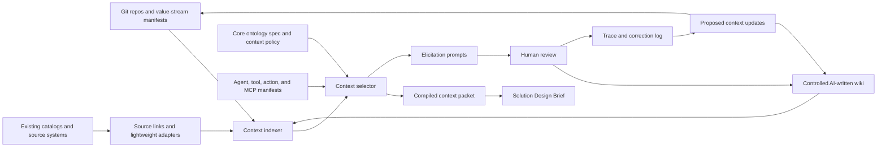

## Purpose

This artifact evaluates whether the implementation scope can be reduced by using existing Git repositories, catalog metadata, and controlled AI-written wikis instead of building a full custom ontology platform up front.

It should answer:

> If enterprise and value-stream knowledge already lives across repositories, docs, catalogs, and source systems, can we reduce the amount of software, infrastructure, ingestion, and UI we need to build?

## Recommendation

Yes.

Use a **reduced-build, context-federation model** for the pilot:

1. Keep the core ontology and phase artifacts in Git-backed Markdown/YAML.
2. Add lightweight repo-local context manifests for systems, components, interfaces, and ownership.
3. Use controlled AI-written wiki pages as the living narrative context layer.
4. Treat authoritative systems as linked sources, not data to fully replicate.
5. Build only a thin context-indexing and retrieval layer for the pilot.
6. Defer custom graph store, custom workflow UI, full ingestion framework, and broad source synchronization until the pilot proves value.

The ontology still matters, but more as a **portable semantic contract** and **context-selection policy** than as a large central application.

The vendor/practitioner research reinforces this recommendation with one refinement: the reduced build should not only index static context. It should also capture the **agent/tool/action surface** and use **reviewed traces and corrections** to propose context updates over time.

The user-supplied VentureBeat article on AWS Context adds a second refinement: the context layer is emerging as a stack, not a single store. Durable patterns appear at the storage/object layer, catalog/semantic layer, graph/index layer, runtime agent/API layer, and feedback-learning layer. The pilot should represent those layers with lightweight metadata, source profiles, compiled context packets, and candidate proposals rather than recreating a managed context platform.

## Research Signals

| Pattern | What It Suggests For Us |
|---------|--------------------------|
| Shared-context AI workspaces | Context can compound from work threads, corrections, and wiki-style reviewed updates instead of upfront modeling every source. |
| Operational ontology platforms | Full enterprise ontology platforms combine semantic model, governed actions, functions, security, SDKs, applications, and operational workflows. Powerful, but heavy for a pilot. |
| Developer catalog models | Software landscape facts can often start from repo-local descriptors and catalog conventions rather than custom inventory UI. |
| Metadata catalog platforms | Data, lineage, pipeline, dashboard, ML, storage, and search metadata should usually be sourced from existing catalog/connectors rather than rebuilt. |
| Storage/object annotations | Some context belongs close to documents, evidence snapshots, and source objects before it becomes canonical ontology fact. |
| Catalog semantic enrichment | Business definitions, usage rules, runbooks, query patterns, lineage, object tags, and data-quality context should often attach at the catalog layer. |
| MCP-style resources and elicitation | Context can be exposed through standard resource, subscription, and elicitation patterns instead of custom integration contracts everywhere. |
| Agent/tool/action registries | AI context should include what tools, actions, contracts, and permissions are available, not only descriptive facts. |
| Synced versus federated connectors | Stable context can be indexed; volatile, sensitive, or high-volume context should be linked or fetched live through governed adapters. |
| Task-specific context compilation | Agents perform better when the relevant context packet is compiled before generation rather than assembled ad hoc in the prompt. |
| Semantic cache and agent memory | Runtime caching and memory can reduce repeated retrieval work, but they add invalidation, privacy, and poisoning risks. |
| GraphRAG and graph-assisted retrieval | Graph extraction and community summaries can improve reasoning over documents, but should not be confused with governed authoritative facts. |
| Trace-driven graph growth | Agent traces, failed retrievals, reviewer corrections, and design decisions can propose graph edges or wiki/manifest updates, but should not auto-promote to authoritative facts. |
| Semantic wiki and Wikibase-style systems | Wiki-style structured knowledge can be versioned, reviewed, linked, queried, and exported without forcing a full custom ontology application. |

## Reduced Build Architecture

The pilot does not need one central store to own everything. It needs a reliable way to select and cite context across:

- Git-authored semantic specs.
- Repo-local manifests.
- Controlled wiki pages.
- Existing source systems.
- Generated indexes.
- Context attachments/frontmatter on documents, evidence, wiki pages, and source-object links.
- Compiled context packets for task-specific review.
- Agent, tool, action, and MCP/resource manifests.
- Review traces, corrections, and failed retrievals that propose updates.
- Human review and elicitation loops.

## What Moves To Git

Use Git for stable or reviewable engineering context.

| Content | Format | Owner | Why Git Works |
|---------|--------|-------|---------------|
| Core ontology classes and relationships | Markdown/YAML | Architecture/ontology stewards | Stable, reviewable, versioned. |
| Context operation policies | Markdown/YAML | Ontology and AI/platform stewards | Small, policy-like, versioned. |
| Gate profiles and validation rule definitions | YAML/Markdown | Architecture/risk/governance owners | Reviewable through pull requests. |
| Repo-local software facts | `catalog-info.yaml`, `ontology-context.yaml`, or similar | Component teams | Lives with code and changes with delivery. |
| Interface contracts | OpenAPI, AsyncAPI, schemas, tool contracts | Component/API owners | Already machine-readable and close to implementation. |
| Architecture decisions | ADR Markdown | Teams/architects | Versioned rationale. |
| Value-stream context pack | Markdown/YAML in a value-stream meta-repo | Value-stream architecture owner | Coordinates multiple component repos without centralizing all app code. |
| Context attachment metadata | Frontmatter or metadata sidecars | Source/document/evidence owners | Gives documents, evidence, and source-object links owner, scope, freshness, access, and usage rules. |

## What Moves To Controlled Wiki

Use the controlled wiki for living narrative context that people rarely maintain manually but AI can draft from work.

The wiki should be **AI-write, human-review**:

- AI proposes page creation or update.
- Human reviews, edits, approves, declines, or routes to an owner.
- Approved pages become retrievable context.
- Every page has provenance, revision history, owner, scope, and access policy.

| Wiki Page Type | Example | Why Wiki Beats Custom App |
|----------------|---------|---------------------------|
| Product context page | Product purpose, owners, critical journeys, current design caveats. | Easy to read and update from discussions. |
| Software system page | What it does, dependencies, known constraints, operational caveats. | Humans need narrative, not only fields. |
| Interface page | Consumers, provider obligations, unpublished context, review notes. | Complements machine-readable contracts. |
| Gate decision page | Review posture, blockers, accepted risks, planned evidence. | Keeps design conversation durable. |
| Exception/rationale page | Why a standard/control is deferred or interpreted a certain way. | Captures judgment that systems rarely own. |
| Source interpretation page | Which source wins for a disputed attribute and why. | Captures operating policy near the conflict. |
| Pattern/playbook page | Common integration pattern, NFR interpretation, reusable design guidance. | Useful context without expanding the core ontology. |
| Trace interpretation page | Why a brief missed context, why a reviewer corrected it, and what update was proposed. | Lets work improve the context layer without silently changing authoritative facts. |

## What Stays In Authoritative Systems

Do not copy everything into the ontology or wiki.

| Source Area | Reduced-Build Treatment |
|-------------|-------------------------|
| CMDB / ITSM | Link and query for lifecycle, support, incidents, changes, and production ownership. |
| Developer catalog | Use as source for components, APIs, resources, ownership, and repo links. |
| Data catalog | Link/query for data assets, classification, lineage, and ownership. |
| GRC/control tooling | Link/query for controls, risks, exceptions, evidence, and findings. |
| CI/CD | Link/query for builds, releases, deployment evidence, and test evidence. |
| Observability | Summarize or query on demand; do not continuously ingest high-volume telemetry into the ontology. |
| Work tracking | Query or summarize current delivery status; do not treat volatile work items as stable ontology facts. |
| Agent traces | Summarize, redact, and convert into candidate updates; do not treat traces as authoritative facts. |

## What We Can Avoid Building For The Pilot

| Original Build Item | Reduced-Build Alternative |
|---------------------|---------------------------|
| Custom ontology steward console | Git PRs plus lightweight generated docs for core ontology changes. |
| Full source profile UI | Markdown/YAML source profiles reviewed in Git. |
| Full graph store | Generate a lightweight graph index from manifests, wiki frontmatter, and source links. |
| Full relational workflow app | Use Git review, wiki review, or existing work management for pilot approvals. |
| Full ingestion pipeline framework | Start with file/repo/wiki crawlers plus a small number of source adapters. |
| Broad connector library | Reuse existing catalogs and link to source systems; build adapters only for pilot-critical sources. |
| Storage/object annotation platform | Use frontmatter and metadata sidecars for the pilot. |
| Catalog semantic enrichment pipeline | Represent semantic enrichment as source-profile fields and reviewed wiki/source links first. |
| Custom evidence repository | Store evidence links and snapshots in the wiki/object store only when necessary. |
| Complex review UI | Use controlled wiki workflow, pull requests, and generated review packets. |
| Live operational telemetry integration | Use summarized operational context or on-demand source queries. |
| General-purpose AI workspace | Generate only the Solution Design Brief and context trace first. |
| Automated ontology-learning platform | Generate candidate graph/wiki/manifest proposals from traces and documents, but require review before promotion. |

## Minimal Pilot Build

The smallest credible build is:

| Capability | Minimal Implementation |
|------------|------------------------|
| Core ontology | Markdown/YAML in Git. |
| Repo-local landscape facts | `catalog-info.yaml` or `ontology-context.yaml` in component repos. |
| Value-stream rollup | Value-stream meta-repo with a generated cross-component context pack. |
| Controlled wiki | AI-written, human-reviewed pages with frontmatter, provenance, owner, scope, and access classification. |
| Context index | Search/vector index over ontology specs, manifests, wiki pages, ADRs, and selected contracts. |
| Lightweight graph | Derived graph from frontmatter, YAML links, catalog relationships, and interface contracts. |
| Context attachment metadata | Frontmatter/sidecars for docs, wiki pages, evidence snapshots, and source-object links. |
| Agent/tool/action registry | File-based registry of approved tools, actions, contracts, scopes, and invocation constraints for the pilot. |
| Context selector | Rules/prompted service that selects by anchor, gate, fact state, source, freshness, and access. |
| Compiled context packet | Materialized task-specific context packet before generation, with included/excluded facts and provenance. |
| Brief generator | Produces Solution Design Brief with context trace and missing-context questions. |
| Elicitation loop | Missing facts become structured questions; approved answers update wiki or repo manifest. |
| Trace improvement loop | Reviewer corrections and failed retrievals become candidate wiki/manifest/graph update proposals. |
| Validation | YAML gate profiles plus deterministic checks for required attributes and fact state. |

This can be built with far fewer moving parts than the full roadmap:

- No custom graph database at first.
- No custom ontology UI at first.
- No full workflow engine at first.
- No broad ingestion platform at first.
- No source replication for volatile systems.
- No semantic cache or long-lived agent memory at first.
- No managed object-annotation or catalog-enrichment platform at first.

## Data Placement Rules

| Data Type | Preferred Place |
|-----------|-----------------|
| Stable ontology semantics | Git. |
| Software facts owned by component teams | Git manifests in repos. |
| Cross-repo value-stream context | Value-stream meta-repo. |
| Human-readable living context | Controlled wiki. |
| Document/evidence/source-object context | Frontmatter, metadata sidecars, or source links until object-store/catalog integration is justified. |
| Source-of-record operational facts | Existing authoritative systems. |
| High-velocity delivery/runtime state | Existing systems plus summaries or on-demand queries. |
| Agent/tool/action context | Git-reviewed manifests or an existing tool registry, with scopes and approval status. |
| Agent traces and reviewer corrections | Redacted trace summaries and candidate update proposals, not authoritative facts. |
| Generated context packets | Ephemeral artifact, optionally archived for audit. |
| Semantic cache or agent memory | Deferred until repeated queries justify cache/memory plus invalidation and privacy controls. |
| Evidence files | Existing evidence repository, wiki attachment, or object storage only if needed. |
| Derived search/vector/graph indexes | Rebuildable indexes, not authoritative stores. |

## Risks

| Risk | Mitigation |
|------|------------|
| Wiki becomes another stale documentation surface | AI writes updates from work, but humans approve; pages carry freshness and owner metadata. |
| AI writes plausible but wrong context | New or changed wiki facts start as candidate until approved, cited, and scoped. |
| Git manifests become inconsistent across repos | Provide schema, examples, linting, and generated rollup checks. |
| No graph database limits complex traversal | Accept for pilot; materialize graph store only if derived graph and search cannot answer pilot questions. |
| Automated graph proposals become trusted too quickly | Treat learned edges as candidate context; require source evidence, reviewer approval, and fact-state visibility. |
| Search/vector retrieval over-selects context | Use context policy, fact states, source authority, and gate profiles to filter. |
| Security model is too loose for shared wiki | Enforce page/resource scopes before indexing and retrieval; do not rely on prompt instructions. |
| Source links rot or source APIs change | Add source freshness checks and dead-link/schema-drift checks for pilot-critical sources. |
| Tool/action metadata is missing from solution design | Add a small approved-tool/action registry so brief generation can reason about feasible integration and agentic execution surfaces. |
| Cached or remembered context goes stale or leaks | Defer semantic cache and agent memory until scale; require freshness, access, fact-state, and invalidation tests first. |

## Decision

For the next iteration, treat the full feature roadmap as the **scale target**, not the pilot baseline.

Adopt a reduced pilot baseline:

1. Git-backed ontology and gate profiles.
2. Repo-local manifests for software/system/interface facts.
3. Value-stream meta-repo for cross-repo rollups.
4. Controlled AI-written wiki for living context.
5. Rebuildable search/vector/derived-graph index.
6. File-based agent/tool/action registry for approved execution surfaces.
7. Context attachment metadata for documents, evidence snapshots, wiki pages, and source-object links.
8. Thin context selector, compiled context packet, and Solution Design Brief generator.
9. Elicitation and trace-improvement loops that write candidate updates back to wiki or Git-reviewed manifests.

The build should only graduate to custom graph store, richer ingestion pipelines, custom UIs, and workflow services after the pilot proves that generated briefs materially improve solution design review.

## Research Anchors

- [[it-sdlc-ontology-context-layer-vendor-patterns-survey]] captures the applied vendor/practitioner pattern survey behind the roadmap refinements.
- The user-supplied VentureBeat article on AWS Context highlights a layered context stack: storage annotations, catalog skill assets, self-learning graph, steward promotion, IAM/Lake Formation permission inheritance, Iceberg/S3 Tables metadata, agentic search APIs, and MCP tools. Primary public docs for some exact product names were not found during this pass, so the durable pattern is folded in rather than the vendor-specific implementation.
- The article's other named vendors were checked as pattern inputs: Snowflake reinforces semantic catalog, verified examples, and agent workflow evaluation; Microsoft reinforces graph/connectors, ACL mirroring, and synced-versus-federated access; Redis reinforces semantic cache, governed memory, and live operational context as scale capabilities; Pinecone reinforces compiled document context, snippets, citations, metadata filters, MCP exposure, and answer evaluation.
- PromptQL positions shared context as a multiplayer AI workspace that can read scattered sources, propose wiki updates from corrections, preserve citations/revision history, and enforce scopes. See [PromptQL home](https://promptql.io/), [product](https://promptql.io/product), [architecture](https://promptql.io/why-promptql-works), and [security](https://promptql.io/security).
- Palantir's Ontology documentation describes an operational layer connecting data assets to real-world objects, links, actions, functions, security, SDKs, and user-facing applications. See [Ontology overview](https://www.palantir.com/docs/foundry/ontology/overview) and [Ontology SDK overview](https://www.palantir.com/docs/foundry/ontology-sdk/overview).
- AWS AgentCore separates memory, gateway/tool access, identity, observability, runtime, and evaluation concerns for agentic systems. See [AgentCore Memory](https://docs.aws.amazon.com/bedrock-agentcore/latest/devguide/memory.html), [AgentCore Gateway](https://docs.aws.amazon.com/bedrock-agentcore/latest/devguide/gateway.html), and [AgentCore Observability](https://docs.aws.amazon.com/bedrock-agentcore/latest/devguide/observability.html).
- Glean's Enterprise Graph pattern emphasizes entities, relationships, permissions, activity, and personal/work context for enterprise AI retrieval. See [Glean Enterprise Graph](https://www.glean.com/product/enterprise-graph).
- Microsoft Copilot connector guidance distinguishes synced connectors from federated live retrieval through MCP, which maps to our source-profile retrieval modes. See [Copilot connectors overview](https://learn.microsoft.com/en-us/microsoft-365/copilot/connectors/overview).
- Backstage's catalog model shows a lightweight repo/catalog path for components, APIs, resources, systems, and domains. See [Backstage system model](https://backstage.io/docs/features/software-catalog/system-model/) and [descriptor format](https://backstage.io/docs/features/software-catalog/descriptor-format/).
- OpenMetadata shows that broad metadata ingestion should often be delegated to existing catalog tooling and connectors. See [OpenMetadata connectors](https://docs.open-metadata.org/latest/connectors).
- MCP resources and elicitation provide a standardized pattern for exposing context resources, subscriptions, Git/file resources, and structured user input. See [MCP resources](https://modelcontextprotocol.io/docs/concepts/resources) and [MCP elicitation](https://modelcontextprotocol.io/docs/concepts/elicitation).
- GraphRAG demonstrates the value of graph extraction, community summaries, and graph-assisted retrieval over private corpora, but this should be treated as a derived retrieval layer, not the authoritative ontology. See [Microsoft GraphRAG](https://microsoft.github.io/graphrag/).
- Semantic wiki and Wikibase patterns support structured, versioned, linked knowledge with human-readable pages, APIs, exports, and validation possibilities. See [Semantic MediaWiki](https://www.semantic-mediawiki.org/) and [Wikibase](https://www.wikibase.cloud/).
