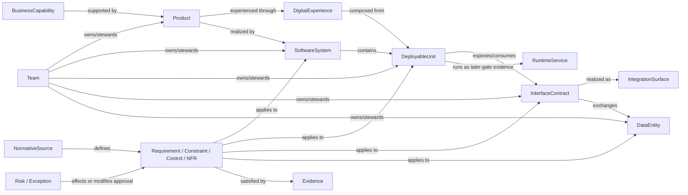
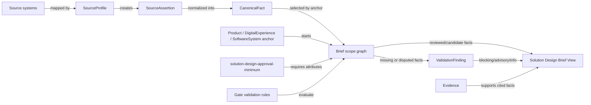
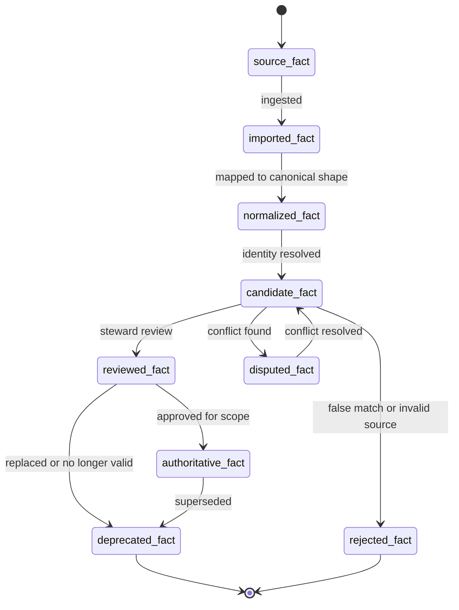
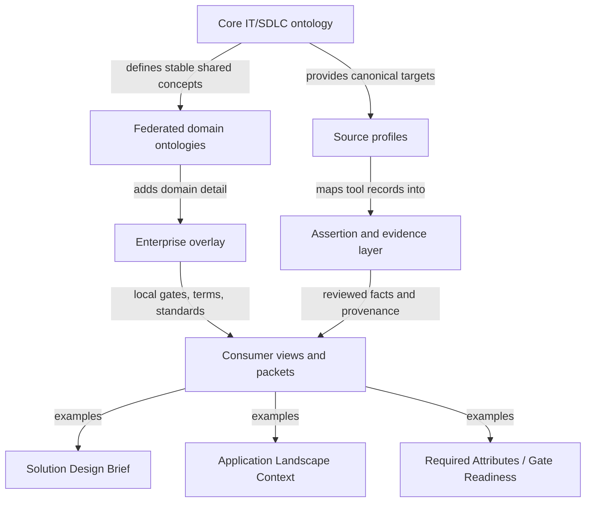

## Purpose

Phase 10 converts the earlier concept, relationship, context, source mapping, validation, governance, and consumer-view work into a minimum viable ontology specification.

This is not yet a physical implementation design. It does not choose RDF, OWL, SHACL, graph database, relational schema, document store, vector index, catalog platform, or integration runtime.

It defines the logical specification needed to support the first pilot consumer output:

> Solution Design Brief View for the Solution Design Approval gate.

## Specification Boundary

The minimum viable ontology specification should be just large enough to:

- Describe a product or digital experience in the application landscape.
- Distinguish Product, DigitalExperience, SoftwareSystem, DeployableUnit, InterfaceContract, and RuntimeService.
- Capture integration surfaces and exchanged data.
- Capture required solution-design attributes.
- Show applicable standards, NFRs, controls, risks, exceptions, and evidence.
- Preserve provenance and assertion state.
- Produce a useful Solution Design Brief View.
- Support gate-aware validation for Solution Design Approval.

Do not include full enterprise-scale coverage yet. Additional classes, properties, and relationships should be added only when a pilot competency question or view requires them.

## Accepted Consumer Output

Decision status: accepted on 2026-06-29.

The first consumer-facing pilot output is:

> Solution Design Brief View.

The initial supporting views are:

1. Application Landscape Context View.
2. Product/System Composition View.
3. Integration Surface View.
4. Required Attributes and Gate Readiness View.
5. Standards, NFR, Controls, and Regulation Applicability View.
6. Evidence and Provenance View.

The first packet should be assembled from these views rather than authored as a standalone document of record.

## Minimum Viable Specification Diagrams

These diagrams summarize the minimum viable specification before the detailed class, property, relationship, and validation tables.

### Pilot Class Backbone

This diagram shows the smallest useful class backbone for the Solution Design Brief pilot.



### Source To Solution Design Brief Assembly

This diagram shows how source facts become a generated Solution Design Brief without making the brief a new source of truth.



### Assertion State Lifecycle

This lifecycle keeps living ontology facts from becoming false certainty too early.



### Core, Federated Extension, Source Profile, And View Layers

This diagram shows how the reusable core stays portable while still allowing enterprise-specific tooling, standards, and views.



## Modeling Conventions

Use these conventions for the logical specification:

| Convention | Rule |
|------------|------|
| Class names | PascalCase, singular, human-readable. Example: `SoftwareSystem`. |
| Property names | camelCase. Example: `lifecycleState`. |
| Relationship names | Verb phrases from source to target. Example: `exposesInterfaceContract`. |
| IDs | Stable canonical IDs should be separate from source-system IDs. |
| Source records | Source-specific fields belong in source profiles, not the core class definition. |
| Required fields | Requiredness is gate-specific unless the property is needed for identity, ownership, or provenance. |
| Extension fields | Domain-specific details should live in federated extensions or enterprise overlays. |
| Fact state | Every non-manual fact should carry assertion state and provenance. |

## Context Policy Minimum

Every class included in a Solution Design Brief should have enough context policy metadata for an AI system to know whether to load it, refresh it, cite it, ask a human about it, or exclude it.

Minimum context policy fields:

| Field | Required? | Purpose |
|-------|-----------|---------|
| `contextRole` | Yes | Defines whether the record is core semantic context, source fact, evidence, rule, gate attribute, or human-provided judgment. |
| `volatility` | Yes | Indicates whether the record is stable, semi-stable, living, high-velocity, episodic, or experimental. |
| `captureMode` | Yes | Shows whether the record was authored, ingested, elicited, inferred, observed, or manually seeded. |
| `updateMode` | Yes | Shows whether the record is updated through change control, scheduled sync, event subscription, on-demand review, runtime summarization, or human correction. |
| `retrievalMode` | Yes | Shows whether the record should be always loaded, graph-retrieved, rule-triggered, searched, queried live, exposed only as evidence drill-down, or excluded by default. |
| `authorityExpectation` | Yes | Shows whether the record should be authoritative, steward-reviewed, candidate, inferred, or user-provided. |
| `freshnessExpectation` | Recommended | Indicates when the record should warn, refresh, or be refused for gate use. |
| `elicitationPolicy` | Recommended | Indicates whether and when a human should be asked for this context. |
| `securityPolicy` | Recommended | Indicates access, classification, masking, or exclusion rules. |

Context policy is defined in detail in [[it-sdlc-ontology-phase-5-context-selection-operations]].

## Common Record Properties

Every governed ontology record should support these common properties.

| Property | Applies To | Required For Pilot? | Purpose |
|----------|------------|---------------------|---------|
| `ontologyId` | All governed records | Yes | Stable canonical identifier. |
| `name` | All named records | Yes | Human-readable label. |
| `description` | Most records | Recommended | Human-readable meaning and scope. |
| `recordType` | All records | Yes | Class/type of record. |
| `factState` | All asserted records | Yes | Source, candidate, inferred, reviewed, authoritative, disputed, deprecated, or rejected. |
| `sourceProfileId` | Imported/asserted records | Yes when imported | Source profile that supplied or mapped the fact. |
| `sourceRecordRef` | Imported/asserted records | Yes when imported | Reference to the original source record. |
| `ownerTeam` | Ownable records | Yes where applicable | Accountable team for the entity or artifact. |
| `steward` | Governed records | Recommended | Person/team responsible for semantic correctness. |
| `lifecycleState` | Landscape and delivery records | Yes where applicable | Planned, active, deprecated, retired, etc. |
| `lastReviewedOn` | Reviewed records | Yes for reviewed/authoritative facts | Date of last human review. |
| `reviewedBy` | Reviewed records | Yes for reviewed/authoritative facts | Reviewer or approving role. |
| `confidence` | Inferred/candidate records | Yes for inferred facts | Confidence level or confidence rationale. |
| `tags` | All records | Optional | Lightweight classification, not a substitute for semantic fields. |

## Assertion States

The pilot should use the Phase 6 assertion states as a required part of the logical model.

| State | Meaning | Can Appear In Solution Design Brief? |
|-------|---------|--------------------------------------|
| `source_fact` | Raw fact from a source system. | Only in provenance drill-down. |
| `imported_fact` | Fact loaded from a source but not normalized. | No, except as source evidence. |
| `normalized_fact` | Fact mapped to canonical shape. | Yes with caveat. |
| `candidate_fact` | Plausible fact awaiting review. | Yes if clearly marked. |
| `inferred_fact` | Derived fact from rules, telemetry, or AI. | Yes only with confidence and review caveat. |
| `reviewed_fact` | Human-reviewed fact. | Yes. |
| `authoritative_fact` | Approved source of truth for the scope. | Yes. |
| `disputed_fact` | Conflicting or challenged fact. | Yes only as a finding or blocker. |
| `deprecated_fact` | Previously valid fact being phased out. | Yes if relevant to migration or risk. |
| `rejected_fact` | Fact explicitly rejected. | No, except audit history. |

## Minimum Viable Class Set

The pilot should start with this class set.

| Class | Definition | Why It Is In The Minimum Spec |
|-------|------------|-------------------------------|
| `BusinessCapability` | Stable business ability or outcome. | Anchors solution purpose. |
| `Product` | Managed value offering with ownership, roadmap, and outcomes. | Separates business accountability from software realization. |
| `DigitalExperience` | User/channel-facing experience or journey. | Represents digital surfaces composed from software parts. |
| `SoftwareSystem` | Cohesive software boundary with owner, purpose, and interfaces. | Central application landscape concept. |
| `DeployableUnit` | Independently built, versioned, deployed, scaled, or operated unit. | Covers micro-frontends, BFFs, backend services, workers, pipelines, and agent services. |
| `InterfaceContract` | Contract through which a system/unit is used or integrated. | Makes APIs, events, files, UI fragments, and agent tools first-class. |
| `IntegrationSurface` | General interaction surface between systems or actors. | Groups API/event/file/queue/stream patterns. |
| `DataEntity` | Business or technical data object. | Supports data responsibility and classification. |
| `DataAsset` | Managed dataset, store, feed, report, or analytical asset. | Supports data lineage and reuse. |
| `NormativeSource` | Regulation, policy, standard, pattern, or principle. | Grounds standards, controls, NFRs, and constraints. |
| `Requirement` | Business, functional, technical, compliance, or evidence need. | Connects solution intent to validation. |
| `Constraint` | Design, delivery, operational, security, regulatory, or technology limitation. | Makes rules actionable in design. |
| `QualityAttributeRequirement` | NFR or quality target such as availability, latency, scalability, or recoverability. | Makes NFRs explicit and testable. |
| `Control` | Required safeguard, obligation, or governance mechanism. | Supports risk/control review. |
| `Risk` | Potential or realized exposure. | Supports design-risk discussion. |
| `Exception` | Approved deviation from a requirement, standard, control, or rule. | Keeps deviations governed. |
| `Evidence` | Artifact or record proving a claim, review, control, test, deployment, or decision. | Supports trust and auditability. |
| `ApplicabilityRule` | Rule determining when a requirement/control/constraint applies. | Separates stable rules from living facts. |
| `WorkItem` | Tool-neutral delivery work item. | Links design to SDLC execution. |
| `Repository` | Source-code or artifact repository. | Links design to implementation. |
| `Environment` | Runtime or pre-runtime context. | Supports deployment and operational readiness. |
| `RuntimeService` | Observable running workload, service, process, or deployed instance. | Connects deployable units to operations. |
| `Team` | Accountable group. | Supports ownership and review. |
| `Person` | Individual actor or stakeholder. | Supports review and accountability. |

## Class Property Minimums

### Product

Required for Solution Design Approval:

- `ontologyId`
- `name`
- `ownerTeam`
- `lifecycleState`
- `supportsBusinessCapability`
- `hasDigitalExperience` or `realizedBySoftwareSystem`
- `businessCriticality`
- `factState`
- `lastReviewedOn` for reviewed facts

Recommended:

- `roadmapOwner`
- `valueStream`
- `businessOutcome`
- `consumerSegment`
- `strategicPosture`

### DigitalExperience

Required for Solution Design Approval:

- `ontologyId`
- `name`
- `experienceKind`
- `channel`
- `realizesProduct`
- `composedOfSoftwareSystem` or `usesDeployableUnit`
- `ownerTeam`
- `consumerActor`
- `factState`

Recommended:

- `journey`
- `accessibilityRequirement`
- `authenticationPattern`
- `experienceCriticality`

### SoftwareSystem

Required for Solution Design Approval:

- `ontologyId`
- `name`
- `systemPurpose`
- `ownerTeam`
- `lifecycleState`
- `realizesProduct` or `supportsBusinessCapability`
- `containsDeployableUnit`
- `exposesInterfaceContract` or explicit `noExternalInterfaceKnown`
- `consumesInterfaceContract` where applicable
- `hasRequiredAttributeSet`
- `factState`

Recommended:

- `architectureOwner`
- `technologyStack`
- `hostingPattern`
- `strategicPosture`
- `supportModel`
- `systemCriticality`

### DeployableUnit

Required for Solution Design Approval:

- `ontologyId`
- `name`
- `deployableUnitKind`
- `ownedByTeam`
- `partOfSoftwareSystem`
- `buildOwnership`
- `exposesInterfaceContract` or explicit `internalOnly`
- `consumesInterfaceContract` where applicable
- `repository` where known
- `factState`

Allowed `deployableUnitKind` values for pilot:

- `micro-frontend`
- `bff`
- `backend-service`
- `agentic-app`
- `agent-service`
- `workflow-worker`
- `batch-job`
- `data-pipeline`
- `event-publisher`
- `event-consumer`
- `library`
- `configuration-package`

Recommended:

- `deploymentPattern`
- `runtimePlatform`
- `scalingProfile`
- `operationalTier`
- `agenticExtensionRef` for agentic units

### InterfaceContract

Required for Solution Design Approval:

- `ontologyId`
- `name`
- `interfaceKind`
- `provider`
- `consumer` or `intendedConsumer`
- `ownedByTeam`
- `contractStatus`
- `dataEntityExchanged` where applicable
- `securityPattern` where known
- `factState`

Allowed `interfaceKind` values for pilot:

- `rest-api`
- `graphql-api`
- `event`
- `queue`
- `stream`
- `file-transfer`
- `batch-feed`
- `ui-fragment-contract`
- `agent-tool-contract`
- `saas-connector`

Recommended:

- `contractSpecRef`
- `protocol`
- `latencyExpectation`
- `volumeExpectation`
- `version`
- `backwardCompatibility`
- `deprecationPolicy`

### DataEntity and DataAsset

Required for Solution Design Approval when data is in scope:

- `ontologyId`
- `name`
- `dataOwner`
- `dataClassification`
- `masteredBy` or `systemOfRecord` where known
- `usedBySoftwareSystem` or `exchangedViaInterfaceContract`
- `retentionRequirement` where applicable
- `factState`

Recommended:

- `lineageRef`
- `residencyRequirement`
- `privacyImpact`
- `qualityExpectation`
- `dataContractRef`

### NormativeSource, Requirement, Constraint, QualityAttributeRequirement, and Control

Required for Solution Design Approval when applicable:

- `ontologyId`
- `name`
- `definedByNormativeSource`
- `appliesTo`
- `applicabilityRule`
- `gateRelevance`
- `requiredEvidence`
- `ownerTeam` or `controlOwner`
- `factState`

Recommended:

- `severity`
- `riskTheme`
- `controlFrequency`
- `testMethod`
- `exceptionAllowed`

### Risk and Exception

Required for Solution Design Approval when applicable:

- `ontologyId`
- `name`
- `riskOrExceptionTarget`
- `reason`
- `impact`
- `ownerTeam`
- `status`
- `reviewDate`
- `mitigation` or `compensatingControl`
- `factState`

Recommended:

- `decisionRef`
- `expiryDate`
- `residualRisk`
- `approvalRef`

### Evidence

Required when evidence is used:

- `ontologyId`
- `name`
- `evidenceKind`
- `supportsClaim`
- `sourceRecordRef` or `artifactRef`
- `createdOn`
- `ownerTeam`
- `reviewStatus`
- `factState`

Allowed `evidenceKind` values for pilot:

- `architecture-review`
- `source-record`
- `api-spec`
- `event-spec`
- `data-classification`
- `test-result`
- `build-result`
- `deployment-record`
- `control-attestation`
- `exception-approval`
- `decision-record`
- `manual-review-note`

## Minimum Relationship Set

Use this relationship set for the pilot.

| Relationship | Source -> Target | Required For Solution Design Brief? |
|--------------|------------------|-------------------------------------|
| `supportsCapability` | Product/SoftwareSystem -> BusinessCapability | Yes |
| `realizesProduct` | DigitalExperience/SoftwareSystem -> Product | Yes where applicable |
| `composesExperience` | SoftwareSystem/DeployableUnit -> DigitalExperience | Yes for digital-facing solutions |
| `containsDeployableUnit` | SoftwareSystem -> DeployableUnit | Yes |
| `partOfSoftwareSystem` | DeployableUnit -> SoftwareSystem | Yes |
| `exposesInterfaceContract` | SoftwareSystem/DeployableUnit -> InterfaceContract | Yes when exposed |
| `consumesInterfaceContract` | SoftwareSystem/DeployableUnit -> InterfaceContract | Yes when consumed |
| `providedBy` | InterfaceContract -> SoftwareSystem/DeployableUnit | Yes |
| `consumedBy` | InterfaceContract -> SoftwareSystem/DeployableUnit/ExternalActor | Yes when known |
| `exchangesDataEntity` | InterfaceContract -> DataEntity | Yes when data crosses boundaries |
| `usesDataAsset` | SoftwareSystem/DeployableUnit -> DataAsset | Yes when material |
| `ownedByTeam` | Product/System/Unit/Contract/Data/Control -> Team | Yes |
| `implementedInRepository` | DeployableUnit -> Repository | Recommended for design, required by Build Readiness |
| `runsAsRuntimeService` | DeployableUnit -> RuntimeService | Optional at Solution Design, required later |
| `deployedToEnvironment` | RuntimeService/Deployment -> Environment | Optional at Solution Design, required later |
| `definedBy` | Requirement/Control/Constraint -> NormativeSource | Yes when applicable |
| `appliesTo` | Requirement/Control/Constraint/QualityAttributeRequirement -> target entity | Yes |
| `satisfiedBy` | Requirement/Control/Constraint -> Evidence | Planned or actual evidence required |
| `hasRisk` | Product/System/Unit/Contract -> Risk | Yes when risk exists |
| `hasException` | Requirement/Control/Constraint/target entity -> Exception | Yes when exception exists |
| `supportedByEvidence` | Assertion/Fact/Decision -> Evidence | Yes for reviewed facts |

## Solution Design Approval Required Attribute Profile

The first gate-aware required attribute profile should be named:

```text
solution-design-approval-minimum
```

Minimum required attributes:

| Attribute Group | Required At Solution Design Approval |
|-----------------|--------------------------------------|
| Scope | Product or software-system anchor, target gate, design summary, in-scope/out-of-scope boundaries. |
| Ownership | Product/system owner, technical owner, architecture owner, data owner where applicable, support owner if production impact is known. |
| Landscape | Related systems, platforms, dependencies, lifecycle state, strategic posture where known. |
| Composition | Software systems, deployable units, interface contracts, and runtime assumptions where known. |
| Integration | Provider/consumer, interface type, contract status, data exchanged, security pattern, latency/volume assumptions where material. |
| Data | Data entities/assets, classification, owner, system of record/mastership where known, privacy/residency concerns where applicable. |
| NFRs | Availability, performance/latency, scalability, recoverability, observability, support model expectations. |
| Standards/controls | Applicable standards, controls, constraints, regulations, quality attributes, and evidence expectations. |
| Delivery | Work item or initiative link, repository/deployable mapping where known, planned evidence for Build Readiness. |
| Risk | Open risks, disputed facts, exceptions, missing blockers, advisory gaps. |
| Provenance | Fact state and source/evidence for all facts used in gate decisions. |

## Validation Severity Rules

For Solution Design Approval, validation findings should be classified as:

| Severity | Meaning |
|----------|---------|
| `blocking` | Missing or disputed fact prevents responsible approval. |
| `advisory` | Gap should be addressed, but approval can proceed with owned risk or planned evidence. |
| `info` | Context for reviewers; no approval impact. |
| `not_applicable` | Rule does not apply after review or applicability evaluation. |

Examples:

| Finding | Severity |
|---------|----------|
| No accountable owner for SoftwareSystem. | `blocking` |
| InterfaceContract has provider but no consumer identified. | `advisory` or `blocking`, depending on gate scope. |
| DataEntity crosses boundary with no classification. | `blocking` |
| RuntimeService missing production monitoring evidence at Solution Design Approval. | `advisory`, with planned evidence for later gate. |
| DeployableUnit has no repository identified. | `advisory` at design, potentially `blocking` at Build Readiness. |
| Control applies but required evidence is planned for later gate. | `advisory` if evidence timing is accepted. |

## Source Profile Minimum

Every pilot source profile should define:

- `sourceProfileId`
- `sourceSystemName`
- `sourceOwner`
- `sourcePurpose`
- `mappedClasses`
- `mappedProperties`
- `identityKeys`
- `authorityScope`
- `conflictPolicy`
- `refreshExpectation`
- `sampleRecords`
- `reviewOwner`

Authority scopes should be explicit:

| Authority Scope | Meaning |
|-----------------|---------|
| `authoritative` | Source owns the fact for the declared scope. |
| `supporting` | Source provides evidence but not final authority. |
| `contextual` | Source gives useful context only. |
| `candidate` | Source can propose facts that require review. |
| `derived` | Source is computed/inferred and must carry confidence. |

## Federated Extension Points

The minimum viable core should expose extension points without requiring full extension implementation.

| Extension Point | Extends | Example |
|-----------------|---------|---------|
| Data ontology | DataEntity, DataAsset, DataContract | Data classification, lineage, quality, retention. |
| Risk/control ontology | Control, Risk, Evidence, Exception | Control testing, attestation, issue management. |
| Security ontology | Constraint, Control, InterfaceContract, DeployableUnit | IAM, secrets, encryption, threat model. |
| Agentic systems ontology | DeployableUnit, InterfaceContract, Evidence, Risk | Agent service, tool contract, model review, autonomy level. |
| Infrastructure/cloud ontology | RuntimeService, Environment, Platform | Hosting, network, resilience, capacity. |
| Business architecture ontology | Product, BusinessCapability, BusinessProcess | Capability map, value stream, business outcome. |

Extension rule:

- Extensions may add properties, subclasses, and validation rules.
- Extensions should not rename or replace core concepts.
- Extensions should map back to core concepts for solution-design packets.

## Minimum Example Record Set

The pilot should create at least one reviewed example record for each of these:

- Product.
- DigitalExperience, if applicable.
- SoftwareSystem.
- Three to five DeployableUnits.
- Two to four InterfaceContracts.
- Two to five DataEntities or DataAssets.
- One NormativeSource.
- One QualityAttributeRequirement.
- One Control or Constraint.
- One Risk or Exception.
- Two to five Evidence records.
- Two to four Teams or owners.

The example should include at least:

- One micro-frontend.
- One BFF.
- One backend service.
- One API contract.
- One event or asynchronous integration, if applicable.
- One agentic deployable unit, if in scope for the pilot.

## Solution Design Brief Assembly Rules

The Solution Design Brief should be generated from ontology facts using these rules:

1. Start from a Product, DigitalExperience, or SoftwareSystem anchor.
2. Pull directly related SoftwareSystems, DeployableUnits, InterfaceContracts, DataEntities, owners, standards, controls, risks, and evidence.
3. Include only facts relevant to the target gate.
4. Mark every fact state.
5. Promote reviewed and authoritative facts into the main brief.
6. Show candidate, inferred, and disputed facts as findings or caveats.
7. Show missing required attributes as validation findings.
8. Keep raw source records in drill-down, not in the primary brief.
9. Include planned evidence separately from actual evidence.
10. End with decisions needed at the gate.

## Phase 10 Deliverables

The reviewed output of this phase should be:

- Minimum viable class set.
- Common record properties.
- Assertion state model.
- Required class properties for Solution Design Approval.
- Minimum relationship set.
- Solution Design Approval required attribute profile.
- Validation severity rules.
- Source profile minimum.
- Federated extension points.
- Minimum pilot example record set.
- Solution Design Brief assembly rules.

## Review Questions

- Is the minimum class set small enough for the pilot?
- Are Product, DigitalExperience, SoftwareSystem, DeployableUnit, InterfaceContract, and RuntimeService still clear to humans?
- Which required properties are too heavy for Solution Design Approval?
- Which properties should move to Build Readiness or Deploy to Production?
- Which relationships are required for the Solution Design Brief View?
- Which source profile fields are needed before importing any real records?
- Which extension point should be exercised first: data, risk/control, agentic systems, security, or infrastructure?
- What example product/system slice should instantiate this specification?

## Research Anchors for Progressive Disclosure

Use these anchors when explaining specification choices.

| Anchor | Use When |
|--------|----------|
| [OWL 2](https://www.w3.org/TR/owl2-overview/) | Explaining ontology classes, properties, and logical semantics if the implementation moves toward formal ontology tooling. |
| [RDF Schema](https://www.w3.org/TR/rdf-schema/) | Explaining lightweight class/property vocabulary choices. |
| [SHACL](https://www.w3.org/TR/shacl/) | Explaining required properties, validation profiles, and gate-aware constraint checks. |
| [PROV-O](https://www.w3.org/TR/prov-overview/) | Explaining assertions, provenance, evidence, review status, and fact trust. |
| [ISO/IEC/IEEE 42010](https://www.iso.org/standard/74393.html) | Explaining architecture views, stakeholders, concerns, and viewpoint-driven packet assembly. |
| [C4 Model](https://c4model.com/) | Explaining human-readable system/deployable/component boundaries. |
| [Backstage System Model](https://backstage.io/docs/features/software-catalog/system-model/) | Explaining system, component, API, resource, owner, and domain catalog mappings. |
| [OpenAPI Specification](https://spec.openapis.org/oas/latest.html) | Explaining API contract evidence and interface specification. |
| [AsyncAPI Specification](https://www.asyncapi.com/docs/reference/specification/v3.0.0) | Explaining event, message, and channel contract evidence. |

Progressive-disclosure rule:

- Start with the pilot packet and required attributes.
- Bring in OWL/RDFS only when discussing formal semantics.
- Bring in SHACL when discussing validation.
- Bring in PROV-O when discussing trust, source facts, evidence, and AI/RAG grounding.
- Bring in architecture/catalog/contract anchors when explaining how the specification maps to human-facing views.
