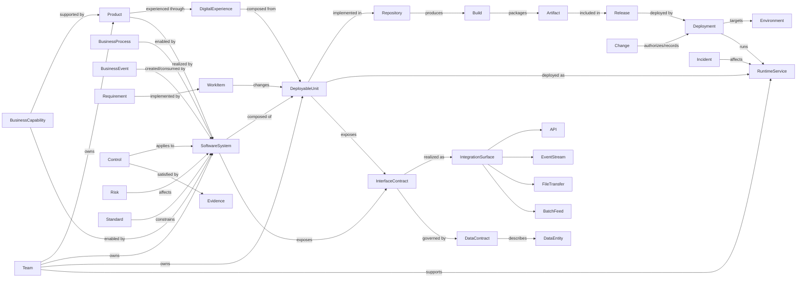
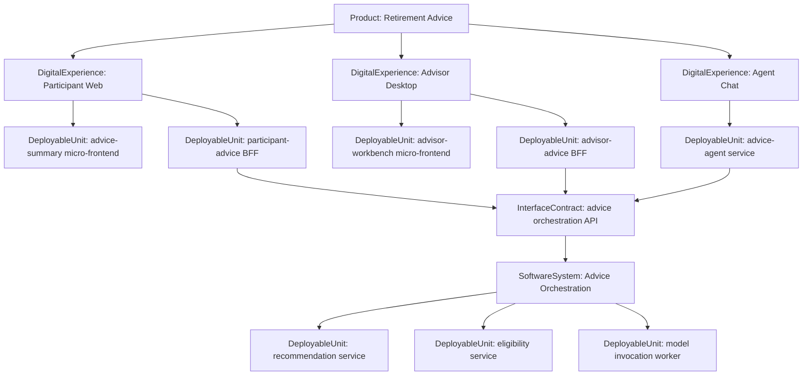

## Purpose

Phase 3 defines the first-pass core concept model for the enterprise IT and SDLC ontology.

The core concept model should be small enough to travel across enterprises and rich enough to answer the Phase 1 competency questions for solution design, application landscape analysis, integration discovery, SDLC traceability, operations, risk, and compliance.

## Modeling Stance

The core model is:

- Tool-neutral: it should not assume ServiceNow, Ardoq, Jira Align, Jira, Azure DevOps, GitHub, GitLab, or any other tool.
- Product-to-runtime centered: products, experiences, software systems, deployable units, interface contracts, data, ownership, and runtime/deployment facts are first-class.
- Solution-design oriented: concepts must support decisions about reuse, constraints, fit, integration, risk, and impact.
- Extensible by domain: architecture, SDLC, operations, integration, data, risk, and compliance can add detail without bloating the core.
- Mappable to sources: every source-system record should map into canonical concepts or into source-profile extensions.

## Research Synthesis

The initial draft used DigitalProduct, Application, ApplicationComponent, and ApplicationService as neighboring concepts. That is too ambiguous for human use because enterprises use "application", "app", "service", "component", and "product" inconsistently.

The revised model borrows the clearer separation used by several widely adopted architecture/catalog practices:

- C4 separates software architecture into Software System, Container, Component, and Code. C4 explicitly notes that organizations often use terms such as application, product, and service for similar boundaries, and that a C4 container is a runtime boundary such as a web app, mobile app, server-side app, serverless function, database, or batch process.
- Backstage models software catalogs with Components, APIs, and Resources, and uses Systems as collections of components and resources that expose public APIs. This is close to how a developer portal needs to represent microservices, websites, data pipelines, APIs, and ownership.
- Micro-frontend practice treats a digital web experience as a composition of independently owned frontend features or fragments.
- The Backend-for-Frontend pattern treats BFFs as interface-specific backend services tailored to the needs of a frontend or channel.
- OpenAPI and AsyncAPI reinforce that interface contracts should be first-class and machine-readable, independent of the internal software that implements them.

Decision: keep Product, Experience, SoftwareSystem, DeployableUnit, InterfaceContract, and RuntimeService distinct. Treat "Application" as a common enterprise alias for SoftwareSystem or a source-system profile term, not as the primary canonical concept.

## Revised Human-Friendly Stack

| Level | Canonical Concept | Human Test | Examples |
|-------|-------------------|------------|----------|
| 1 | Product | Is this funded, roadmapped, measured, and managed as a value offering? | Retirement Advice, Participant Onboarding, Claims Experience |
| 2 | DigitalExperience | Is this a user/channel-facing surface or journey through which people or systems experience the product? | Participant web experience, mobile app, advisor desktop, agent chat experience |
| 3 | SoftwareSystem | Is this a cohesive software boundary with an owner, architecture, interfaces, and internal implementation? | Eligibility system, advice orchestration system, document generation system |
| 4 | DeployableUnit | Is this independently built, versioned, deployed, scaled, or operated? | Micro-frontend, BFF, backend service, agentic app, workflow worker, batch job, data pipeline |
| 5 | InterfaceContract | Is this how another actor or system interacts with the software? | REST API, GraphQL schema, event topic, file contract, UI fragment contract, agent capability, tool contract |
| 6 | RuntimeService | Is this a running/observable instance or workload in an environment? | Kubernetes workload, Cloud Foundry app, Lambda function, running agent service, production API runtime |

This stack is intentionally not the same as any one standard. It is an enterprise ontology stack that maps cleanly to C4, Backstage, ArchiMate, ServiceNow CSDM, Ardoq, Jira Align, API catalogs, CMDBs, CI/CD, and observability systems.

## Minimum Viable Core

The first version of the portable core should contain these concepts.

| Concept | Definition | Why It Belongs In Core |
|---------|------------|------------------------|
| BusinessCapability | A stable business ability or outcome the enterprise needs. | Anchors application purpose and solution-design intent. |
| BusinessProcess | A business activity flow or operational process. | Connects applications to work performed by the business. |
| BusinessEvent | A meaningful business occurrence created, consumed, or responded to by systems. | Anchors event-driven architecture and integration analysis. |
| Product | A managed value offering with funding, roadmap, outcomes, ownership, and consumers. | Separates business/product accountability from the software that realizes it. |
| DigitalExperience | A user-facing or channel-facing surface, journey, or experience through which a product is consumed. | Represents digital surfaces composed from micro-frontends, BFFs, backend services, and agentic apps. |
| SoftwareSystem | A cohesive software boundary with an owner, architecture, purpose, interfaces, and internal implementation. | Replaces ambiguous "Application" as the central landscape concept. |
| DeployableUnit | An independently built, versioned, deployed, scaled, or operated software unit. | Gives micro-frontends, BFFs, backend services, agentic apps, workers, jobs, and pipelines a clear home. |
| InterfaceContract | A machine- or human-readable contract through which a system or deployable unit is used. | Replaces ambiguous "ApplicationService" with a clearer interaction boundary. |
| Platform | A shared technology foundation used by systems, deployable units, or products. | Helps identify reuse, dependency, and hosting constraints. |
| IntegrationSurface | A general point of interaction between systems. | Abstract parent for APIs, events, files, queues, streams, and batch feeds. |
| API | A callable interface exposed or consumed by a system. | Core solution-design and integration-discovery concept. |
| EventStream | An event-based integration channel or stream. | Supports event-driven architecture and business-event tracing. |
| DataContract | A structured agreement about data exchanged across an integration. | Makes integration surfaces designable and governable. |
| DataEntity | A business or technical data object such as Customer, Account, Policy, or Transaction. | Connects applications to information responsibilities. |
| DataAsset | A managed dataset, store, report, feed, or analytical asset. | Supports data lineage, AI/RAG grounding, and solution design. |
| Requirement | A business, functional, technical, or compliance need. | Connects solution intent to delivery artifacts. |
| WorkItem | A planned unit of delivery work such as epic, feature, story, task, or defect. | Tool-neutral bridge across Jira, Jira Align, Azure DevOps, and others. |
| Repository | A source-code or artifact repository. | Connects systems and deployable units to implementation evidence. |
| Build | A CI/CD execution that produces or validates an artifact. | Supports SDLC traceability. |
| Release | A packaged or approved set of changes intended for deployment. | Connects change scope to business and operational impact. |
| Deployment | A release or artifact installation into an environment. | Links delivery to runtime, incidents, and controls. |
| Environment | A runtime or pre-runtime context such as dev, test, stage, prod, or DR. | Needed for deployment, risk, and operations questions. |
| RuntimeService | An observable runtime service, workload, process, or deployed instance. | Bridges deployable architecture to operational telemetry. |
| Incident | An operational disruption or service-impacting event. | Core operations and impact-analysis concept. |
| Change | An approved or recorded alteration to a system, service, or configuration. | Connects ITSM, deployment, and risk/control evidence. |
| Control | A required safeguard, obligation, or governance mechanism. | Anchors compliance and assurance. |
| Risk | A potential or realized exposure affecting business, technology, security, or operations. | Supports design review and governance. |
| Evidence | A record or artifact proving that a requirement, control, deployment, test, or review occurred. | Supports auditability and automated assurance. |
| NormativeSource | An authoritative source of rules or obligations, such as a regulation, policy, standard, pattern, or architecture principle. | Allows regulations, enterprise standards, and policies to be modeled without hard-coding them into systems. |
| Standard | A required or recommended architecture, technology, delivery, or operational rule. | Supports solution-design guardrails. |
| Constraint | A specific design, delivery, operational, security, regulatory, or technology limitation that applies to a target. | Makes standards, regulations, and architecture decisions actionable in solution design. |
| ApplicabilityRule | A rule that determines when a standard, constraint, control, policy, regulation, or NFR applies. | Separates stable rules from living target facts and enables gate-aware validation. |
| Team | A group accountable for ownership, delivery, support, or stewardship. | Core ownership and operating-model concept. |
| Person | An individual actor or stakeholder. | Supports accountability and review workflows. |
| Organization | A business unit, vendor, group, or enterprise entity. | Supports ownership, provider/consumer, and accountability context. |

## Standards, Constraints, NFRs, and Regulations

The ontology should explicitly represent how enterprise standards, constraints, NFRs, policies, and regulations apply to solution designs and production systems.

Use this pattern:

```text
NormativeSource
  -> defines Requirement / Constraint / Control / QualityAttributeRequirement
  -> scoped by ApplicabilityRule
  -> appliesTo Product / DigitalExperience / SoftwareSystem / DeployableUnit / InterfaceContract / DataEntity / RuntimeService
  -> satisfiedBy Evidence
  -> may have Exception
```

Recommended concept treatment:

| Concept | Treatment | Example |
|---------|-----------|---------|
| Regulation | Federated risk/control or compliance ontology concept; also a type of NormativeSource. | SEC, FINRA, privacy, retention, accessibility, model-risk regulation. |
| Policy | Federated risk/control or enterprise-overlay concept; also a type of NormativeSource. | Enterprise AI policy, data-handling policy, change policy. |
| Standard | Core concept because solution design needs architecture, technology, and operational standards. | Approved hosting standard, API standard, observability standard. |
| Constraint | Core concept because solution design needs to know what limits or directs choices. | Must run in approved region; must not expose restricted data publicly. |
| QualityAttributeRequirement | A specialized Requirement, usually in a requirements/NFR extension. | Availability >= 99.9%, p95 latency <= 300ms, RTO <= 4h. |
| Control | Core/risk-control bridge concept. | Access review, encryption at rest, change approval, model output review. |
| ApplicabilityRule | Core concept because applicability is needed across all standards and gates. | Applies when data classification is Restricted and interface visibility is external. |

Applicability rules are the important bridge. They decide when a stable normative asset applies to a living target.

Examples:

```text
API Security Standard appliesTo InterfaceContract
  when InterfaceContract.visibility in [Public, Restricted]

Restricted Data Handling Policy appliesTo SoftwareSystem
  when SoftwareSystem reads/writes DataEntity classifiedAs Restricted

Production Observability Standard appliesTo RuntimeService
  when RuntimeService runsIn Production Environment

Model Risk Control appliesTo DeployableUnit
  when DeployableUnit.kind = agentic-app and usesModelEndpoint exists
```

This lets a solution-design gate ask:

- Which standards and constraints apply to this proposed design?
- Which NFRs must be satisfied before build or production?
- Which regulations or policies create controls for this system/interface/data?
- Which exceptions are being requested, and who can approve them?
- Which evidence is planned versus already available?

## Concepts That Should Not Be Core Yet

These should start in domain extensions or source profiles:

- Jira Align Portfolio Epic, Jira Story, Azure DevOps Work Item, GitHub Pull Request, GitLab Merge Request.
- ServiceNow Business Application, Application Service, Technical Service, Configuration Item.
- Ardoq Application, Component, Interface, Reference, Workspace.
- C4 Container and Backstage Component as literal names. Their semantics are useful, but the ontology uses DeployableUnit to avoid confusion with Docker containers and overloaded component language.
- Specific control framework objectives, control IDs, and test procedures.
- Cloud-provider-specific resources such as AWS Lambda, ECS Service, Azure Function, Kubernetes Deployment.
- Detailed observability records such as span, log line, metric data point, and alert instance.
- Tool-specific lifecycle states and workflow statuses.

Reason: these are important, but they are either source-specific, domain-specific, or too detailed for the portable core.

## First-Pass Concept Groups

### Business Context

- BusinessCapability
- BusinessProcess
- BusinessEvent
- Outcome
- Journey
- Stakeholder

### Product and Application Landscape

- Product
- DigitalExperience
- SoftwareSystem
- DeployableUnit
- InterfaceContract
- Platform
- TechnologyComponent
- Standard

### Integration and Data

- IntegrationSurface
- API
- EventStream
- Queue
- Topic
- BatchFeed
- FileTransfer
- DataContract
- Schema
- DataEntity
- DataAsset

### SDLC and Delivery

- Requirement
- WorkItem
- Repository
- Build
- Artifact
- Release
- Deployment
- Environment
- TestCase
- Defect

### Operations and Runtime

- RuntimeService
- Incident
- Problem
- Change
- SLA
- SLO
- Metric
- Alert
- Dependency

### Risk, Control, and Compliance

- Risk
- Control
- NormativeSource
- Standard
- Constraint
- ApplicabilityRule
- Evidence
- Exception
- Policy
- Finding
- Remediation

### Ownership and Accountability

- Person
- Team
- Organization
- Role
- OwnershipAssignment
- StewardshipAssignment

## Concept Model Sketch



## Composable Digital Product Example



In this example, the product is not the application. The digital experiences are not the entire product. Micro-frontends, BFFs, backend services, and agentic apps are deployable units. APIs, UI fragment contracts, events, and agent capabilities are interface contracts.

## Agentic Application Modeling

Agentic apps should not become a separate top-level product/application category in the core. Model them as DeployableUnits with `deployableUnitKind = agentic-app` or `agent-service`.

Agent-specific detail belongs in an Agentic Systems extension:

- Agent
- AgentCapability
- Tool
- ToolContract
- Prompt
- ModelEndpoint
- MemoryStore
- KnowledgeSource
- Guardrail
- Evaluation
- HumanApprovalPoint

This lets an agentic app participate in the same landscape as micro-frontends, BFFs, backend services, workflows, and data pipelines while still capturing agent-specific design constraints.

## Required Solution-Design Attribute Families

These attributes should be modeled early because they drive solution-design decisions:

- Identity: canonical ID, name, aliases, description, source identifiers.
- Purpose: business purpose, supported capabilities, supported processes, business events.
- Ownership: product owner, system owner, deployable-unit owner, technical owner, support owner, data owner, control owner.
- Lifecycle: lifecycle state, strategic posture, target disposition, deprecation date.
- Criticality: business criticality, operational criticality, customer impact, tier.
- Hosting: hosting model, platform, region, environment, runtime pattern.
- Integration: exposed surfaces, consumed surfaces, integration type, protocols, authentication, data contracts, consumers, producers.
- Data: data domains, data entities, data classification, system-of-record role, retention, residency.
- Quality: availability, latency, throughput, volume, scalability, resilience, recovery requirements.
- Security: authentication, authorization, encryption, network exposure, secrets handling, privileged access.
- Compliance: applicable controls, evidence, exceptions, policy obligations.
- Operations: SLA/SLO, monitoring coverage, alerting, runbook, support group, incident history.
- Delivery: repositories, pipelines, artifacts, releases, deployments, environments.
- Composition: product-to-experience, experience-to-deployable-unit, system-to-deployable-unit, and interface-contract relationships.

## Phase 3 Deliverables

The reviewed output of this phase should be:

- Approved minimum viable core concept list.
- Concepts deferred to domain extensions or source profiles.
- Concept definitions.
- Initial concept grouping.
- Initial attribute families for solution design.
- Candidate relationship list for Phase 4.

## Review Questions

- Is the core too large, too small, or about right?
- Which concepts must be promoted into the core to support solution design?
- Which concepts should move out of core into domain extensions?
- Is Product distinct enough from DigitalExperience and SoftwareSystem in the way TIAA works?
- Is SoftwareSystem a better human-facing concept than Application for the canonical ontology?
- Is DeployableUnit the right home for micro-frontends, BFFs, backend services, agentic apps, jobs, workers, and data pipelines?
- Is InterfaceContract clearer than ApplicationService for APIs, UI fragments, events, files, and agent capabilities?
- Is IntegrationSurface the right abstraction for APIs, events, queues, files, streams, and batch?
- Which attribute families are mandatory for the first pilot?

## Research Anchors for Progressive Disclosure

Use these anchors as supporting references when explaining or extending this phase. Do not force all of them into every conversation; disclose the relevant anchor when a modeling question needs it.

| Anchor | Use When |
|--------|----------|
| [C4 Model abstractions](https://c4model.com/abstractions) | Explaining SoftwareSystem, DeployableUnit, and why "Application" and "Component" are too overloaded as canonical terms. |
| [Backstage System Model](https://backstage.io/docs/features/software-catalog/system-model/) | Explaining developer-catalog concepts such as systems, components, APIs, resources, domains, and ownership. |
| [Micro Frontends](https://micro-frontends.org/) | Explaining DigitalExperience composition from independently owned frontend features/fragments. |
| [Backends for Frontends pattern](https://learn.microsoft.com/en-us/azure/architecture/patterns/backends-for-frontends) | Explaining why BFFs are DeployableUnits tailored to a channel or frontend, not a separate top-level product/application type. |
| [OpenAPI Specification](https://spec.openapis.org/oas/latest.html) | Explaining machine-readable HTTP API contracts. |
| [AsyncAPI Specification](https://www.asyncapi.com/docs/reference/specification/v3.0.0) | Explaining event/message/channel contracts for asynchronous integrations. |

Progressive-disclosure rule:

- Start with the human distinction: Product, DigitalExperience, SoftwareSystem, DeployableUnit, InterfaceContract, RuntimeService.
- Bring in C4 or Backstage only when someone asks how this maps to known architecture/catalog models.
- Bring in OpenAPI, AsyncAPI, and micro-frontend/BFF references only when discussing interface contracts or modern digital composition.
