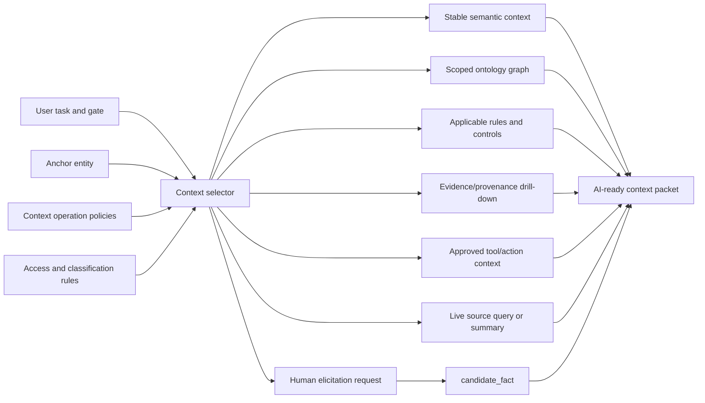

## Purpose

Phase 5 reframes the ontology as the enterprise context-selection layer for AI-assisted solution design.

When we say we are building AI systems, we are often really building systems that decide:

- What context should be captured.
- What context should be updated.
- What context should be retrieved.
- What context should be withheld.
- What tool, action, or resource context should be visible for the task.
- What context should be elicited from a human because no authoritative source exists.

This phase should answer:

> For each type of ontology data, how should the system capture it, keep it current, retrieve it, and decide whether to ingest it from an authoritative source or elicit it from a person?

## Research-Informed Synthesis

Enterprise AI and ontology platforms are converging on a few common patterns:

- The ontology is not only a data model. It is the governed context layer between source systems, human decisions, AI agents, and operational actions.
- Context should be exposed through controlled resources, tools, actions, and views rather than by dumping raw enterprise data into prompts.
- Tool and action context is part of context selection: an AI system needs to know which execution surfaces exist, which are allowed, which contracts govern them, and which should be withheld.
- Context retrieval should vary by data shape: graph traversal for related entities, search for unstructured knowledge, source queries for live facts, rule evaluation for applicability, and elicitation for missing judgment.
- Some context should be synced into indexes; some should stay federated or live-query only because it is volatile, sensitive, high-volume, or source-controlled.
- Freshness matters as much as relevance. Stable semantic concepts, living landscape facts, delivery events, runtime telemetry, and governance evidence should not share the same update or retrieval policy.
- Agent traces, reviewer corrections, failed retrievals, and generated brief feedback can propose updates, but those proposals are candidate context until reviewed.
- Context may attach at several layers: document/page frontmatter, evidence metadata, source-object links, catalog definitions, derived graph edges, and compiled context packets.
- Access control, provenance, and source authority are part of context selection, not afterthoughts.

The output artifacts should therefore include a **context operation policy** for each major ontology data type.

## Context Operation Policy

Every major class or context source should declare:

| Field | Meaning |
|-------|---------|
| `contextRole` | Why this data is used in AI context: core semantic meaning, source fact, evidence, rule, gate attribute, example, or user-provided judgment. |
| `attachmentLayer` | Where context is attached: ontology, source record, object/document, catalog, graph/index, compiled packet, trace, or human review. |
| `volatility` | Expected change pattern: stable, semi-stable, living, high-velocity, episodic, or experimental. |
| `captureMode` | How context is first captured: governed authoring, source ingestion, human elicitation, inference, observation, or manual seeding. |
| `updateMode` | How context is kept fresh: change control, scheduled sync, event subscription, on-demand review, runtime summarization, or human correction. |
| `retrievalMode` | How context should be selected: always-load, scoped graph retrieval, rule-triggered retrieval, hybrid search, live source query, evidence drill-down, or never-by-default. |
| `connectorMode` | Whether the source should be synced/indexed, linked-only, live/federated, manually elicited, or excluded by default. |
| `authorityExpectation` | Whether the data should come from an authoritative source, steward review, candidate source, inference, or user-provided assertion. |
| `freshnessExpectation` | How stale it may be before the system warns, refreshes, or refuses to use it. |
| `elicitationPolicy` | Whether humans should be asked for the fact, and under what conditions. |
| `securityPolicy` | What access control, classification, or redaction applies before retrieval. |
| `gateVisibility` | Which gates may use the context: solution design, build readiness, release, deploy, operate, or decommission. |

## Context Data Matrix

| Ontology Data Type | Volatility | Likely Source | Capture Mode | Update Mode | Retrieval Mode | Elicit Or Ingest? |
|--------------------|------------|---------------|--------------|-------------|----------------|-------------------|
| Core ontology classes and relationships | Stable | Ontology stewarding and standards review | Governed authoring | Change control | Always-load compact semantic map | Elicit from stewards during design; do not ingest blindly. |
| Enterprise terms and aliases | Semi-stable | Enterprise overlay, glossary, architecture office, source-tool labels | Stewarded mapping plus source profiling | Periodic review and source-drift checks | Term expansion during search and graph retrieval | Elicit ambiguous meanings; ingest aliases only as candidates. |
| Product and business capability facts | Semi-stable to living | Product portfolio, planning tools, business architecture repositories | Source ingestion plus steward review | Scheduled sync and review on portfolio changes | Scoped graph retrieval around the design anchor | Prefer authoritative ingestion; elicit gaps or intent changes. |
| Digital experience facts | Living | Product/design artifacts, experience catalogs, journey maps, architecture notes | Manual seeding plus source ingestion | Review on initiative or journey change | Scoped graph retrieval for product/system composition | Elicit when experience boundaries or channels are unclear. |
| Software system facts | Living | Architecture repository, CMDB, developer catalog, application portfolio tool | Source ingestion with identity resolution | Scheduled sync plus steward review on conflicts | Scoped graph retrieval around anchor, dependencies, and owners | Prefer authoritative ingestion; elicit ownership or boundary ambiguity. |
| Deployable unit facts | Living | Developer catalog, repositories, CI/CD, service registry, architecture notes | Source ingestion from repository/catalog/CI metadata | Event-driven or scheduled sync | Scoped graph retrieval for composition and build readiness | Ingest where possible; elicit only for non-discoverable intent or ownership. |
| Interface contracts | Living | API catalog, event catalog, OpenAPI/AsyncAPI specs, repositories | Source ingestion from contract catalogs and specs | Event-driven or release-linked sync | Contract retrieval plus graph traversal to providers/consumers/data | Prefer authoritative ingestion; elicit intended consumers and unpublished contracts. |
| Data entities and data assets | Semi-stable to living | Data catalog, glossary, lineage tool, data governance system | Source ingestion plus data-steward review | Scheduled sync and review on classification or lineage change | Rule-triggered retrieval when data crosses boundaries | Prefer authoritative ingestion; elicit business meaning and unresolved ownership. |
| Data classification and privacy constraints | Semi-stable | Data governance, policy, GRC, DLP/classification tooling | Authoritative ingestion plus control review | Policy-change sync and gate review | Rule-triggered retrieval for data/interface/system scope | Do not rely on elicitation except to request review or risk acceptance. |
| Normative sources, standards, policies, regulations | Stable to semi-stable | Policy repository, standards library, GRC, architecture governance | Governed authoring or authoritative ingestion | Change control and scheduled policy review | Rule-triggered retrieval by applicability | Ingest authoritative text/metadata; elicit interpretation only from owners. |
| Applicability rules | Semi-stable | Architecture/risk/control owners, policy interpretation, validated patterns | Stewarded authoring | Change control and retrospective tuning | Rule evaluation before gate validation | Mostly elicited/formalized from experts, then governed. |
| Quality attribute requirements and NFRs | Semi-stable per product/system | Architecture standards, SLO/SLA repositories, solution design records | Template capture plus source ingestion where mature | Review per solution and gate | Gate-profile retrieval | Elicit target values when no authoritative NFR catalog exists. |
| Controls and control applicability | Semi-stable | GRC/control library, policy repository, risk systems | Authoritative ingestion plus applicability mapping | Control-library sync and review on policy change | Rule-triggered retrieval for governed targets | Ingest controls; elicit applicability rationale or exception context. |
| Risks, decisions, and exceptions | Episodic | Architecture review notes, risk registers, decision records, GRC | Human capture during reviews | Review-date and expiry-date workflow | Gate packet retrieval and evidence drill-down | Usually elicited/captured from review decisions, then governed. |
| Evidence and attestations | Episodic to living | GRC, CI/CD, test systems, change management, API catalog, review artifacts | Source ingestion or manual evidence attachment | Event-linked update and gate review | Evidence drill-down only when needed | Ingest from authoritative systems; elicit only missing evidence plan. |
| Document, evidence, and source-object annotations | Semi-stable to living | Wiki frontmatter, document metadata, object tags, evidence records, catalog metadata | Metadata attachment plus source links | Review on document/source-object change | Search/vector retrieval plus evidence drill-down | Capture lightweight metadata first; ingest from source metadata where available. |
| Work items and SDLC delivery state | High-change living | Jira, Jira Align, Azure DevOps, GitHub/GitLab, CI/CD | Source ingestion | Event-driven or frequent scheduled sync | Live source query or concise delivery summary | Ingest, do not elicit except for scope clarification. |
| Runtime services and operational telemetry | High velocity | Observability, service registry, incident/change/problem systems | Observation and source ingestion | Continuous or summarized refresh | Summaries and live query, not always-load | Ingest summaries; elicit operational assumptions at design time. |
| Agent, tool, resource, and action context | Semi-stable to living | Agent registry, MCP servers, automation catalogs, API gateways, platform teams, repo manifests | Governed authoring plus source ingestion | Review on tool/action change and contract release | Tool/action selection and progressive disclosure; never invoke by default | Ingest approved registry data or elicit from platform owners when missing. |
| AI/RAG feedback and human corrections | Living/experimental | Review sessions, AI interaction logs, curator notes | Human correction capture | Curation workflow and confidence downgrade/upgrade | Retrieval only as candidate context | Elicit corrections explicitly; never promote without review. |
| Agent traces and retrieval failures | Living/experimental | Agent runtime, observability, evaluation logs, reviewer notes | Trace summarization and redaction | Curation workflow and proposal review | Candidate-only proposal retrieval | Ingest redacted summaries only when permitted; use to propose wiki, manifest, or graph updates. |
| Source profiles and mappings | Semi-stable | Integration owners, source-system admins, ontology stewards | Stewarded authoring plus sample-record review | Review when source schema/tools change | Always available to provenance and ingestion flows | Elicit mapping intent from source owners; verify with sample records. |

## Context Capture Rules

Capture should be explicit about whether the fact is:

- Authored by an ontology steward.
- Imported from an authoritative source.
- Imported from a supporting source.
- Manually seeded for a pilot.
- Elicited from a person.
- Inferred by a rule, model, telemetry, or AI assistant.
- Observed from runtime or delivery systems.

Every captured fact should carry:

- `captureMode`.
- `sourceProfileId` or human capture owner.
- `capturedOn`.
- `factState`.
- `authorityExpectation`.
- `reviewOwner`.
- `privacy/security classification`, where applicable.

## Context Update Rules

Update cadence should follow volatility:

| Volatility | Update Strategy | Examples |
|------------|-----------------|----------|
| Stable | Versioned governance change. | Core ontology concepts and relationship semantics. |
| Semi-stable | Scheduled sync plus steward review. | Policies, standards, applicability rules, data classifications. |
| Living | Source sync with conflict review. | Products, systems, deployable units, interface contracts, owners. |
| High-velocity | Live query, event subscription, or summarized snapshot. | Work items, builds, runtime telemetry, incidents. |
| Episodic | Event-created record with review/expiry. | Decisions, exceptions, evidence, risk acceptance. |
| Experimental | Candidate-only until curated. | AI-suggested mappings, inferred dependencies, conversational corrections. |

Do not use one universal refresh policy. The ontology should know whether a fact is stale for its purpose.

## Context Retrieval Rules

The AI system should choose context by task:

| Task | Retrieval Strategy |
|------|-------------------|
| Explain a concept | Load stable core semantics and enterprise aliases. |
| Build a Solution Design Brief | Start from product/experience/system anchor, retrieve scoped graph neighborhood, then gate-required attributes. |
| Validate a gate | Retrieve target facts, applicability rules, required attributes, evidence, risks, exceptions, and fact states. |
| Discover integrations | Retrieve interface contracts, providers, consumers, data entities, contract specs, and source confidence. |
| Design an agentic or automated workflow | Retrieve approved tools/actions/resources, contracts, scopes, sensitive-action flags, policy constraints, and evidence requirements. |
| Analyze reuse | Retrieve related products/systems/deployable units/contracts by capability, domain, data, and interface similarity. |
| Explain why a control applies | Retrieve normative source, applicability rule, target facts, evidence, and exceptions. |
| Answer operational impact | Retrieve runtime/service/dependency summary and live incidents/changes only for the scoped target. |
| Ground an AI answer | Retrieve only facts whose fact state and authority allow use for the requested decision. |
| Compile a review packet | Materialize selected context, source revisions, included/excluded facts, freshness posture, and citations before generation. |

Retrieval should prefer:

1. Stable semantic context.
2. Gate/task profile.
3. Scoped graph neighborhood.
4. Rule-triggered obligations.
5. Evidence and provenance.
6. Tool/action context when it changes what the design can do.
7. Live or high-velocity data only when the task needs it.

## Elicitation Policy

Use human elicitation when the needed context is not reliably available from an authoritative source.

Elicit:

- Design intent.
- Target outcomes.
- Scope boundaries.
- Product/experience/system boundary ambiguity.
- Intended consumers for not-yet-published contracts.
- Risk appetite or exception rationale.
- Applicability-rule interpretation.
- Planned evidence for later gates.
- Corrections to candidate or inferred facts.
- Missing or incorrect tool/action scope, contract, or owner context.
- Reviewer corrections from generated briefs and trace summaries.

Do not elicit as a substitute for authoritative ingestion when a governed source exists.

Avoid eliciting:

- Sensitive secrets or credentials.
- Facts that should come from policy/GRC systems.
- Runtime status that should come from observability.
- Build/deploy state that should come from SDLC or CI/CD tooling.
- Data classification final decisions when a data governance process owns them.

Elicited facts should start as `candidate_fact` unless captured by an authorized approver in an approved review workflow.

## Context In The Output Artifacts

The current output artifacts should evolve as follows:

| Artifact | Context Additions Needed |
|----------|--------------------------|
| Phase 6 - Source Mapping and Ingestion | Maintain context operation policy in source profiles: capture mode, update mode, retrieval mode, freshness expectation, and elicitation policy. |
| Feature Roadmaps | Treat agent/tool/action registry and trace-driven context improvement as roadmap capabilities, not as mandatory pilot platform build. |
| Phase 9 - Consumer Views | Each view declares which context it requires, which context is hidden by default, and which facts need evidence drill-down. |
| Phase 10 - Minimum Viable Specification | Keep context policy fields, attachment layer, and compiled packet trace in the common record model and class/property minimums. |
| Phase 11 - Worked Pilot Instance | Include a context-selection trace showing why each fact was included in the generated Solution Design Brief. |
| Future implementation design | Define the context selector as a first-class component, separate from source ingestion, storage, and generation. |

## Context Selector Concept

The context selector is the logical component that decides what the AI sees.

It should evaluate:

- User task.
- Target gate.
- Anchor entity.
- Allowed fact states.
- Source authority.
- Connector mode: synced/indexed, linked-only, live/federated, manually elicited, or excluded.
- Data classification and access rights.
- Freshness.
- Retrieval budget.
- Evidence requirements.
- Need for human elicitation.

The generated context packet should include:

- Included facts.
- Excluded facts and why, if relevant.
- Fact states.
- Source references.
- Freshness timestamps.
- Evidence references.
- Open questions or elicitation requests.

For reviewable gates, the context packet should be treated as a **compiled context artifact**: a materialized snapshot of the selected context before generation. This makes the AI output debuggable because reviewers can inspect what the model was allowed to see before they inspect what it wrote.

## Output Packet Context Trace

Every AI-generated Solution Design Brief should include a context trace.

Minimum trace:

| Trace Field | Meaning |
|-------------|---------|
| Anchor | Product, DigitalExperience, or SoftwareSystem used to start retrieval. |
| Target gate | Gate profile used to select required context. |
| Retrieval modes used | Graph, search, rule-triggered, live query, evidence drill-down, elicitation. |
| Attachment layers used | Ontology, source records, document/page metadata, catalog metadata, graph/index, trace, or compiled packet. |
| Fact states allowed | Which fact states were allowed into the main brief. |
| Candidate facts included | Candidate facts included with caveats. |
| Facts excluded | Facts withheld due to security, irrelevance, staleness, or low confidence. |
| Freshness warnings | Facts older than their freshness expectation. |
| Elicitation requests | Questions that must be answered by humans. |

## Phase 5 Deliverables

The reviewed output of this phase should be:

- Context operation policy fields.
- Context data matrix.
- Context capture rules.
- Context update rules.
- Context retrieval rules.
- Elicitation policy.
- Required updates to existing artifacts.
- Context selector concept.
- Output packet context trace.

## Review Questions

- Which ontology data types need authoritative ingestion on day one?
- Which data types should be manually seeded for the first pilot?
- Which data types should be elicited during solution design review?
- Which high-velocity sources should be summarized instead of retrieved live?
- Which fact states are allowed in the main Solution Design Brief?
- How stale can product/system/interface/data/control facts be before warning reviewers?
- Which source should be authoritative for product ownership, system ownership, interface contracts, data classification, and controls?
- Which remaining consumer views need a full context trace beyond the Solution Design Brief?

## Research Anchors for Progressive Disclosure

The artifact body intentionally uses vendor-neutral language. Use these anchors only when deeper justification is needed.

| Anchor | Use When |
|--------|----------|
| Ontology-backed application SDK and controlled writeback patterns | Explaining why ontology context should be queryable/actionable but governed. |
| Model Context Protocol resources, tools, subscriptions, and elicitation | Explaining resources, live context, change notifications, and structured human input. |
| Graph-based RAG and hybrid retrieval patterns | Explaining why graph neighborhood retrieval, search, and summarization are different modes. |
| Enterprise search and agentic retrieval documentation | Explaining query planning, multi-source retrieval, chunking, citations, access control, and freshness. |
| Developer catalog and data catalog models | Explaining why software, API, data, ownership, and metadata sources should be ingested from authoritative systems when possible. |

Progressive-disclosure rule:

- Start with the context matrix.
- Bring in platform anchors only when reviewers ask where the pattern is proven.
- Keep the ontology vocabulary vendor-neutral.
