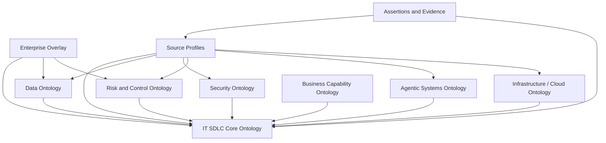

## Purpose

Phase 8 defines how the IT SDLC ontology is governed as a living enterprise asset.

The ontology will only remain useful if changes to meaning, relationships, source mappings, validation rules, and controlled vocabularies are owned, reviewed, versioned, released, and measured.

This phase should answer:

> Who can change the ontology, who approves semantic decisions, how do federated ontology extensions stay aligned, and how do source mappings evolve without breaking solution design, delivery, governance, and AI/RAG consumers?

## Governance Principle

Govern meaning centrally, extend locally.

The core ontology should remain small, stable, and portable. Domain teams should be able to extend it through governed domain extensions, source profiles, controlled vocabularies, and enterprise overlays.

The governance model should prevent two failure modes:

- Central bottleneck: every small source mapping or term addition waits on a heavyweight review board.
- Semantic drift: teams create local meanings that look compatible but answer different questions.

## Governed Assets

| Asset | What It Contains | Governance Need |
|-------|------------------|-----------------|
| Core ontology | Product, DigitalExperience, SoftwareSystem, DeployableUnit, InterfaceContract, RuntimeService, Control, Risk, Evidence, etc. | Highest stability and review rigor. |
| Domain extensions | Architecture, SDLC, integration, data, operations, risk, compliance, agentic systems. | Owned by domain stewards, aligned to core. |
| Controlled vocabularies | Lifecycle state, strategic posture, criticality, integration type, hosting model, data classification, support model. | Governed values, deprecation, synonyms. |
| Source profiles | ServiceNow, Ardoq, Jira Align, Jira, GitHub/GitLab, CI/CD, API catalog, GRC, observability. | Mapping ownership and authority boundaries. |
| Validation profiles | Solution design, build readiness, integration approval, release readiness, deploy-to-production, operate, decommission. | Gate owners approve severity and evidence rules. |
| Mapping rules | Field mappings, relationship mappings, identity keys, entity resolution rules. | Versioned and tested against sample records. |
| Source assertions | Imported or inferred facts with provenance and authority. | Traceability, conflict handling, review status. |
| Research anchors | References that justify modeling choices. | Progressive disclosure and decision memory. |

## Stability Tiers

The ontology should differentiate stable semantic assets from living operational assets.

| Stability Tier | What Belongs Here | Change Pattern | Governance |
|----------------|-------------------|----------------|------------|
| Stable core | Core concepts and high-value relationships: Product, SoftwareSystem, DeployableUnit, InterfaceContract, RuntimeService, Control, Risk, Evidence, Team. | Changes slowly; breaking changes are rare. | Formal semantic review and versioned release. |
| Stable normative assets | Regulations, enterprise policies, standards, architecture principles, controlled vocabularies, NFR categories. | Changes when policy, regulation, or enterprise standards change. | Owned by policy/architecture/risk stewards; versioned and effective-dated. |
| Semi-stable applicability assets | ApplicabilityRule, validation profile, gate severity, record authority matrix, source profile authority scope. | Changes as gates mature, source systems change, or new domains are added. | Steward review with impact analysis. |
| Living design assets | Proposed products, solution designs, architecture decisions, planned interface contracts, planned NFRs, planned evidence. | Changes during discovery, design, and build. | Gate-aware validation and design review. |
| Living operational assets | Deployments, RuntimeServices, incidents, telemetry, SLO evidence, source assertions, control evidence, exceptions. | Changes continuously or per event. | Provenance, freshness checks, automated validation, periodic attestation. |
| Experimental assets | AI-suggested mappings, inferred runtime dependencies, candidate aliases, proposed ontology terms. | Changes rapidly until reviewed. | Marked proposed/experimental; cannot become authoritative without review. |

This is the practical distinction:

- Stable elements define meaning.
- Semi-stable elements define when meaning applies.
- Living elements describe current reality.
- Experimental elements suggest possible meaning or facts.

Examples:

```text
Stable:
  InterfaceContract means a contract by which a system or deployable unit is used.

Stable normative:
  API Security Standard requires authentication, versioning, and consumer visibility for restricted APIs.

Semi-stable:
  API Security Standard applies when InterfaceContract.visibility is Public or Restricted.

Living design:
  participant-profile API is proposed as Restricted and will exchange ParticipantProfile data.

Living operational:
  participant-profile API v2.3 is deployed in prod and has SLO evidence from observability.

Experimental:
  Telemetry suggests advice-agent calls participant-profile API, pending review.
```

Stability tiers should appear in metadata for ontology assets:

```text
stabilityTier: stable-core | stable-normative | semi-stable-applicability | living-design | living-operational | experimental
effectiveFrom: date
effectiveTo: date
reviewStatus: proposed | candidate | approved | deprecated | retired
authorityLevel: authoritative | reviewed | inferred | proposed
```

## Roles

| Role | Responsibility |
|------|----------------|
| Ontology Product Owner | Owns roadmap, scope, adoption, prioritization, and value realization. |
| Semantic Architect | Owns core model quality, naming, relationship design, federation patterns, and semantic consistency. |
| Domain Steward | Owns domain extension quality for architecture, SDLC, integration, data, operations, risk, or compliance. |
| Source Profile Owner | Owns mapping quality, authority declarations, sync behavior, sample records, and source drift handling. |
| Controlled Vocabulary Owner | Owns allowed values, synonyms, deprecated values, and mapping to source-system values. |
| Validation Profile Owner | Owns gate-specific validation rules, severity overrides, exception paths, and approval criteria. |
| Integration / Connector Owner | Owns technical ingestion, sync reliability, API access, connector health, and error handling. |
| Data / Evidence Steward | Owns data classification, evidence provenance, lineage, and quality expectations. |
| Risk / Control Steward | Owns control applicability, evidence expectations, exceptions, and risk treatment semantics. |
| Consumer Representative | Represents solution architects, delivery teams, operations, governance, AI/RAG, and reporting users. |

## Decision Rights

| Decision | Primary Owner | Reviewers | Notes |
|----------|---------------|-----------|-------|
| Add or rename core concept | Semantic Architect | Domain stewards, ontology product owner | Requires impact analysis and release note. |
| Add domain extension concept | Domain Steward | Semantic Architect | Must map to core or document why not. |
| Add relationship type | Semantic Architect | Affected domain stewards | Avoid broad `relatedTo` unless provisional. |
| Add controlled vocabulary value | Vocabulary Owner | Affected domain steward | Must include definition and source mappings. |
| Change validation severity for a gate | Validation Profile Owner | Gate owner, risk/control steward if relevant | Must state impact on workflow. |
| Add source profile | Source Profile Owner | Semantic Architect, connector owner | Must declare authority scope and identity keys. |
| Change record authority | Ontology Product Owner | Source owners, affected consumers | Requires conflict and downstream impact review. |
| Promote inferred relationship to approved | Domain Steward or Source Profile Owner | Consumer representative if high-impact | Must preserve provenance. |
| Deprecate concept or relationship | Semantic Architect | Affected domain/source owners | Requires replacement path or retirement rationale. |

## Change Types

| Change Type | Examples | Review Level |
|-------------|----------|--------------|
| Patch | Description typo, synonym, documentation clarification, research anchor update. | Lightweight steward review. |
| Minor | New non-breaking concept, relationship, vocabulary value, source mapping, validation warning. | Domain steward + semantic review. |
| Major | Rename, delete, semantic redefinition, breaking validation rule, authority change. | Formal review and versioned release. |
| Emergency | Compliance correction, security/control issue, broken source mapping affecting active gate. | Fast-track review with post-change audit. |
| Experimental | Candidate source mapping, AI-suggested relationship, proposed domain extension. | Mark as draft/proposed until reviewed. |

## Change Workflow

1. Propose change.
2. Classify change type.
3. Identify affected assets: concepts, relationships, source profiles, validation profiles, consumers.
4. Run impact analysis.
5. Draft model/mapping/rule update.
6. Test against sample records and competency questions.
7. Run validation profiles.
8. Review with required owners.
9. Approve, reject, or mark as experimental.
10. Release with version, decision note, and migration guidance.
11. Monitor downstream validation errors, consumer feedback, and source drift.

## Lifecycle States

Use explicit lifecycle states for ontology assets.

| State | Meaning |
|-------|---------|
| Proposed | Suggested but not yet reviewed. |
| Candidate | Under review or pilot use. |
| Approved | Accepted for governed use. |
| Experimental | Allowed in sandbox/pilot, not authoritative. |
| Deprecated | Still usable but replacement is preferred. |
| Retired | No longer valid for new use. |
| Rejected | Reviewed and intentionally not adopted. |

## Versioning

Use semantic versioning for the IT SDLC ontology.

```text
MAJOR.MINOR.PATCH
```

| Version Change | Meaning |
|----------------|---------|
| Patch | Non-semantic edits, documentation clarifications, examples, research anchors. |
| Minor | Backward-compatible additions to concepts, relationships, mappings, validation warnings, or vocabulary values. |
| Major | Breaking semantic changes, removals, renamed concepts, changed authority, or stricter gate-blocking validation. |

Each release should include:

- Version number.
- Date.
- Summary of changes.
- Affected phases/assets.
- Migration notes.
- Deprecated terms or relationships.
- New or changed validation rules.
- Source profile changes.
- Known risks or open questions.

## Federation Rules

This IT SDLC ontology is one member of a future federated ontology set.

Federation rules:

- Core concepts remain stable and portable.
- Domain extensions must declare which core concepts they extend.
- Source profiles must not redefine core meaning.
- Enterprise overlays may add local terminology but must map back to canonical terms.
- Controlled vocabularies may have local aliases, but approved values must remain traceable.
- Cross-ontology relationships require named mappings and owners.
- Federated extensions should use the same provenance, validation, and lifecycle patterns.

Example future extensions:

- Data ontology.
- Security ontology.
- Risk/control ontology.
- AI/agentic systems ontology.
- Business capability ontology.
- Customer/domain ontology.
- Infrastructure/cloud ontology.

## Core vs Extension vs Source Profile vs Enterprise Overlay

These are different layers and should not be blended together.

| Layer | Owns | Example | Change Frequency |
|-------|------|---------|------------------|
| Core ontology | Stable cross-enterprise meaning used by many domains. | Product, DigitalExperience, SoftwareSystem, DeployableUnit, InterfaceContract, RuntimeService, Team, Control, Risk, Evidence. | Low |
| Federated domain ontology | Specialized domain meaning that extends core concepts. | DataEntity, DataProduct, Agent, AgentCapability, Threat, Vulnerability, ControlObjective, CloudResource. | Medium |
| Source profile | How a tool's records map into core or domain concepts. | ServiceNow Business Application maps to SoftwareSystem; Jira Align Feature maps to WorkItem; API catalog endpoint maps to InterfaceContract. | Medium/high |
| Enterprise overlay | Local enterprise language, gate artifacts, policy names, and delivery-method terms. | RKT Tollgate B, TIAA-specific data classifications, internal architecture standards. | Medium |
| Assertion/evidence layer | Specific facts imported or asserted from sources, with provenance. | `advice-agent` consumes `participant-profile-api`, asserted by API catalog on 2026-06-27. | High |

Rule of thumb:

- Put a concept in core when many domains need the same meaning.
- Put a concept in a federated domain ontology when it is specialized but reusable.
- Put a concept in a source profile when it mainly reflects a tool's schema.
- Put a concept in the enterprise overlay when it reflects local process, terminology, or governance.
- Put a fact in the assertion/evidence layer when it describes a real-world instance or relationship.

## Federation Dependency Model

Federated ontologies should depend inward toward the core, not sideways through hidden assumptions.



Allowed dependencies:

- Domain ontology extends core concepts.
- Enterprise overlay maps local names to core/domain concepts.
- Source profile maps tool records to core/domain concepts.
- Assertions reference core/domain concepts and preserve source provenance.

Avoid:

- Domain ontology redefining a core concept.
- Source profile becoming the canonical definition.
- Enterprise overlay changing global meaning.
- One domain extension depending on another without an explicit mapping and owner.

## Federation Linkage Patterns

Use these patterns when connecting core and federated ontologies.

| Pattern | Meaning | Example |
|---------|---------|---------|
| extends | A domain concept specializes a core concept. | AgenticApp extends DeployableUnit. |
| classifies | A domain concept classifies a core instance. | DataClassification classifies DataEntity exchanged by InterfaceContract. |
| constrains | A policy/control/security concept constrains a core concept. | SecurityPolicy constrains InterfaceContract. |
| evidences | A source or artifact proves a claim about a concept. | SBOM evidences DeployableUnit dependencies. |
| mapsTo | A source or enterprise term maps to a canonical concept. | ServiceNow Business Application mapsTo SoftwareSystem. |
| appliesTo | A governance concept applies to a target. | Control appliesTo SoftwareSystem. |
| implementedBy | A domain-specific implementation realizes a core concept. | AgentCapability implementedBy DeployableUnit. |

## Example: Agentic Advice Experience

Scenario:

> A new advisor-facing agentic experience helps advisors answer participant retirement questions using profile data, plan rules, document retrieval, and recommendation services.

The same solution touches multiple ontologies, but each ontology owns a different kind of meaning.

### Core IT SDLC Ontology

Core concepts:

- Product: Retirement Advice.
- DigitalExperience: Advisor Agent Chat.
- SoftwareSystem: Advice Orchestration.
- DeployableUnit: advice-agent service.
- DeployableUnit: advisor-advice BFF.
- InterfaceContract: participant-profile API.
- InterfaceContract: recommendation API.
- RuntimeService: advice-agent production workload.
- Team: Advice Platform Team.

Core relationships:

```text
Retirement Advice experiencedThrough Advisor Agent Chat
Retirement Advice realizedBy Advice Orchestration
Advisor Agent Chat composedFrom advice-agent service
Advice Orchestration composedOf advice-agent service
advice-agent service consumesContract participant-profile API
advice-agent service consumesContract recommendation API
advice-agent service deployedAs advice-agent production workload
Advice Platform Team owns Advice Orchestration
```

### Agentic Systems Ontology Extension

The agentic ontology extends the core without redefining it.

Agentic concepts:

- Agent extends DeployableUnit or is implementedBy DeployableUnit.
- AgentCapability.
- ToolContract extends InterfaceContract.
- Prompt.
- ModelEndpoint.
- MemoryStore.
- KnowledgeSource.
- Guardrail.
- Evaluation.
- HumanApprovalPoint.

Agentic relationships:

```text
advice-agent service hasAgentCapability answerParticipantQuestion
answerParticipantQuestion usesTool participant-profile API
answerParticipantQuestion usesKnowledgeSource plan-document-index
advice-agent service usesModelEndpoint approved-enterprise-llm
advice-agent service governedByGuardrail pii-redaction-policy
advice-agent service evaluatedBy retirement-answer-quality-eval
```

### Data Ontology Extension

The data ontology owns data-specific meaning.

Data concepts:

- DataEntity: ParticipantProfile.
- DataEntity: PlanRule.
- DataAsset: Plan Document Index.
- DataClassification: Confidential / Restricted.
- DataSteward.
- RetentionPolicy.

Data relationships:

```text
participant-profile API exchangesData ParticipantProfile
ParticipantProfile classifiedAs Restricted
Plan Document Index containsDataEntity PlanRule
Plan Document Index governedByRetentionPolicy plan-doc-retention-policy
```

### Security Ontology Extension

The security ontology owns threat, access, and protection semantics.

Security concepts:

- AuthPattern.
- Entitlement.
- Threat.
- Vulnerability.
- SecurityControl.
- TrustBoundary.

Security relationships:

```text
participant-profile API requiresAuthPattern OAuth2ClientCredentials
advice-agent service crossesTrustBoundary advisor-platform-boundary
advice-agent service mitigatesThreat prompt-injection
```

### Risk and Control Ontology Extension

The risk/control ontology owns control objectives, assurance, and evidence semantics.

Risk/control concepts:

- ControlObjective.
- Control.
- Evidence.
- Exception.
- Finding.
- Remediation.

Risk/control relationships:

```text
PIIAccessControl appliesTo participant-profile API
PIIAccessControl appliesTo advice-agent service
PIIAccessControl satisfiedBy access-review-evidence
ModelOutputReviewControl appliesTo advice-agent service
ModelOutputReviewControl satisfiedBy evaluation-report
```

### Source Profiles

Source profiles map real tools to the canonical and domain concepts.

```text
Ardoq Application -> SoftwareSystem
Backstage Component -> DeployableUnit
API Catalog API -> InterfaceContract
Data Catalog Dataset -> DataAsset
GRC Control -> Control
Observability Service -> RuntimeService
Jira Align Feature -> WorkItem
GitHub Repository -> Repository
```

### Why This Federation Works

The core ontology answers solution-design questions:

- What product is this for?
- What experience is being introduced?
- Which systems and deployable units are involved?
- Which interface contracts are consumed?
- Who owns the system?
- What runtime workload goes to production?

The federated domain ontologies add specialized detail:

- Data ontology explains data classification, stewardship, lineage, and retention.
- Security ontology explains auth, entitlement, threat, and trust-boundary concerns.
- Risk/control ontology explains controls, evidence, exceptions, and findings.
- Agentic systems ontology explains tools, prompts, model endpoints, guardrails, memory, and evaluations.

No ontology has to own everything. The linkage works because each domain extension attaches to stable core anchors: Product, DigitalExperience, SoftwareSystem, DeployableUnit, InterfaceContract, RuntimeService, Control, Risk, Evidence, Team.

## Minimal Federation Contract

Every federated ontology should publish a small contract:

| Contract Item | Meaning |
|---------------|---------|
| Extends | Which core concepts it extends or references. |
| Owns | Which concepts it owns semantically. |
| Does not own | Which concepts it deliberately leaves to core or another domain. |
| Key relationships | Cross-ontology relationships it introduces. |
| Source profiles | Sources that commonly populate it. |
| Validation profiles | Rules or gates where it participates. |
| Owners | Domain steward and reviewers. |
| Version | Version and compatibility with the core ontology. |

Example:

```text
Ontology: Agentic Systems Ontology
Extends:
  - DeployableUnit
  - InterfaceContract
  - Evidence
Owns:
  - Agent
  - AgentCapability
  - ToolContract
  - Prompt
  - ModelEndpoint
  - MemoryStore
  - Guardrail
  - Evaluation
Does not own:
  - Product
  - SoftwareSystem
  - RuntimeService
  - DataClassification
  - Control
Key relationships:
  - hasAgentCapability
  - usesTool
  - usesModelEndpoint
  - governedByGuardrail
  - evaluatedBy
Validation participation:
  - Solution Design Approval
  - Deploy to Production
  - Operate / Periodic Attestation
```

## Governance Cadence

| Cadence | Activity |
|---------|----------|
| Weekly during pilot | Review source mapping gaps, validation failures, open modeling questions. |
| Biweekly/monthly | Review ontology changes, domain extension proposals, controlled vocabulary updates. |
| Per gate cycle | Review validation profile feedback from solution design, build, release, and deploy gates. |
| Quarterly | Review adoption metrics, source drift, deprecated terms, and federation roadmap. |
| On major tool/process change | Review source profiles, record authority, and validation impacts. |

## Operating Metrics

Measure whether the ontology is alive and useful.

| Metric | Why It Matters |
|--------|----------------|
| Competency questions answered | Proves the ontology supports real decisions. |
| Gate validation pass/fail rate | Shows whether data quality supports governance workflows. |
| Mapping coverage by source | Shows ingestion maturity. |
| Concepts with owners | Shows semantic accountability. |
| Source profiles with authority scope | Shows record authority clarity. |
| Conflicting assertions unresolved | Shows trust and reconciliation backlog. |
| Deprecated terms still used | Shows migration/adoption risk. |
| AI/RAG retrieval citations to ontology-backed facts | Shows grounding value. |
| Solution-design reuse recommendations accepted | Shows design acceleration value. |
| Time to approve ontology change | Shows whether governance is lightweight enough. |

## Exception Handling

Exceptions should be explicit and time-boxed.

Each exception should include:

- Exception ID.
- Target concept, relationship, validation rule, or source profile.
- Reason.
- Risk impact.
- Approved by.
- Valid from / valid to.
- Compensating control or mitigation.
- Review date.
- Replacement or remediation plan.

Exceptions should not silently weaken the ontology. They should become governed records that can be queried and reviewed.

## Decision Records

Significant modeling decisions should have lightweight decision records.

Examples:

- Use SoftwareSystem instead of Application as canonical core concept.
- Treat ServiceNow/Ardoq/Jira Align as source profiles, not ontology core.
- Use gate-specific validation profiles instead of one flat validation severity.
- Model agentic apps as DeployableUnits with an agentic systems extension.

Decision records should include:

- Decision.
- Context.
- Alternatives considered.
- Outcome.
- Affected concepts/relationships/source profiles.
- Review date.
- Research anchors.

## Phase 8 Deliverables

The reviewed output of this phase should be:

- Governance roles and decision rights.
- Change workflow.
- Change type taxonomy.
- Lifecycle states.
- Versioning policy.
- Federation rules.
- Governance cadence.
- Operating metrics.
- Exception handling model.
- Decision-record template.

## Review Questions

- Who should own the IT SDLC ontology as a product?
- Which roles already exist, and which need to be created or assigned?
- Which changes require formal review versus steward approval?
- How should federated ontology extensions be approved?
- What is the minimum viable governance model for the pilot?
- What metrics prove the ontology is helping solution design and delivery?
- How do we prevent governance from becoming too slow for delivery teams?

## Research Anchors for Progressive Disclosure

Use these anchors when explaining governance and operating-model choices.

| Anchor | Use When |
|--------|----------|
| [PROV-O](https://www.w3.org/TR/prov-overview/) | Explaining provenance, assertion ownership, evidence, and change traceability. |
| [SHACL](https://www.w3.org/TR/shacl/) | Explaining governed validation rules and gate-specific validation profiles. |
| [DCAT](https://www.w3.org/TR/vocab-dcat-3/) | Explaining catalog governance for datasets, services, distributions, and knowledge assets. |
| [COBIT](https://www.isaca.org/resources/cobit) | Explaining governance objectives, accountability, control, risk, and assurance. |
| [IT4IT](https://publications.opengroup.org/standards/it4it) | Explaining product/value-stream operating model alignment. |

Progressive-disclosure rule:

- Start with ownership and decision rights.
- Bring in provenance and validation anchors when discussing trust or enforcement.
- Bring in COBIT/IT4IT when aligning ontology governance to enterprise IT governance and operating-model language.
