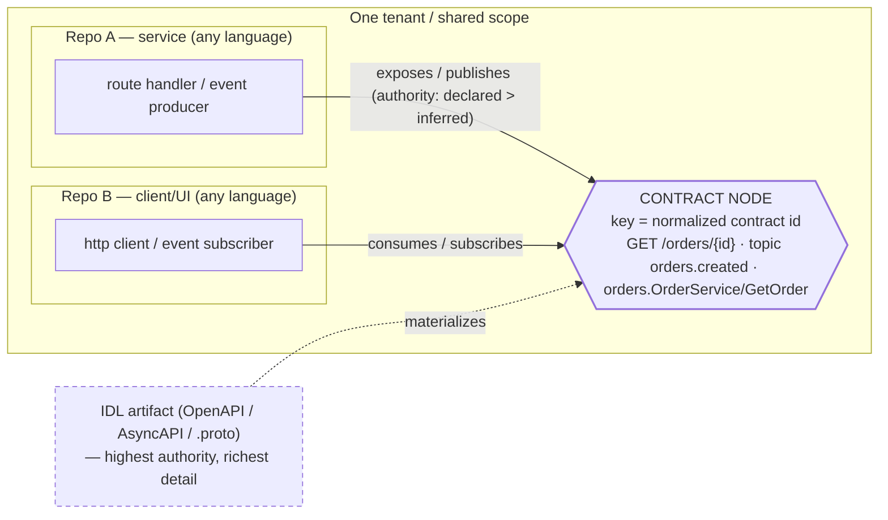

# RFC-0008: Cross-repo linkage

- **Status:** Accepted
- **Author:** phanijapps
- **Approver:** phanijapps
- **Date opened:** 2026-07-04
- **Date closed:**
- **Decision weight:** standard
- **Related:** RFC-0007 (federated assertion reconciliation), RFC-0004 (enterprise knowledge platform), ADR-0012 (source-assertion domain type), ADR-0013 (validation-event trigger family), `docs/specs/graph-explorer/`, `docs/specs/background-repo-indexer/`, `docs/research/more/it-sdlc-ontology-*.md`, research note `docs/research/cross-repo-linkage.md`

## Reviewer brief

- **Decision:** Make cross-repo linkage mean **interface/contract linkage** — materialize a shared contract (REST route, event channel, gRPC method) as a node keyed by a *normalized contract identifier*, and attach each repo as a producer or consumer — rather than symbol-name matching. Commit an IDL/contract-first first slice.
- **Recommended outcome:** accept.
- **Change if accepted:** (1) repo gains a structured identity + `Repository` node in one shared scope; (2) contracts found in repos (OpenAPI/AsyncAPI/`.proto`) become first-class `Api`/channel nodes with `exposes`/`consumes`/`publishes`/`subscribes` edges; (3) a repo-clustered graph view shows *typed* cross-repo contract edges (not bare-name guesses).
- **Affected surface:** `adapters/ingest` (new contract extractors), `core/knowledge` (produce the already-defined `EntityKind::Api` + typed predicates), `adapters/knowledge/sqlite` (additive column), demo read path; `core/domain` needs no new *required* fields for the first slice.
- **Stakes:** reversible at the first slice (additive; nothing persisted a re-scan can't reshape). The linking-model choice (D1) becomes costly to reverse as later phases build on it — each a separate, gated spec.
- **Review focus:** (a) D1 — contract-node join vs symbol-name matching vs SCIP symbol identity; (b) D3 — that IDL/contract-first is the right *first* extraction source given the static-analysis limits on dynamic identifiers.
- **Not in scope:** cross-*tenant* federation; runtime/observability-derived topology (the eventual complement, not the base); resolving dynamically-constructed URLs/topics; a universal parser.

## The ask

**Recommendation (BLUF):** Approve redefining cross-repo linkage as **contract linkage** — a shared contract identifier (normalized REST `method+path`, event channel/topic, gRPC `service/method`) materialized as a node that both repos attach to via typed `exposes`/`consumes`/`publishes`/`subscribes` edges — and approve an **IDL/contract-first first slice** (ingest OpenAPI/AsyncAPI/`.proto` present in repos) on top of a structured repo identity. Symbol-name matching is demoted to a weak within-tenant hint; SCIP-style symbol identity is the separate "direct linkage" track for genuinely shared published libraries.

**Why now (SCQA):**
- *Situation.* Engram builds a per-file code graph and (via RFC-0007) reconciles competing source assertions into beliefs. The ambition (RFC-0004; the `it-sdlc-ontology` research) is org-wide knowledge across services.
- *Complication.* The valuable cross-repo relationships in a real system are *service integrations* — repo A exposes a REST endpoint repo B calls; repo C publishes a Kafka topic repo D subscribes to. These two sides **share no code symbol** and are usually in different languages, so symbol-name matching (the earlier framing, and the pruned `graph-explorer` view) cannot connect them. Meanwhile `EntityKind::Api` is defined but never produced, and no contract (OpenAPI/AsyncAPI/proto) is ever parsed.
- *Question.* What identity should join two repos, what is the smallest useful slice that produces real (not guessed) cross-service links, and how do we keep it honest about what static analysis cannot know?

**Decisions requested:**

| ID | Question | Recommendation | Why | Decide by | Reviewer action |
| --- | --- | --- | --- | --- | --- |
| D1 | What identity joins two repos? | A **shared contract node** keyed by a normalized contract identifier, with typed provides/consumes edges | The two sides share a contract, not a symbol or a name; matches Backstage/OpenAPI/AsyncAPI/gRPC | this review | Confirm contract-node model; rule against name-matching as primary |
| D2 | How is a repository modeled? | A `KnowledgeSource` + `EntityKind::Repository` node within one shared scope | Reuses existing types; additive; keeps repos in one scope so later reconciliation stays single-scope | this review | Confirm repo model; rule against `Scope.workspace` |
| D3 | Which extraction source first? | **IDL/contract-first** (OpenAPI/AsyncAPI/`.proto`), then declarative-in-code, then dynamic/runtime deferred | Highest reliability + richest detail + explicit keys; sidesteps the undecidable dynamic case | this review | Confirm phasing along the reliability gradient |
| D4 | How are confidence, authority, and drift handled? | Carry the edge as a `KnowledgeRelationship` (typed predicate + confidence); rank *declared-vs-inferred scalar contract facts* with `reconcile`; detect consumer→missing-producer as a graph-reachability check | Reuses what each mechanism actually does; edge-level authority is an open contract question | Phase-B/D spec | Confirm direction |
| D5 | Contract-key normalization | Per-protocol canonical form (path params → placeholders; channel/topic literal; `pkg.Service/Method`) | A stable join key is the crux; IDL makes it explicit | this review (direction) | Confirm direction; mechanics to spec |

## Problem & goals

**Diagnosis.** Two distinct linkage kinds hide under "cross-repo," and Engram addresses neither today:

- **Direct linkage** — repo B references a symbol repo A *publishes* (a shared library). Join key = a shared symbol (SCIP: package + version + qualified name). Needs a genuinely shared artifact.
- **Indirect / contract linkage** — repo A and repo B never reference each other's code; both reference a shared **external contract** (a route, a topic, a gRPC method). This is the dominant cross-service pattern, and the two sides share no symbol and may differ in language.

What exists today (verified): extraction is deterministic and **code-symbol-only** — `Function`/`Class`/`Concept` entities with `calls`/`mentions` edges (`adapters/ingest/src/extractor.rs:107,150,280-295`). There is **no** detection of routes, verbs, topics, channels, or gRPC methods, and **no** OpenAPI/AsyncAPI/proto ingestion (repo-wide grep: zero code hits; spec files are classified as plain `Code`/`Text`, `adapters/ingest/src/scanner.rs:357-358`). `EntityKind::Api` is defined (`core/domain/src/knowledge.rs:185`) but never constructed by any producer. The pruned `graph-explorer` view matched on **bare entity name** — which cannot connect a Java controller to a TypeScript `fetch`, and over-links common names.

But the *generic* substrate is expressive enough to carry contract edges without a contract break (verified): `KnowledgeRelationship.predicate` is a free `String` and it carries `confidence: Option<f32>` (`core/domain/src/knowledge.rs:218-236`); `SourceAssertion` carries `authority_level: AuthorityTier` = `Primary|Secondary|Inferred` (`core/domain/src/assertion.rs:56-80`); `reconcile` ranks by authority (`core/belief/src/reconcile.rs:132-158`); and `KnowledgeEntity.source_refs: Vec<EvidenceRef>` lets one entity accrue evidence from multiple repos.

**Goals.**
- Represent a shared interface contract as a first-class node with a normalized, language-independent key, and attach producers/consumers across repos to it with typed edges.
- Ingest declared contracts (OpenAPI/AsyncAPI/`.proto`) as the canonical, richest, highest-authority contract nodes.
- Keep the mechanism honest about static-analysis limits (dynamic identifiers are undecidable in general) by attaching confidence/authority and leaving runtime signals as a later complement.
- Reuse RFC-0007's reconciliation so a declared contract outranks an inferred one and a consumer→missing-producer link surfaces as a contradiction (cross-repo drift/breakage detection).

**Non-goals.**
- Cross-*tenant* federation (`domain-data-model.md:283` reserves a future federated query type; we do not build it).
- Runtime/observability-derived topology (OpenTelemetry service graph) — named as the eventual complement, not this proposal.
- Resolving dynamically-constructed URLs/topics precisely (undecidable — best-effort + low confidence only).
- A single universal parser; language independence comes from a shared contract vocabulary, not one grammar.

## Proposal

**Core model (D1).** A cross-repo link is: `(repo-A code) --exposes/publishes--> [Contract node] <--consumes/subscribes-- (repo-B code)`. The contract node is keyed by a normalized contract identifier; both sides join on that key. This decouples the two sides' languages and frameworks, exactly as Backstage's `providesApi`/`consumesApi` relate components to a standalone `API` entity.

**Repo identity (D2).** Represent each repository as its existing `KnowledgeSource` (upgraded to structured git identity + `SourceKind::GitRepository`) plus an `EntityKind::Repository` node its files/contracts link to via `belongs_to`. All repos in a workspace share one `Scope`; repo is not a scope dimension. This keeps cross-repo reads a normal intra-scope operation and keeps later reconciliation single-scope.

**Extraction along a reliability gradient (D3).** Three sources of a contract fact, sequenced highest-reliability first:
1. **IDL / contract-first (first slice).** Detect and parse OpenAPI, AsyncAPI, and `.proto` files in a repo; emit contract nodes (`Api` for REST/gRPC operations, a channel entity for events) keyed by the normalized identifier, with an `exposes`/`publishes` edge from the owning repo and **rich details from the spec** (request/response schemas, methods, message types, docs). Highest authority (`Primary`), least per-framework effort, explicit keys.
2. **Declarative-in-code (next).** Per-framework tree-sitter rules recognize route registrations, client calls, `@KafkaListener`, `producer.send(...)`, etc., and emit participation edges to the same contract keys at `Secondary` authority. The framework rule library is the cost.
3. **Dynamic / constructed (deferred) + runtime complement.** URLs/topics built at runtime are undecidable in general (Rice's theorem); emit at most low-confidence `Inferred` edges, and treat OpenTelemetry-style runtime service maps as the future complement, not part of this proposal.

**Join & accrual.** Producers and consumers across repos are linked by matching the normalized contract key; one contract node accrues `source_refs` from every participating repo (using the existing multi-source evidence shape).

**Confidence & drift (D4).** Three distinct mechanisms, deliberately kept separate (they are not one `reconcile` call):
- *The participation edge* is a `KnowledgeRelationship` — typed predicate (`exposes`/`consumes`/…) plus `confidence: Option<f32>` — representable with **no contract change**. Whether the edge also needs an explicit declared-vs-inferred *tier* is an **open contract question** (OQ1): `AuthorityTier` today lives only on `SourceAssertion`, not on `KnowledgeRelationship`, so edge-level authority means either encoding it via confidence bands / distinct predicates, or adding an additive `authority_level` field to the relationship.
- *Scalar contract facts* (e.g. an endpoint's response type, a topic's schema version) that multiple sources assert differently are reconciled by `reconcile` under an `AuthorityPolicy` that ranks declared (`Primary`) above inferred (`Inferred`); equal-tier disagreement yields a `Contradiction`. This is a *value*-disagreement mechanism over `SourceAssertion`s — it does **not** see `KnowledgeRelationship`s.
- *Missing-producer drift* — a consumer edge whose target contract node has **no inbound producer edge** — is a **graph-reachability check**, not a `reconcile` contradiction. This is the cross-repo breakage signal.

**Presentation.** Re-introduce a repo-clustered graph view drawing the *typed* contract edges (replacing the pruned bare-name explorer).

**Migration.** Additive: contract nodes and edges are new records; the repo-identity column is additive; nothing destructive.

## Options considered

**Axis: what identity joins two repos** (exhaustive over the candidate join keys — shared contract, shared symbol, surface name, runtime signal, nothing).

| Option | Join key | Trade-offs | |
| --- | --- | --- | --- |
| **A. Shared contract node** | normalized route / channel / gRPC method | Links across languages; rich detail from IDL; needs extraction + normalization. Matches Backstage/OpenAPI/AsyncAPI/gRPC | ★ recommended |
| B. Shared code-symbol identity (SCIP) | package + version + qualified symbol | Correct for genuinely shared *published libraries* (direct linkage); useless for cross-language services that share no symbol. Complement, not primary | |
| C. Bare entity-name match | entity `name` (± `kind`) | Cheap, no extraction; but language-blind, semantically empty, over-links common names — the pruned `graph-explorer` heuristic. Demote to a weak hint | |
| D. Runtime/observability topology | client/server span pairing | Ground truth of who actually calls whom (OpenTelemetry service graph); but outside a static code graph's scope and needs a running system. The eventual complement | |
| E. Do-nothing | — | Zero cost; cross-service links stay invisible, `EntityKind::Api` stays unused, RFC-0004's org-wide ambition stalls. Cost of delay compounds per repo ingested | |

**Prior-art grounding.** A is the service-catalog / contract-first model (Backstage `providesApi`/`consumesApi`; OpenAPI; AsyncAPI channels + `send`/`receive`; gRPC/proto IDL). B is SCIP. D is OpenTelemetry service graphs. C is the status-quo heuristic. Recommend **A as primary, B as a later direct-linkage track, D as a future complement, C demoted**.

## Risks & what would make this wrong

**Pre-mortem.**
- *Key normalization mismatch.* Path templating differs across frameworks (`/orders/{id}` vs `/orders/:id`), topics get env/namespace prefixes, and base URLs hide behind service discovery — causing false negatives. **Mitigation:** per-protocol canonicalization; start with IDL, where the key is explicit in the artifact.
- *Over-claiming completeness.* Dynamically-constructed identifiers are undecidable (Rice's theorem); a static resolver must over-approximate. **Mitigation:** mark inferred edges low-confidence `Inferred`; never present static results as complete; name runtime signals as the complement.
- *Framework-rule sprawl.* Declarative-in-code coverage needs rules per framework/language. **Mitigation:** IDL-first needs none; scope declarative rules to a few high-value frameworks.
- *"Language-agnostic" oversold.* It is agnostic at the contract-vocabulary layer, not for free. **Mitigation:** say so; the cost is a rule library, and tree-sitter (already present) supplies the parsing.

**Key assumptions (falsifiable).**
- Both sides of a real cross-service dependency reference a normalizable shared identifier — true for IDL/declarative, false for fully dynamic (hence the gradient).
- The generic substrate carries typed contract edges with **confidence** and no contract change — verified (free-string predicate + `Option<f32>` confidence on `KnowledgeRelationship`, `knowledge.rs:225,231`). **Edge-level *authority* is the exception:** `AuthorityTier` lives only on `SourceAssertion` (`assertion.rs:69`), so tiering the *edge* needs an additive field or an encoding (OQ1) — not free.
- IDL artifacts appear in repos often enough to be worth prioritizing — assumption; declarative-in-code covers repos without them.

**Drawbacks.** New per-protocol extractors and a normalization layer to maintain; inferred edges can mislead if surfaced without their confidence; committing to the contract-node model (D1) is costly to reverse once later phases depend on it. Accepted for an additive foundation that produces *real* cross-service links.

## Evidence & prior art

**Spike / de-risk result.** Riskiest assumption: that the contract key normalizes cleanly enough to join both sides. Checked against the sources: for IDL-declared contracts the key is explicit in the artifact (OpenAPI `path`+method; AsyncAPI `channel`; proto `service.method`), so normalization is well-defined; for declarative-in-code it is tractable per framework; for dynamic values it is undecidable (Rice). This directly motivates D3's IDL-first ordering — prioritizing the case where the join key is unambiguous de-risks the whole mechanism.

**Repo precedent.**
- `docs/research/more/it-sdlc-ontology-*.md` — already specifies the intended interface model: `produces`/`subscribesTo`/`sendsTo`/`receivesFrom` predicates (`...phase-4-relationship-model.md:46`), an `InterfaceContract`/`EventStream` concept needing OpenAPI/AsyncAPI/protobuf (`...phase-7-validation-rules.md:329-330`), and a "Contract scanner" pipeline listed as an unbuilt "Pilot MVP" (`...feature-roadmap.md:123`). This RFC realizes that vision incrementally. (This RFC uses `exposes`/`consumes`/`publishes`/`subscribes` illustratively; final predicate tokens will align to that ontology vocabulary in the spec.)
- `docs/rfcs/0007-federated-assertion-reconciliation.md` + ADR-0012/0013 — the belief engine D4 reuses for *scalar* contract facts. Declared-over-inferred is **not** intrinsic to `AuthorityTier` (whose ordering is policy-supplied, `assertion.rs:18-20`; default `Primary`, `:32`); it is an `AuthorityPolicy` configured that way (`reconcile.rs:134`).
- `core/domain/src/knowledge.rs:185` (`EntityKind::Api`, defined-but-unused), `:218-236` (free-predicate + `confidence` relationship), `core/belief/src/reconcile.rs:132-158` (authority-ranked survivorship) — the substrate this builds on.
- `docs/specs/source-assertion-reconciliation/spec.md:52-53` ("Always do": reconcile over one scope, never mix scopes) — the belief-layer constraint motivating D2's single-scope choice. (This lives in the *spec*, not RFC-0007's body.)
- `docs/domain-data-model.md:283` — the hard partition is *tenant*; `workspace` and below are optional narrowing filters (`adapters/knowledge/sqlite/src/scope.rs:8-14`), so cross-repo reads within a tenant are already permitted.

**External prior art** (all fetched and confirmed to contain the cited claim).
- [Backstage — Well-known Relations](https://backstage.io/docs/features/software-catalog/well-known-relations/) — `providesApi`/`consumesApi` relate a Component to a standalone `API` entity via `spec.providesApis`/`spec.consumesApis`. Grounds D1's contract-node model.
- [OpenAPI — Introduction](https://learn.openapis.org/introduction.html) — a vendor-neutral machine-readable description of HTTP APIs both provider and consumer reference.
- [AsyncAPI Specification v3.0.0](https://www.asyncapi.com/docs/reference/specification/v3.0.0) — protocol-agnostic (lists Kafka); models `channels` and `operations` with an `action` of `send`/`receive`. Grounds the event/topic case.
- [gRPC — Core concepts](https://grpc.io/docs/what-is-grpc/core-concepts/) — service + methods defined in a shared `.proto` IDL; both sides generated from it.
- [Rice's theorem](https://en.wikipedia.org/wiki/Rice%27s_theorem) — non-trivial semantic properties are undecidable; the fundamental limit on statically resolving dynamic identifiers.
- [Rapoport et al., "Who you gonna call?" (arXiv:1705.06629)](https://arxiv.org/abs/1705.06629) — static URL extraction misses dynamically-constructed requests; motivates static+dynamic complement.
- [OpenTelemetry Collector — Service Graph Connector](https://github.com/open-telemetry/opentelemetry-collector-contrib/tree/main/connector/servicegraphconnector) — builds a service dependency map by pairing client/server spans at runtime. Grounds D-deferred runtime complement.
- [Sourcegraph scip-clang — CrossRepo](https://github.com/sourcegraph/scip-clang/blob/main/docs/CrossRepo.md) — cross-repo symbol id = (package, version, qualified symbol). The direct-linkage (Option B) contrast.

**Promoted research.** Full current-state analysis and diagrams live in `docs/research/cross-repo-linkage.md` (contract-linkage framing).

## Open questions

1. **How is a cross-repo contract edge represented, and does it need an authority tier?** (owner: Phase-A spec author; decide-by: Phase-A spec). Recommended default: carry the entity-to-entity edge as a `KnowledgeRelationship` (it has `confidence` and entity refs), and use `SourceAssertion` only for *scalar* contract facts — because `SourceAssertion.object` is a `Scalar`, not an `EntityRef` (`core/domain/src/assertion.rs`). Since `KnowledgeRelationship` has no `authority_level`, encode declared-vs-inferred via confidence bands / distinct predicates first; add an additive `authority_level` field (a compatible change) only if that proves insufficient.
2. **New `EntityKind` for event channels, or reuse `Api` + metadata?** (owner: Phase-A spec author; decide-by: Phase-A spec). Recommended default: reuse `EntityKind::Api` for REST/gRPC operations and add a channel kind only if event semantics prove distinct; avoid premature enum growth.
3. **Contract-key normalization specifics per protocol** (owner: Phase-A spec author; decide-by: Phase-A spec). Recommended default: REST → `METHOD` + path with params folded to positional placeholders; events → channel/topic literal (namespace/env prefix stripped); gRPC → `package.Service/Method`.

## Follow-on artifacts

*Filled in on acceptance.*
- ADR: record the contract-node linking model (D1) and the repo model + intra-scope stance (D2).
- Spec: `docs/specs/structured-repo-identity/` (foundation) and `docs/specs/contract-first-ingestion/` (Phase A — OpenAPI/AsyncAPI/proto → contract nodes + typed edges).
- Later specs: `docs/specs/declarative-interface-extraction/` (Phase B — framework rules), a belief-drift spec extending RFC-0007 (Phase D — declared-vs-inferred ranking + consumer→missing-producer contradictions), and a re-instated `docs/specs/cross-repo-contract-graph-view/` (presentation).
- Update `docs/research/cross-repo-linkage.md` to the contract-linkage framing.
